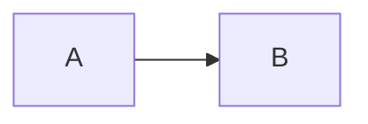

# Contribuer à la documentation Hikube

Merci de contribuer à la documentation publique Hikube ! Ce guide explique comment proposer des modifications.

## Prérequis

- [Node.js](https://nodejs.org/) v18+
- npm

## Installation locale

```bash
git clone https://github.com/HidoraSwiss/hikube-public-doc.git
cd hikube-public-doc
npm install
npm run start
```

Le site est accessible sur `http://localhost:3000`.

## Commandes utiles

| Commande | Description |
|----------|-------------|
| `npm run start` | Serveur de dev avec hot-reload |
| `npm run build` | Build de production (vérifie les broken links) |
| `npm run serve` | Sert le build local |

## Structure Diátaxis

Chaque service suit le framework [Diátaxis](https://diataxis.fr/) :

```
docs/services/<service>/
├── overview.md          # Présentation du service
├── concepts.md          # Terminologie, architecture
├── quick-start.md       # Démarrage rapide en 7 étapes
├── how-to/              # Guides pratiques atomiques
│   └── _category_.json
├── api-reference.md     # Référence API complète
├── faq.md               # Questions fréquentes
└── troubleshooting.md   # Dépannage
```

L'ordre dans la sidebar est contrôlé par `sidebars.js`.

## Conventions de rédaction

### Langue

- Contenu principal en **français** (locale par défaut)
- Traductions anglaises dans `i18n/en/`

### Frontmatter

Chaque page Markdown commence par un bloc frontmatter :

```yaml
---
sidebar_position: 1
title: Mon titre
---
```

### Manifestes YAML

- **Ne jamais inclure `namespace: default`** dans les exemples (le namespace est implicite)
- API group standard : `apiVersion: apps.cozystack.io/v1alpha1`
- Toujours ajouter `title="fichier.yaml"` sur les blocs code YAML :

````markdown
```yaml title="mon-service.yaml"
apiVersion: apps.cozystack.io/v1alpha1
kind: ...
```
````

### Quick-starts

Suivre le modèle en **7 étapes** (cf. `docs/services/kubernetes/quick-start.md`) :

1. Créer le manifeste
2. Déployer
3. Vérification des pods (avec résultat attendu)
4. Récupérer les identifiants
5. Connexion et tests
6. Dépannage rapide
7. Nettoyage

### Admonitions

Utiliser les admonitions Docusaurus pour les encadrés importants :

```markdown
:::tip Bonne pratique
Contenu du tip.
:::

:::warning Attention
Contenu du warning.
:::

:::note
Contenu de la note.
:::
```

### Diagrammes

Mermaid est supporté nativement :

````markdown

````

## Ajouter un guide how-to

1. Créer un fichier dans `docs/services/<service>/how-to/mon-guide.md`
2. Ajouter un frontmatter avec `title`
3. Le guide apparaît automatiquement dans la sidebar (autogenerated)

## Versioning

La documentation utilise le [versioning Docusaurus](https://docusaurus.io/docs/versioning) :

- **v2.0** : version stable actuelle (servie par défaut)
- **next** (3.0.0-alpha) : version en cours de restructuration Diátaxis
- **v1.0** : ancienne version, non maintenue

Les modifications courantes vont dans `docs/` (version next). La version stable est dans `versioned_docs/version-2.0/`.

## Soumettre une contribution

1. Forker le dépôt
2. Créer une branche : `git checkout -b feat/ma-contribution`
3. Effectuer les modifications
4. Vérifier le build : `npm run build`
5. Commiter (style mixte FR/EN accepté)
6. Ouvrir une Pull Request vers `main`

## Pièges connus

- **RabbitMQ, NATS, Kafka** sont sous `services/messaging/`, pas `services/databases/`
- Si `resources` (CPU/mémoire explicites) est défini, `resourcesPreset` est ignoré
- `onBrokenLinks: 'warn'` : le build ne casse pas sur les liens cassés, vérifier les warnings manuellement
