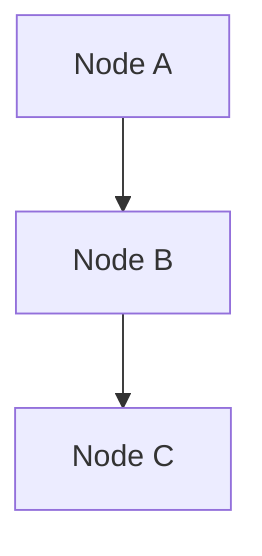
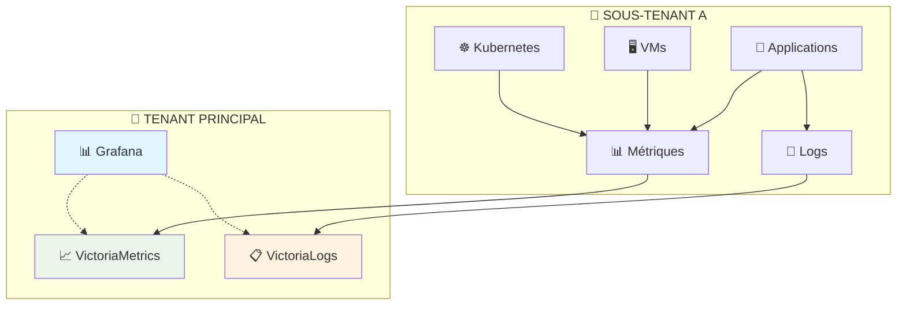
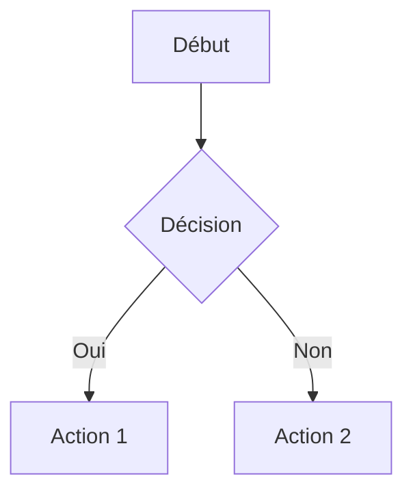
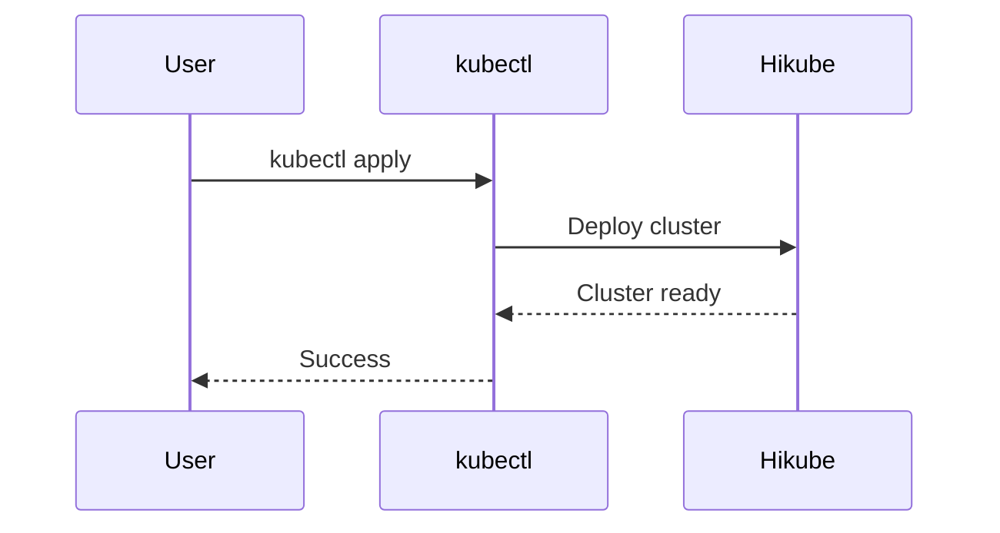
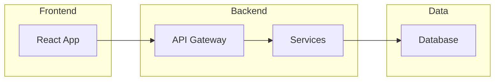
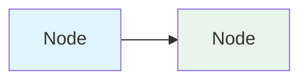

# 📊 CONFIGURATION MERMAID - RÉSUMÉ

**Date :** Janvier 2025  
**Objectif :** Activer le support des diagrammes Mermaid dans Docusaurus  
**Statut :** ✅ Configuré et testé avec succès

---

## 🔧 ÉTAPES RÉALISÉES

### **1. Installation du plugin Mermaid**
```bash
npm install @docusaurus/theme-mermaid
```

**Résultat :** 134 packages ajoutés incluant les dépendances Mermaid (d3, chevrotain, etc.)

### **2. Configuration dans `docusaurus.config.js`**

#### **Ajout du thème :**
```javascript
themes: ['@docusaurus/theme-mermaid'],
```

#### **Configuration Mermaid :**
```javascript
themeConfig: {
  // ... autres configurations
  mermaid: {
    theme: {light: 'neutral', dark: 'dark'},
  },
}
```

### **3. Correction de la sidebar**
Nettoyage des références aux fichiers manquants :
- ❌ `services/compute/virtual-machines/troubleshooting`
- ❌ `services/compute/virtual-machines/tutorials/*`

---

## 📋 UTILISATION DES DIAGRAMMES MERMAID

### **Syntaxe dans les fichiers Markdown :**

````markdown

````

### **Exemple concret utilisé dans la documentation :**



---

## ✅ VALIDATION

### **Build réussi :**
- ✅ `npm run build` → **SUCCESS**
- ✅ Toutes les dépendances Mermaid chargées correctement
- ✅ Diagrammes intégrés dans la documentation

### **Serveur de développement :**
- ✅ `npm start` → Serveur lancé
- ✅ Diagrammes visibles dans le navigateur

### **Fonctionnalités supportées :**
- ✅ **Thème adaptatif** : `neutral` (light) / `dark` (dark mode)
- ✅ **Syntaxe complète** Mermaid : flowcharts, sequence, gantt, etc.
- ✅ **Emojis** dans les diagrammes
- ✅ **Styles personnalisés** avec `style` et `fill`

---

## 🎨 EXEMPLES DE DIAGRAMMES SUPPORTÉS

### **1. Flowchart (utilisé dans concepts.md) :**


### **2. Sequence Diagram :**


### **3. Architecture Diagram :**


---

## 🔍 CONFIGURATION DÉTAILLÉE

### **Package.json ajouté :**
```json
{
  "dependencies": {
    "@docusaurus/theme-mermaid": "^3.8.1"
  }
}
```

### **Fichiers modifiés :**
- `docusaurus.config.js` → Thème et configuration Mermaid
- `versioned_sidebars/version-2.0-sidebars.json` → Nettoyage références
- `versioned_docs/version-2.0/getting-started/concepts.md` → Diagrammes ajoutés

---

## 📚 DOCUMENTATION MISE À JOUR

### **Diagrammes intégrés dans :**

1. **`concepts.md`** :
   - Architecture multi-tenant monitoring
   - Stack Grafana + VictoriaMetrics + VictoriaLogs
   - Flux de données entre tenants

2. **Prêt pour :**
   - Architecture générale Hikube
   - Workflows CI/CD
   - Schémas de sécurité
   - Diagrammes réseau

---

## 🎯 BONNES PRATIQUES

### **✅ Recommandations :**
- Utiliser des **emojis** pour rendre les diagrammes plus clairs
- Appliquer des **styles cohérents** avec la charte Hikube
- Garder les diagrammes **simples** et **lisibles**
- Utiliser des **labels explicites**

### **🎨 Palette couleurs Hikube :**


### **📝 Syntaxe recommandée :**
- `graph TB` pour flow vertical
- `graph LR` pour flow horizontal  
- `subgraph` pour grouper logiquement
- `style` pour couleurs cohérentes

---

## 🚀 RÉSULTAT FINAL

**Mermaid est maintenant complètement intégré à Docusaurus !**

### **Avantages obtenus :**
- 📊 **Diagrammes interactifs** dans la documentation
- 🎨 **Adaptation automatique** au thème (light/dark)
- ⚡ **Performance optimisée** (rendu côté client)
- 🔧 **Maintenabilité** (diagrammes en markdown)
- 📱 **Responsive** sur mobile/desktop

### **Impact pour Hikube :**
- **Documentation plus visuelle** et engageante
- **Architecture complexe** expliquée simplement
- **Workflows** clarifiés avec des schémas
- **Onboarding** amélioré pour les nouveaux utilisateurs

---

**Les diagrammes Mermaid sont prêts à enrichir toute la documentation Hikube ! 🎉**

---

*Configuration testée et validée avec Docusaurus 3.8.1 et @docusaurus/theme-mermaid 3.8.1* 