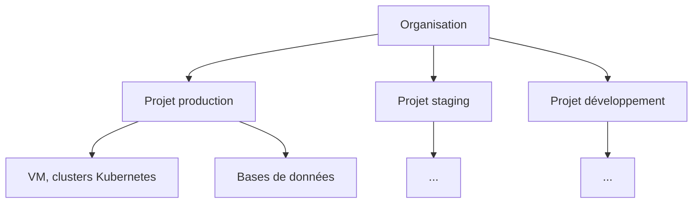

# Concepts clés d'Hikube

Cette page présente les notions à connaître pour utiliser Hikube : comment vos ressources sont organisées, comment vous les pilotez, et ce que la plateforme gère pour vous.

---

## La console Hikube

Toutes les opérations courantes se font dans la **console web** : [https://console.hikube.cloud](https://console.hikube.cloud). Vous vous y connectez avec votre compte Hikube (authentification unique). Depuis la console, vous créez, modifiez et supprimez vos ressources, consultez leur état et leur coût estimé, et récupérez les informations de connexion.

Le menu latéral d'un projet regroupe les services :

| Section | Services |
|---------|----------|
| **Tableau de bord** | Vue d'ensemble du projet, quotas, coûts, ressources récentes |
| **Infrastructure** | **Instances VM**, **Disques**, **Buckets S3**, **Kubernetes**, **Réseau** |
| **DB & Messaging** | **PostgreSQL**, **MariaDB**, **MongoDB**, **Redis**, **RabbitMQ** |

---

## Organisation et projets

### Organisation

L'**organisation** représente votre entreprise. Elle est créée par Hidora lors de l'ouverture de votre compte et regroupe vos utilisateurs et vos projets. Si vous avez accès à plusieurs organisations, vous en changez depuis le menu de profil (**Changer d'organisation**).

### Projet

Un **projet** est un espace isolé au sein de l'organisation. Chaque ressource (VM, disque, cluster, base de données…) appartient à un seul projet. Un projet apporte :

- **l'isolation** : les ressources d'un projet ne voient pas celles des autres projets ;
- **des quotas** : limites de CPU, de mémoire et de stockage, qui plafonnent la consommation du projet ;
- **un suivi des coûts** : le tableau de bord du projet estime le coût mensuel de ses ressources.

Un usage courant consiste à créer un projet par environnement (production, staging, développement) ou par équipe.

:::note Ancienne terminologie
Dans les versions précédentes de la documentation, un projet était appelé **tenant**.
:::

### Quotas

Les quotas d'un projet se définissent à sa création (étape **Quotas** de l'assistant) et se modifient ensuite dans les paramètres du projet. Les assistants de création affichent l'impact de chaque nouvelle ressource sur le quota avant de la créer. Un quota ne peut pas descendre sous ce que le projet consomme déjà : libérez d'abord des ressources.

### Supprimer un projet

La suppression d'un projet (paramètres du projet → **Zone dangereuse** → **Supprimer ce projet**) détruit définitivement toutes ses ressources : VM, clusters Kubernetes, bases de données, disques, buckets S3 et réseaux. Cette action est réservée aux administrateurs du projet ou de l'organisation.

---

## Services managés

Hikube opère pour vous l'infrastructure sous-jacente de chaque service : haute disponibilité, réplication du stockage entre datacenters, mises à jour de la plateforme. Vous choisissez la taille et la configuration ; la plateforme provisionne et maintient.

| Famille | Services |
|---------|----------|
| Calcul | [Machines virtuelles](../services/compute/overview.md), [GPU](../services/gpu/overview.md) |
| Conteneurs | [Kubernetes managé](../services/kubernetes/overview.md) |
| Stockage | [Disques](../services/storage/disks/overview.md), [Buckets S3](../services/storage/buckets/overview.md) |
| Réseau | [VPC et sous-réseaux](../services/networking/overview.md) |
| Bases de données | [PostgreSQL](../services/databases/postgresql/overview.md), [MariaDB](../services/databases/mariadb/overview.md), [MongoDB](../services/databases/mongodb/overview.md), [Redis](../services/databases/redis/overview.md) |
| Messagerie | [RabbitMQ](../services/messaging/rabbitmq/overview.md) |

Certains services (ClickHouse, Kafka, NATS) ne sont pas encore proposés en libre-service dans la console : ils sont provisionnés à la demande par le support.

---

## Souveraineté et disponibilité

- **Données en Suisse** : toutes les données restent hébergées sur le territoire suisse.
- **Trois datacenters** : le stockage répliqué est réparti sur trois datacenters géographiquement distincts.
- **Isolation réseau** : chaque projet dispose de son propre périmètre réseau.

---

## Prochaines étapes

- **[Démarrage rapide](./quick-start.md)** : créez votre premier projet et votre premier cluster
- **[Machines virtuelles](../services/compute/overview.md)** : déployez une VM Linux ou Windows
- **[FAQ](../resources/faq.md)** : questions fréquentes
