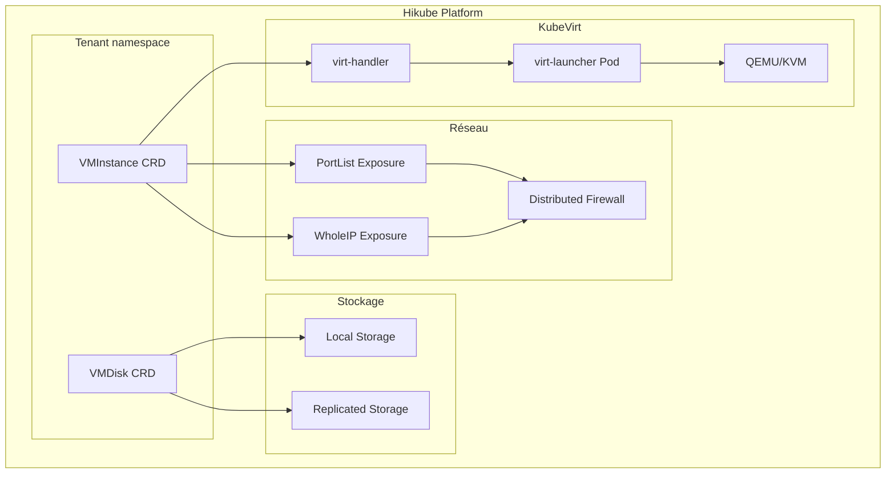
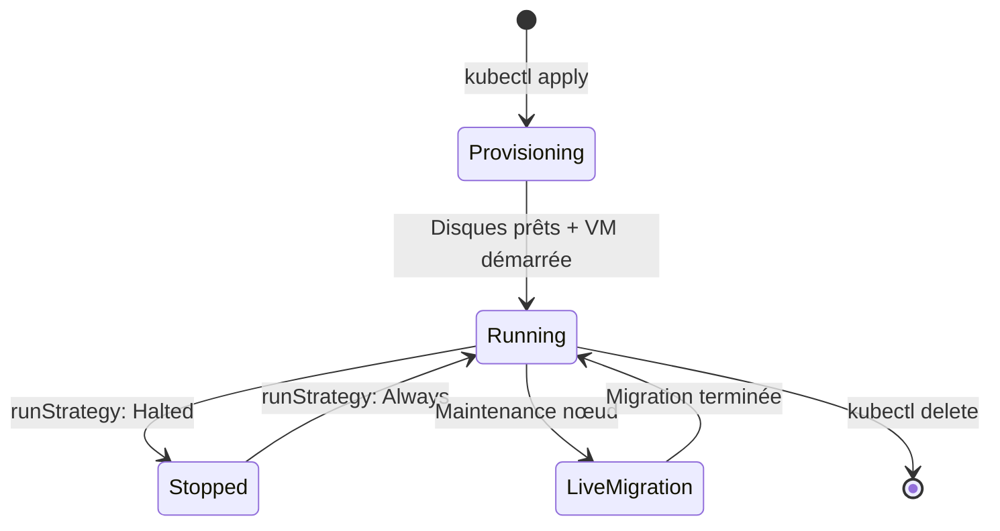

# Concepts — Machines virtuelles

## Architecture

Hikube fournit des machines virtuelles (VM) grâce à **KubeVirt**, une technologie qui permet d'exécuter des VM directement au sein de l'infrastructure Kubernetes. Chaque VM est gérée comme une ressource Kubernetes native, offrant une intégration transparente avec l'écosystème cloud-native.

---

## Terminologie

| Terme | Description |
|-------|-------------|
| **VMInstance** | Ressource Kubernetes (`apps.cozystack.io/v1alpha1`) représentant une machine virtuelle. Gère le cycle de vie, les disques, le réseau et le cloud-init. |
| **VMDisk** | Ressource Kubernetes représentant un disque virtuel. Peut être créé à partir d'une image Golden, d'une source HTTP ou vide. |
| **Golden Image** | Image OS pré-configurée et optimisée pour KubeVirt (AlmaLinux, Rocky, Debian, Ubuntu, etc.). |
| **Instance Type** | Profil de ressources CPU/RAM défini par une série (S, U, M) et une taille. |
| **cloud-init** | Mécanisme d'initialisation automatique des VM au premier démarrage (utilisateurs, packages, scripts). |
| **PortList** | Méthode d'exposition réseau qui expose des ports spécifiques avec firewalling automatique sur l'IP dédiée (recommandé). |
| **WholeIP** | Méthode d'exposition réseau qui attribue une IP publique dédiée à la VM. |

---

## Types d'instances

Hikube propose trois séries d'instances avec des ratios CPU/RAM différents :

| Série | Ratio CPU:RAM | Cas d'usage |
|-------|---------------|-------------|
| **S (Standard)** | 1:2 | Workloads généraux, CPU partagé, burstable |
| **U (Universal)** | 1:4 | Workloads équilibrés, plus de mémoire |
| **M (Memory)** | 1:8 | Applications memory-intensive (caches, bases de données) |

Chaque série va de `small` (1-2 vCPU) à `8xlarge` (32-64 vCPU).

---

## Stockage

Deux classes de stockage sont disponibles pour les disques des VM :

| Classe | Caractéristique | Cas d'usage |
|--------|-----------------|-------------|
| **local** | Stockage sur le nœud physique, performances maximales | Données éphémères, caches, tests |
| **replicated** | Réplication sur plusieurs nœuds/régions | Données de production, haute disponibilité |

:::tip
Utilisez `storageClass: replicated` pour les disques système en production. Le stockage `local` offre de meilleures performances I/O mais ne survit pas à une panne de nœud.
:::

---

## Réseau et exposition

### PortList (recommandé)

Le mode **PortList** expose uniquement les ports spécifiés via une IP dédiée à la VM avec firewalling automatique sur le Service. C'est la méthode recommandée car elle :
- Limite la surface d'attaque
- Attribue une IP dédiée à la VM
- Supporte les ports TCP standard (22, 80, 443, etc.)

### WholeIP

Le mode **WholeIP** attribue une IP publique dédiée avec tous les ports ouverts. Utile quand :
- La VM doit être accessible sur des ports dynamiques
- Un protocole nécessite une IP dédiée (VPN, SIP, etc.)
- La VM sert de gateway ou de VPN

---

## Cycle de vie d'une VM

Les VM Hikube supportent :
- **Démarrage/arrêt** via le champ `spec.runStrategy`
- **Live migration** transparente lors de maintenances
- **Auto-restart** en cas de panne du nœud hôte
- **Snapshots** pour la sauvegarde ponctuelle

---

## Isolation et sécurité

Chaque VM bénéficie d'une isolation multi-niveaux :

- **Isolation kernel** : KubeVirt exécute chaque VM dans son propre processus QEMU/KVM
- **Isolation réseau** : pare-feu distribué entre les tenants
- **Isolation stockage** : chaque disque est un volume dédié

---

## Limites et quotas

| Paramètre | Limite |
|-----------|--------|
| vCPU par VM | Jusqu'à 64 (série S `s1.8xlarge`) |
| RAM par VM | Jusqu'à 256 GB (série M `m1.8xlarge`) |
| Disques par VM | Multiples (système + données) |
| Taille disque | Variable, selon le quota du tenant |

---

## Pour aller plus loin

- [Overview](./overview.md) : présentation détaillée du service
- [Référence API](./api-reference.md) : liste complète des paramètres VMInstance et VMDisk
