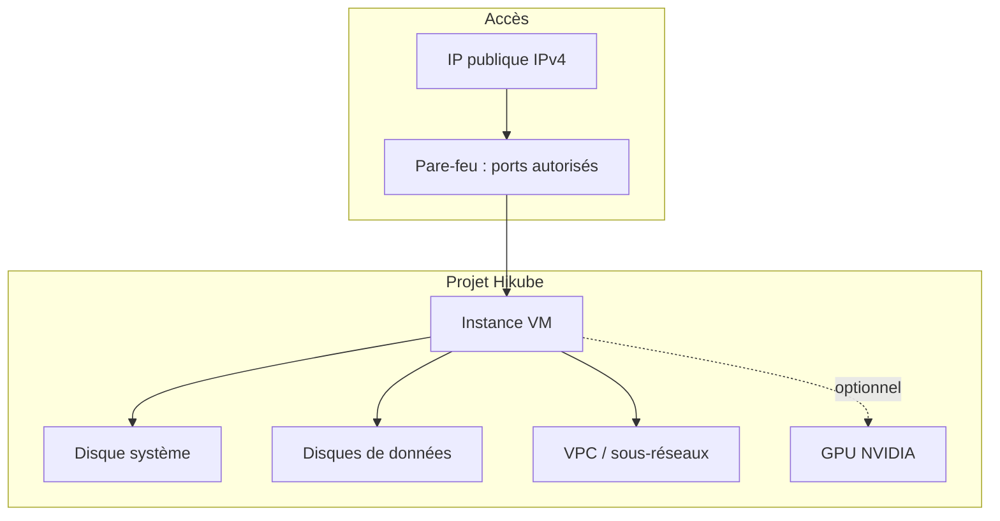
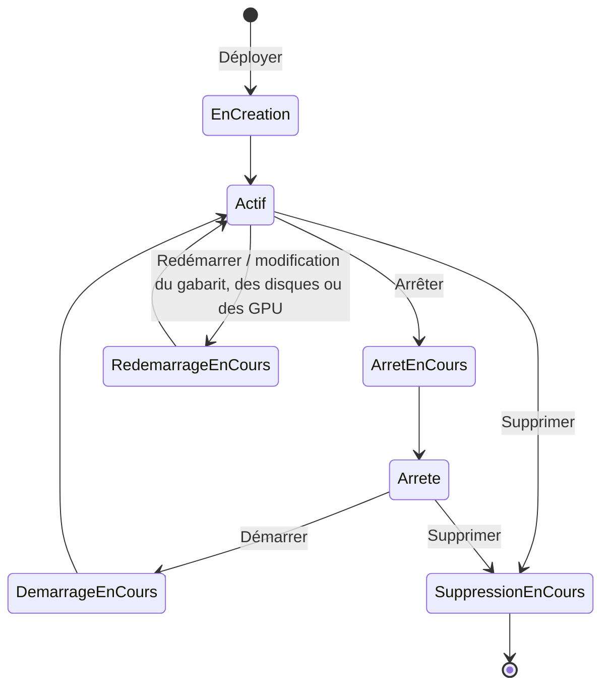

# Concepts — Machines virtuelles

## Architecture

Une **instance VM** Hikube regroupe un gabarit de calcul (vCPU et RAM), un ou plusieurs disques, une configuration réseau et, en option, des GPU. Vous les pilotez depuis la console.

```mermaid
graph TB
    subgraph "Projet Hikube"
        VM[Instance VM]
        SYS[Disque système]
        DATA[Disques de données]
        VPC[VPC / sous-réseaux]
        GPU[GPU NVIDIA]
    end

    subgraph "Accès"
        PUB[IP publique IPv4]
        FW[Pare-feu : ports autorisés]
    end

    VM --> SYS
    VM --> DATA
    VM --> VPC
    VM -.optionnel.-> GPU
    PUB --> FW --> VM
```

---

## Terminologie

| Terme | Description |
|-------|-------------|
| **Projet** | Espace isolé qui regroupe vos ressources et porte des quotas (CPU, Mémoire, Stockage). Anciennement appelé *tenant*. |
| **Instance VM** | Machine virtuelle. Son nom (3 à 16 caractères, minuscules, chiffres et tirets, commençant par une lettre) n'est plus modifiable après création. |
| **Type d'instance** | Gabarit CPU/RAM, défini par une série (S, U, M) et une taille (par exemple `u1.xlarge`). |
| **Image système** | Système d'exploitation installé sur le disque système (Ubuntu, Debian, Rocky Linux, Windows Server…). |
| **Disque système** | Premier disque de la VM, celui qui démarre. Il porte par défaut le nom de la VM. |
| **Disque de données** | Disque supplémentaire, vide à la création. Il apparaît dans l'OS comme un périphérique bloc additionnel (`/dev/vdb`, `/dev/vdc`…). |
| **Réplication** | Mode de copie des données d'un disque sur plusieurs nœuds : **Asynchrone** ou **Synchrone**. |
| **Pare-feu** | Filtrage du trafic entrant sur l'IP publique : seuls les ports autorisés sont ouverts. |
| **VPC** | Réseau privé du projet, découpé en sous-réseaux, auquel une VM peut être reliée. Voir [Réseau](../networking/concepts.md). |
| **cloud-init (User Data)** | Script d'initialisation exécuté au démarrage de la VM (paquets, utilisateurs, commandes). Non disponible pour Windows. |

---

## Types d'instance

| Série | Libellé dans la console | Ratio vCPU:RAM | Tailles |
|-------|-------------------------|----------------|---------|
| `s1` | **Standard (S)** | 1:2 | `small` (1 vCPU) à `8xlarge` (64 vCPU) |
| `u1` | **Universel (U)** | 1:4 | `medium` (1 vCPU) à `8xlarge` (32 vCPU) |
| `m1` | **Mémoire (M)** | 1:8 | `large` (2 vCPU) à `8xlarge` (32 vCPU) |

Le détail des tailles figure dans la [vue d'ensemble](./overview.md#types-dinstance).

---

## Stockage

Chaque disque créé avec la VM se configure dans l'étape **Stockage** de l'assistant :

| Paramètre | Valeurs | Remarques |
|-----------|---------|-----------|
| **Nom du volume** | Généré à partir du nom de la VM (`ma-vm`, `ma-vm-2`…) | Modifiable |
| **Taille (Go)** | 20 Go minimum, 4096 Go maximum | 50 Go minimum pour Windows, 40 Go pour Oracle Linux |
| **Type de réplication** | **Réplication Asynchrone** (Recommandé) ou **Réplication Synchrone** | Voir ci-dessous |
| **Chiffrement du disque** | Activé / désactivé | Chiffrement LUKS des données au repos |

| Mode | RTO | RPO | Usage |
|------|-----|-----|-------|
| **Réplication Asynchrone** | < 5 min | < 5 min | Choix par défaut, adapté à la majorité des usages |
| **Réplication Synchrone** | < 5 min | < 1 min | Données pour lesquelles la perte maximale tolérée doit être minimale |

Un disque peut aussi être **Existant** : il est alors choisi parmi les disques du projet qui ne sont attachés à aucune VM. Le disque système ne peut être qu'un disque contenant une image ; les disques de données ne peuvent être que des disques sans image.

Les disques sont des ressources à part entière, gérées dans le menu **Disques** : voir [Disques](../storage/disks/concepts.md).

---

## Réseau

| Option de l'assistant | Défaut | Effet |
|-----------------------|--------|-------|
| **Adresse IPv4 Publique** | Activée | La VM reçoit une IP publique joignable depuis Internet. |
| **Activer le Pare-feu** | Activé | Seuls les **Ports Autorisés** sont ouverts en entrée (SSH 22 coché par défaut ; HTTP 80, HTTPS 443 et ports personnalisés en option). |
| Pare-feu désactivé | — | Tous les ports de l'IP publique sont ouverts. Protégez alors la VM avec un pare-feu dans l'OS. |
| **Réseaux VPC (Secondaires)** | Aucun | Chaque sous-réseau sélectionné ajoute une interface réseau privée à la VM. |

---

## Cycle de vie

```mermaid
stateDiagram-v2
    [*] --> EnCreation: Déployer
    EnCreation --> Actif
    Actif --> ArretEnCours: Arrêter
    ArretEnCours --> Arrete
    Arrete --> DemarrageEnCours: Démarrer
    DemarrageEnCours --> Actif
    Actif --> RedemarrageEnCours: Redémarrer / modification du gabarit, des disques ou des GPU
    RedemarrageEnCours --> Actif
    Actif --> SuppressionEnCours: Supprimer
    Arrete --> SuppressionEnCours: Supprimer
    SuppressionEnCours --> [*]
```

Statuts affichés dans la console : **En création**, **Actif**, **Démarrage en cours**, **Arrêt en cours**, **Arrêté**, **Redémarrage en cours**, **Suppression en cours**, **Erreur**, **Échec**, **Inconnu**.

L'option **Redémarrage Automatique** (étape **Configuration** de l'assistant, ou **Configuration avancée** en modification) fait redémarrer la VM automatiquement en cas de crash inattendu. Elle est désactivée par défaut.

---

## Ce qui est modifiable après création

| Élément | Modifiable | Effet |
|---------|-----------|-------|
| Nom, image système | Non | — |
| Type d'instance | Oui | Redémarrage de la VM |
| Disques (ajout, détachement) | Oui | Redémarrage de la VM |
| GPU | Oui | Redémarrage de la VM |
| IP publique, pare-feu, ports, VPC | Oui | Appliqué sans redémarrage |
| Clés SSH | Oui | Proposition de recharger le user-data, appliqué au redémarrage suivant |
| Script cloud-init, redémarrage automatique | Oui | Script rejoué après **Recharger UserData** et redémarrage |

---

## Quotas

Chaque projet dispose de quotas **CPU**, **Mémoire** et **Stockage**. L'assistant affiche la consommation actuelle, l'ajout prévu et le total ; le bouton **Suivant** reste désactivé tant que la nouvelle VM dépasse un quota. Le même contrôle s'applique au bouton **Enregistrer** lors d'une modification.

L'assistant affiche aussi une estimation du coût de la VM : type d'instance, nouveaux disques, GPU, licence Windows le cas échéant et IP publique.

---

## Pour aller plus loin

- [Vue d'ensemble](./overview.md)
- [Démarrage rapide](./quick-start.md)
- [Disques](../storage/disks/overview.md)
- [Réseau : VPC et sous-réseaux](../networking/overview.md)
