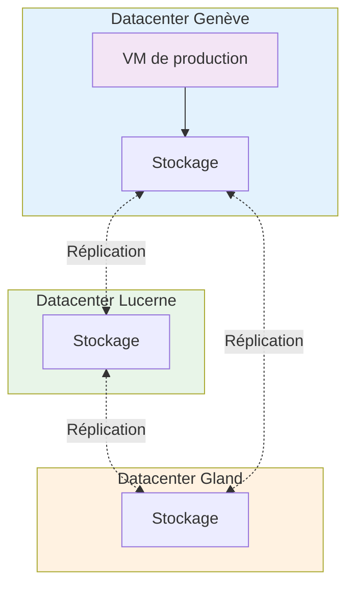

import NavigationFooter from '@site/src/components/NavigationFooter';

# Machines virtuelles sur Hikube

Les **machines virtuelles (VM)** d'Hikube offrent une virtualisation complète de l'infrastructure matérielle, pour exécuter des systèmes d'exploitation hétérogènes et des applications métier dans des environnements cloisonnés.

Dans la [console Hikube](https://console.hikube.cloud), les VM se gèrent depuis le menu **Infrastructure** > **Instances VM** : création guidée, démarrage et arrêt, modification des ressources, des disques et du réseau, suppression.

---

## Ce que vous pouvez faire depuis la console

| Besoin | Où le faire |
|--------|-------------|
| Créer une VM (image, gabarit, disques, réseau, clés SSH, cloud-init, GPU) | **Instances VM** > **Créer une Instance** |
| Démarrer, arrêter, redémarrer | Menu **Actions** de la liste, ou section **Actions** de la page de détail |
| Changer de gabarit, ajouter un disque ou un GPU, modifier les ports ouverts | Page de détail > **Modifier** |
| Rejouer le script cloud-init | **Recharger UserData**, puis **Redémarrer** |
| Obtenir la commande SSH prête à copier | Page de détail, section **Réseau et Sécurité** > **Connexion SSH** |
| Relier la VM à un réseau privé | Étape **Réseau** de l'assistant, ou menu **Réseau** (voir [VPC et sous-réseaux](../networking/overview.md)) |

---

## Architecture et fonctionnement

### Séparation calcul et stockage

Hikube découple le calcul et le stockage :

**Couche calcul**

- La VM s'exécute sur des serveurs physiques répartis sur 3 datacenters.
- Si le nœud qui l'héberge tombe en panne, la VM est redémarrée sur un autre nœud.
- L'indisponibilité se limite au temps de redémarrage.

**Couche stockage**

- Les disques des VM sont **répliqués** sur plusieurs nœuds physiques, en mode synchrone ou asynchrone (choix fait disque par disque dans l'assistant).
- Les disques survivent aux pannes matérielles et restent attachables à la VM relocalisée.
- Ils existent indépendamment de la VM : supprimer une VM détache ses disques sans les supprimer. Ils restent visibles dans le menu **Disques** (voir [Disques](../storage/disks/overview.md)).

### Architecture multi-datacenter

---

## Types d'instance

À l'étape **Configuration** de l'assistant, la console propose trois séries. Choisissez d'abord la série, puis la taille de l'instance.

### Série Standard (S) — ratio 1:2

*Usage économique, pour le développement et les tests.*

| Instance | vCPU | RAM |
|----------|------|-----|
| `s1.small` | 1 | 2 Go |
| `s1.medium` | 2 | 4 Go |
| `s1.large` | 4 | 8 Go |
| `s1.xlarge` | 8 | 16 Go |
| `s1.3large` | 12 | 24 Go |
| `s1.2xlarge` | 16 | 32 Go |
| `s1.3xlarge` | 24 | 48 Go |
| `s1.4xlarge` | 32 | 64 Go |
| `s1.8xlarge` | 64 | 128 Go |

### Série Universel (U) — ratio 1:4

*Usage général : serveurs web, applications.*

| Instance | vCPU | RAM |
|----------|------|-----|
| `u1.medium` | 1 | 4 Go |
| `u1.large` | 2 | 8 Go |
| `u1.xlarge` | 4 | 16 Go |
| `u1.2xlarge` | 8 | 32 Go |
| `u1.4xlarge` | 16 | 64 Go |
| `u1.8xlarge` | 32 | 128 Go |

### Série Mémoire (M) — ratio 1:8

*Optimisée mémoire : bases de données, caches.*

| Instance | vCPU | RAM |
|----------|------|-----|
| `m1.large` | 2 | 16 Go |
| `m1.xlarge` | 4 | 32 Go |
| `m1.2xlarge` | 8 | 64 Go |
| `m1.3xlarge` | 12 | 96 Go |
| `m1.4xlarge` | 16 | 128 Go |
| `m1.8xlarge` | 32 | 256 Go |

:::tip Guide de sélection
- **Développement, tests, services légers** : série **S**.
- **Applications web et métier** : série **U**.
- **Bases de données, caches, analytique** : série **M**.

Le gabarit se change après coup depuis **Modifier** ; la VM redémarre pour appliquer le changement.
:::

---

## Systèmes d'exploitation

Le disque système est créé à partir d'une image fournie par Hikube. L'assistant affiche les images disponibles sous forme de cartes, avec un sélecteur de version :

| Image | Versions |
|-------|----------|
| AlmaLinux | 8, 9 |
| CentOS Stream | 9, 10 |
| CloudLinux | 8, 9 |
| Debian | 12, 13 |
| openSUSE | 15.6, 16.0 |
| Oracle Linux | 8, 9, 10 |
| Rocky Linux | 8, 9, 10 |
| Ubuntu | 22.04, 24.04 |
| Windows Server | 2022, 2025 |

La liste affichée dans la console fait foi : elle évolue avec les versions supportées.

:::note Image personnalisée
L'import d'une image personnalisée (ISO ou QCOW2 depuis une URL HTTPS) se fait en créant un disque dans le menu **Disques**. Ce disque peut ensuite être choisi comme disque système d'une nouvelle VM (option **Existant**). Voir [Créer un disque système à partir d'une image](../storage/disks/how-to/create-from-image.md).
:::

---

## Connectivité et accès

- **IP publique** : option **Adresse IPv4 Publique**, activée par défaut. La VM est alors accessible depuis Internet.
- **Pare-feu** : option **Activer le Pare-feu**, activée par défaut. Seuls les ports cochés (22 par défaut ; 80, 443 ou tout port personnalisé en option) sont ouverts en entrée. Sans pare-feu, tous les ports de l'IP publique sont ouverts.
- **Réseaux privés** : la VM peut être reliée à un ou plusieurs [VPC](../networking/overview.md) pour communiquer en privé avec d'autres VM du projet.
- **SSH** : la page de détail affiche la commande `ssh <utilisateur>@<ip>` prête à copier. L'accès se fait avec les clés SSH publiques saisies dans l'assistant.
- **Windows** : un mot de passe administrateur est généré à la création et affiché une seule fois. L'accès se fait en RDP.

:::note Console série et VNC
L'accès console série ou VNC n'est pas proposé dans la console ; contactez le [support](mailto:support@hidora.io) si vous en avez besoin pour un diagnostic.
:::

---

## Isolation et sécurité

- Chaque **projet** est un espace isolé : les VM d'un projet ne voient pas celles d'un autre.
- Chaque VM s'exécute dans son propre processus de virtualisation, isolé au niveau du noyau.
- Les disques peuvent être **chiffrés au repos** (LUKS), option **Chiffrement du disque** à la création.

---

## Prochaines étapes

- [Créer votre première VM](./quick-start.md)
- [Comprendre les concepts](./concepts.md)
- [Configurer le réseau et le pare-feu](./how-to/configure-network.md)

<NavigationFooter
  nextSteps={[
    {label: "Concepts", href: "../concepts"},
    {label: "Démarrage rapide", href: "../quick-start"},
  ]}
/>
