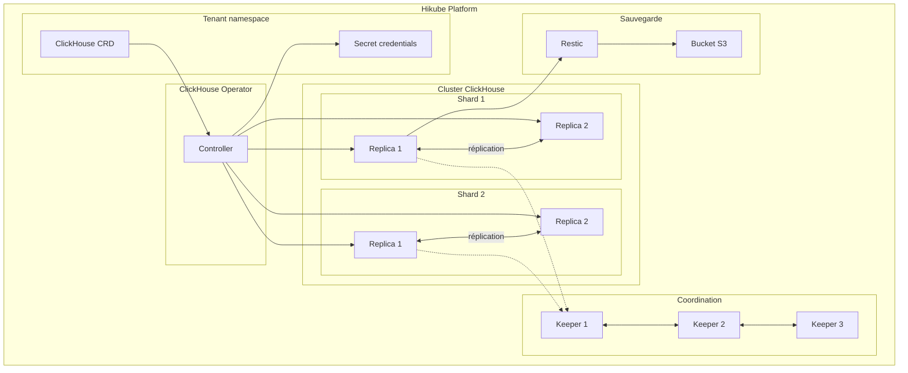
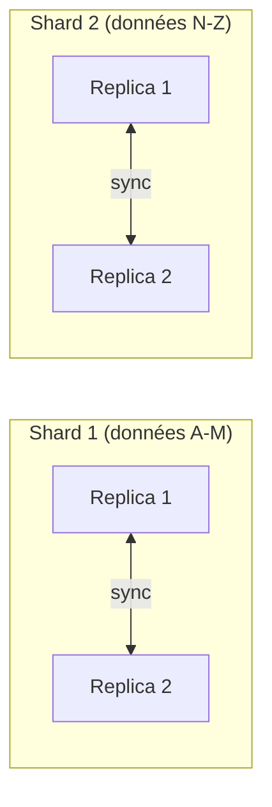

# Concepts — ClickHouse

## Architecture

ClickHouse sur Hikube est un service managé basé sur l'opérateur **ClickHouse Operator**. C'est une base de données SQL orientée colonnes, optimisée pour l'analyse de données (OLAP). L'architecture repose sur des **shards** (partitionnement horizontal) et des **réplicas** (haute disponibilité), coordonnés par **ClickHouse Keeper**.

---

## Terminologie

| Terme | Description |
|-------|-------------|
| **ClickHouse** | Ressource Kubernetes (`apps.cozystack.io/v1alpha1`) représentant un cluster ClickHouse managé. |
| **Shard** | Partition horizontale des données. Chaque shard contient un sous-ensemble des données totales. |
| **Replica** | Copie d'un shard. Assure la redondance et permet la lecture parallèle. |
| **ClickHouse Keeper** | Service de coordination distribué (alternative à ZooKeeper) qui gère la réplication et le consensus entre les nœuds. |
| **Restic** | Outil de sauvegarde pour créer des snapshots chiffrés vers un stockage S3. |
| **OLAP** | Online Analytical Processing — modèle d'accès aux données optimisé pour les requêtes analytiques (agrégations, scans de colonnes). |
| **resourcesPreset** | Profil de ressources prédéfini (nano à 2xlarge). |

---

## Sharding et réplication

### Sharding

Le sharding distribue les données horizontalement entre plusieurs nœuds :

- Chaque **shard** contient une partie des données
- Les requêtes `SELECT` sont exécutées en parallèle sur tous les shards
- Le paramètre `shards` dans le manifeste détermine le nombre de partitions

### Réplication

Chaque shard peut avoir plusieurs réplicas :

- Les réplicas d'un même shard contiennent des **données identiques**
- La coordination est assurée par **ClickHouse Keeper**
- En cas de panne d'une réplica, les lectures sont redirigées vers les autres

:::tip
Pour les petits volumes de données, un seul shard avec 2 réplicas suffit. Ajoutez des shards quand le volume dépasse les capacités d'un seul nœud.
:::

---

## ClickHouse Keeper

ClickHouse Keeper remplace ZooKeeper pour la coordination du cluster :

- Gère le **consensus** entre les réplicas (protocole Raft)
- Stocke les **métadonnées** du cluster (tables distribuées, réplication)
- Nécessite un nombre **impair** d'instances (3 recommandé) pour le quorum

| Paramètre Keeper | Description |
|-------------------|-------------|
| `keeper.replicas` | Nombre d'instances Keeper (3 recommandé) |
| `keeper.resources` / `keeper.resourcesPreset` | Ressources allouées au Keeper |
| `keeper.size` | Taille du stockage Keeper |

---

## Sauvegarde

ClickHouse sur Hikube utilise **Restic** pour les sauvegardes, avec le même modèle que MySQL :

- Snapshots **chiffrés** stockés dans un bucket S3
- Planification via cron (`backup.schedule`)
- Stratégie de rétention configurable (`backup.cleanupStrategy`)

---

## Gestion des utilisateurs

Les utilisateurs sont déclarés dans le manifeste avec :

- **Mot de passe** pour l'authentification
- **Flag readonly** : `true` pour un accès en lecture seule, `false` pour l'accès complet

Un utilisateur `admin` est créé automatiquement avec les droits complets.

---

## Presets de ressources

| Preset | CPU | Mémoire |
|--------|-----|---------|
| `nano` | 250m | 128Mi |
| `micro` | 500m | 256Mi |
| `small` | 1 | 512Mi |
| `medium` | 1 | 1Gi |
| `large` | 2 | 2Gi |
| `xlarge` | 4 | 4Gi |
| `2xlarge` | 8 | 8Gi |

---

## Limites et quotas

| Paramètre | Valeur |
|-----------|--------|
| Shards max | Selon quota tenant |
| Réplicas par shard | Selon quota tenant |
| Taille stockage (`size`) | Variable (en Gi) |
| Keeper instances | 3 recommandé (impair) |

---

## Pour aller plus loin

- [Overview](./overview.md) : présentation du service
- [Référence API](./api-reference.md) : tous les paramètres de la ressource ClickHouse
