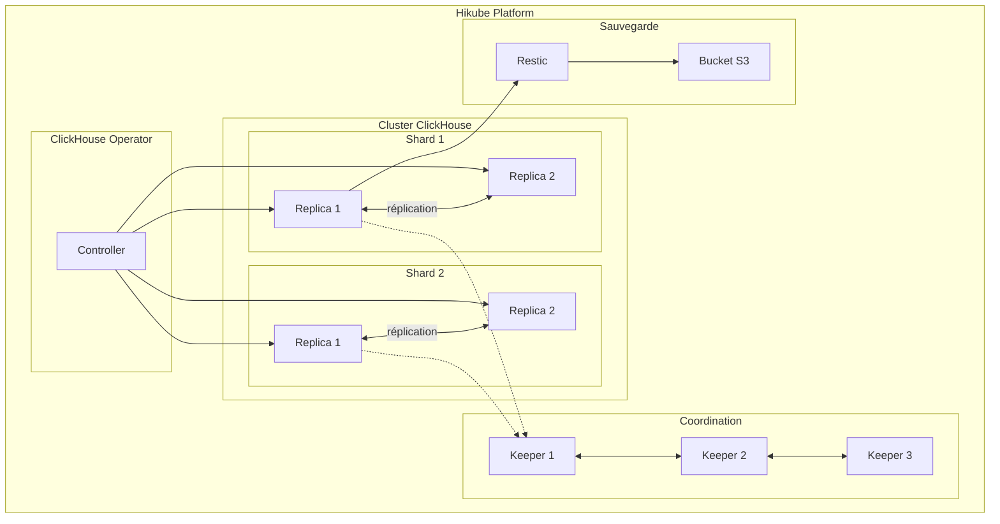
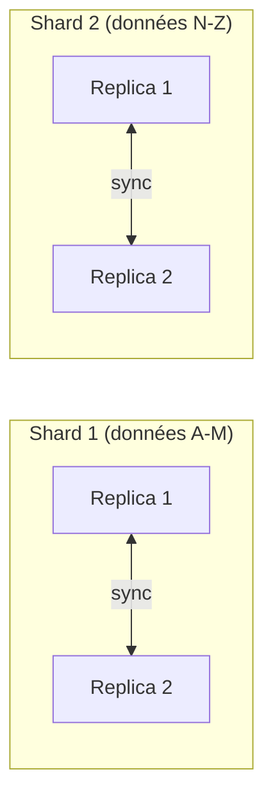

# Concepts — ClickHouse

:::info Disponibilité
ClickHouse n'est pas encore disponible en libre-service dans la [console Hikube](https://console.hikube.cloud).
Pour en provisionner une instance ou modifier sa configuration, [contactez le support](mailto:support@hidora.io).
:::

## Architecture

ClickHouse sur Hikube est un service managé basé sur l'opérateur **ClickHouse Operator**. C'est une base de données SQL orientée colonnes, optimisée pour l'analyse de données (OLAP). L'architecture repose sur des **shards** (partitionnement horizontal) et des **réplicas** (haute disponibilité), coordonnés par **ClickHouse Keeper**.

```mermaid
graph TB
    subgraph "Hikube Platform"
        subgraph "ClickHouse Operator"
            OP[Controller]
        end

        subgraph "Cluster ClickHouse"
            subgraph "Shard 1"
                S1R1[Replica 1]
                S1R2[Replica 2]
            end
            subgraph "Shard 2"
                S2R1[Replica 1]
                S2R2[Replica 2]
            end
        end

        subgraph "Coordination"
            K1[Keeper 1]
            K2[Keeper 2]
            K3[Keeper 3]
        end

        subgraph "Sauvegarde"
            S3[Bucket S3]
            RES[Restic]
        end
    end

    OP --> S1R1
    OP --> S1R2
    OP --> S2R1
    OP --> S2R2
    S1R1 <-->|réplication| S1R2
    S2R1 <-->|réplication| S2R2
    K1 <--> K2
    K2 <--> K3
    S1R1 -.-> K1
    S2R1 -.-> K1
    S1R1 --> RES
    RES --> S3
```

---

## Terminologie

| Terme | Description |
|-------|-------------|
| **Cluster ClickHouse** | Instance managée ClickHouse, provisionnée sur demande dans votre projet. |
| **Shard** | Partition horizontale des données. Chaque shard contient un sous-ensemble des données totales. |
| **Replica** | Copie d'un shard. Assure la redondance et permet la lecture parallèle. |
| **ClickHouse Keeper** | Service de coordination distribué (alternative à ZooKeeper) qui gère la réplication et le consensus entre les nœuds. |
| **Restic** | Outil de sauvegarde pour créer des snapshots chiffrés vers un stockage S3. |
| **OLAP** | Online Analytical Processing — modèle d'accès aux données optimisé pour les requêtes analytiques (agrégations, scans de colonnes). |
| **Preset** | Profil de ressources prédéfini (nano à 2xlarge) alloué à chaque réplica. |

---

## Sharding et réplication

### Sharding

Le sharding distribue les données horizontalement entre plusieurs nœuds :

- Chaque **shard** contient une partie des données
- Les requêtes `SELECT` sont exécutées en parallèle sur tous les shards
- Le nombre de shards est fixé lors du provisionnement

### Réplication

Chaque shard peut avoir plusieurs réplicas :

- Les réplicas d'un même shard contiennent des **données identiques**
- La coordination est assurée par **ClickHouse Keeper**
- En cas de panne d'une réplica, les lectures sont redirigées vers les autres

```mermaid
graph LR
    subgraph "Shard 1 (données A-M)"
        R1A[Replica 1]
        R1B[Replica 2]
    end
    subgraph "Shard 2 (données N-Z)"
        R2A[Replica 1]
        R2B[Replica 2]
    end

    R1A <-->|sync| R1B
    R2A <-->|sync| R2B
```

:::tip
Pour les petits volumes de données, un seul shard avec 2 réplicas suffit. Ajoutez des shards quand le volume dépasse les capacités d'un seul nœud.
:::

---

## ClickHouse Keeper

ClickHouse Keeper remplace ZooKeeper pour la coordination du cluster :

- Gère le **consensus** entre les réplicas (protocole Raft)
- Stocke les **métadonnées** du cluster (tables distribuées, réplication)
- Nécessite un nombre **impair** d'instances (3 recommandé) pour le quorum

Le nombre d'instances Keeper, leurs ressources et leur stockage sont définis lors du provisionnement.

---

## Sauvegarde

ClickHouse sur Hikube utilise **Restic** pour les sauvegardes :

- Snapshots **chiffrés** stockés dans un bucket S3
- Planification régulière
- Stratégie de rétention configurable

La mise en place des sauvegardes se fait sur demande auprès du support.

---

## Gestion des utilisateurs

Les utilisateurs sont définis lors du provisionnement, avec :

- **Mot de passe** pour l'authentification
- **Lecture seule** ou **accès complet**

Un utilisateur `admin` est créé automatiquement avec les droits complets.

---

## Presets de ressources

| Preset | CPU | Mémoire |
|--------|-----|---------|
| `nano` | 250m | 128Mi |
| `micro` | 500m | 256Mi |
| `small` | 1 | 512Mi |
| `medium` | 1 | 1Gi |
| `large` | 2 | 2Gi |
| `xlarge` | 4 | 4Gi |
| `2xlarge` | 8 | 8Gi |

---

## Limites et quotas

| Paramètre | Valeur |
|-----------|--------|
| Shards max | Selon les quotas du projet |
| Réplicas par shard | Selon les quotas du projet |
| Taille du stockage | Variable (en Go) |
| Keeper instances | 3 recommandé (impair) |

---

## Pour aller plus loin

- [Vue d'ensemble](./overview.md) : présentation du service
- [FAQ](./faq.md) : questions fréquentes
