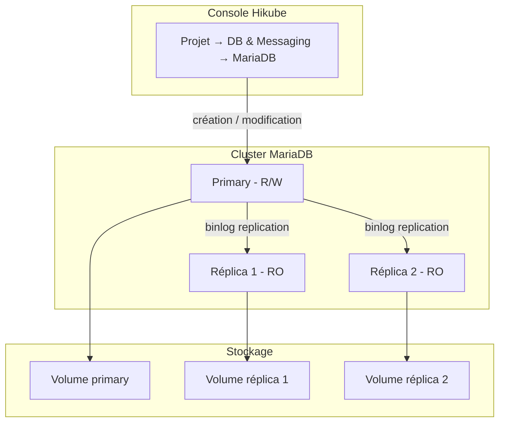
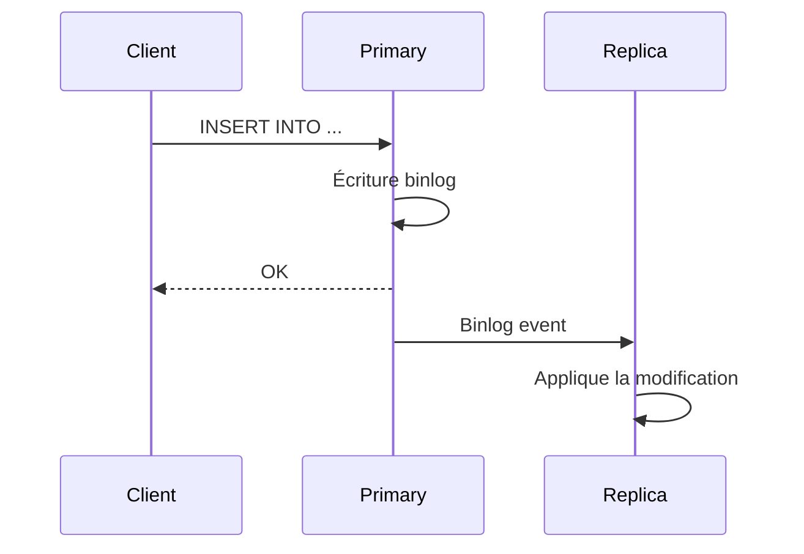

# Concepts — MariaDB

## Architecture

MariaDB sur Hikube est un service managé basé sur l'opérateur **MariaDB-Operator**. MariaDB est un fork de MySQL compatible avec ses clients et son protocole. Chaque cluster créé depuis la console est un ensemble répliqué composé d'un primary et de réplicas éventuels. Il appartient à un **projet** et consomme les quotas de ce projet.

---

## Terminologie

| Terme | Description |
|-------|-------------|
| **Cluster MariaDB** | Instance managée créée depuis la console, composée d'un primary et de réplicas éventuels. |
| **Projet** | Espace isolé qui regroupe vos ressources et porte les quotas. |
| **Primary** | Nœud principal qui accepte les lectures et écritures. |
| **Réplica** | Nœud en lecture seule, synchronisé depuis le primary via la réplication binlog. |
| **MariaDB-Operator** | Opérateur qui gère le déploiement, la réplication et le failover. |
| **Préconfiguration (Preset)** | Gabarit de ressources (CPU, mémoire) alloué à chaque nœud du cluster. |
| **Accès externe** | Option qui expose le cluster sur Internet via une adresse IP publique. |
| **Rôle** | Droit d'un utilisateur sur une base : **Administrateur** ou **Lecture seule**. |

---

## Réplication et haute disponibilité

Le cluster utilise la **réplication binlog** de MariaDB :

1. **Le primary** écrit toutes les modifications dans le binary log
2. **Les réplicas** consomment le binlog et appliquent les modifications
3. **En cas de panne** du primary, l'opérateur promeut automatiquement un réplica

Le **Nombre de réplicas** se choisit à la création :

| Valeur proposée | Usage |
|-----------------|-------|
| **1 (Standalone)** | Développement, tests |
| **3 (Haute disponibilité max)** | Production |
| **5 (Très haute disponibilité)** | Production critique |

:::warning
Le nombre de réplicas et la préconfiguration ne peuvent pas être modifiés après la création. Pour les changer, [contactez le support](mailto:support@hidora.io).
:::

La bascule manuelle du primary (switchover) n'est pas proposée dans la console ; contactez le support.

---

## Utilisateurs, bases et rôles

La page d'un cluster MariaDB comporte une section **Utilisateurs** ; il n'y a pas d'onglet dédié aux bases de données. Les droits se gèrent par utilisateur :

- **Rôle Global (Optionnel)** : **Aucun rôle global**, **Administrateur** ou **Lecture seule (globale)** ;
- **Accès spécifiques (Bases de données)** : une liste de couples **Nom de la base** / **Droits** (**Administrateur (Admin)** ou **Lecture seule (Read-only)**). Accorder un accès sur une base qui n'existe pas encore la crée.

Les utilisateurs déclarés dans l'assistant de création du cluster reçoivent le **Rôle** choisi sur la base système `mysql`, visible dans la colonne **Bases de données** de la liste des utilisateurs. Accordez-leur ensuite l'accès à vos bases applicatives via **Gérer les accès**.

Le mot de passe d'un utilisateur est généré par la plateforme et affiché **une seule fois**. En cas de perte, générez-en un nouveau avec **Changer le mot de passe**.

### Règles de nommage

| Élément | Règle |
|---------|-------|
| Nom du cluster | 3 à 16 caractères : minuscules, chiffres et tirets ; commence par une lettre, se termine par une lettre ou un chiffre |
| Nom d'utilisateur | Minuscules, chiffres et tirets ; commence par une lettre, se termine par une lettre ou un chiffre (3 à 16 caractères dans l'assistant de création du cluster) |
| Nom de base de données | 1 à 63 caractères : minuscules, chiffres et tirets ; commence par une lettre, se termine par une lettre ou un chiffre |

:::note
Les tirets bas (`_`) ne sont pas acceptés dans les noms de base ni dans les noms d'utilisateur.
:::

---

## Préconfigurations

La **Préconfiguration (Preset)** définit la capacité allouée à **chaque nœud** du cluster. La liste affichée par l'assistant fait foi ; à titre indicatif :

| Preset | CPU | Mémoire |
|--------|-----|---------|
| `nano` | 250m | 128Mi |
| `micro` | 500m | 256Mi |
| `small` | 1 | 512Mi |
| `medium` | 1 | 1Gi |
| `large` | 2 | 2Gi |
| `xlarge` | 4 | 4Gi |
| `2xlarge` | 8 | 8Gi |

La définition de ressources CPU/mémoire libres n'est pas proposée dans la console ; contactez le support.

---

## Accès réseau

- **Accès externe désactivé** (par défaut) : le cluster n'est pas exposé sur Internet. Le champ **Hôte (Host)** de la carte **Connexion et réseau** affiche **Non défini**.
- **Accès externe activé** : la plateforme attribue une adresse IP publique, affichée dans le champ **Hôte (Host)**. Le port est le port MySQL standard, `3306`.

---

## Sauvegarde et restauration

La configuration des sauvegardes et la restauration ne sont pas proposées dans la console ; contactez le support. Voir [Configurer les sauvegardes](./how-to/configure-backups.md).

---

## Quotas et coût

L'assistant affiche le **Coût estimé** et l'impact du cluster sur les quotas du projet. Si le cluster dépasse les quotas disponibles, le bouton **Suivant** reste inactif.

| Paramètre | Valeur |
|-----------|--------|
| Versions | 10.6, 10.11, 11.4, 11.8 |
| Réplicas | 1, 3 ou 5 |
| Taille du disque | 1 à 4 096 Go, dans la limite du quota de stockage du projet |

---

## Pour aller plus loin

- [Vue d'ensemble](./overview.md) : présentation du service
- [Démarrage rapide](./quick-start.md) : créer votre premier cluster
