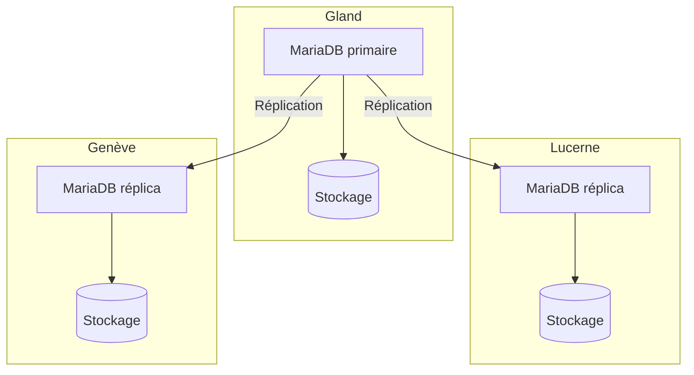

import NavigationFooter from '@site/src/components/NavigationFooter';

# MariaDB sur Hikube

Hikube propose un service **MariaDB managé**. MariaDB est compatible avec le protocole et les clients MySQL : vos applications et outils MySQL existants (`mysql`, `mysqldump`, connecteurs JDBC, PDO, etc.) fonctionnent sans modification.

Le service assure le déploiement d'un cluster répliqué et auto-réparant, que vous créez et administrez depuis la [console Hikube](https://console.hikube.cloud) (menu **DB & Messaging** → **MariaDB**).

:::note
Ce service était auparavant présenté dans cette documentation sous le nom « MySQL ». Le moteur, MariaDB, est inchangé.
:::

---

## Architecture et fonctionnement

La plateforme automatise la gestion du cycle de vie de la base de données : déploiement, mise à jour, réplication et reprise après incident.

L'architecture repose sur un **cluster répliqué** :

- Un **nœud primaire** (primary) gère toutes les opérations d'écriture et assure la cohérence des données.
- Un ou plusieurs **réplicas** reçoivent en continu les transactions par réplication.
- Un mécanisme d'**auto-failover** promeut automatiquement un réplica en nouveau primaire en cas de défaillance.

Cette approche offre :

- **Résilience** en cas de panne matérielle ou logicielle
- **Scalabilité en lecture** grâce à la distribution des requêtes entre les réplicas
- **Simplicité de gestion**, car la plateforme prend en charge la coordination et la maintenance du cluster

---

## Ce que vous gérez depuis la console

| Fonction | Disponible |
|----------|------------|
| Création d'un cluster (version 10.6, 10.11, 11.4 ou 11.8, préconfiguration, taille du disque, 1, 3 ou 5 réplicas, accès externe) | Oui |
| Utilisateurs, rôle global et accès par base (admin / lecture seule), rotation du mot de passe | Oui |
| Modification de la version, de la taille du disque et de l'accès externe | Oui |
| Modification de la préconfiguration ou du nombre de réplicas après création | Non, [contactez le support](mailto:support@hidora.io) |
| Sauvegardes et restauration | Non, [contactez le support](mailto:support@hidora.io) |

---

## Cas d'usage

- **Applications web transactionnelles (OLTP)** : e-commerce, ERP, CRM, où la fiabilité et la rapidité des transactions sont essentielles.
- **CMS et applications PHP** : WordPress, Drupal, Magento et plus généralement toute application conçue pour MySQL.
- **Applications SaaS multi-clients** : une base isolée par client, avec la haute disponibilité de la plateforme.
- **Workloads à forte charge en lecture** : les réplicas permettent de répartir les requêtes.

<NavigationFooter
  nextSteps={[
    {label: "Concepts", href: "../concepts"},
    {label: "Démarrage rapide", href: "../quick-start"},
  ]}
  seeAlso={[
    {label: "Toutes les bases de données", href: "../../"},
  ]}
/>
