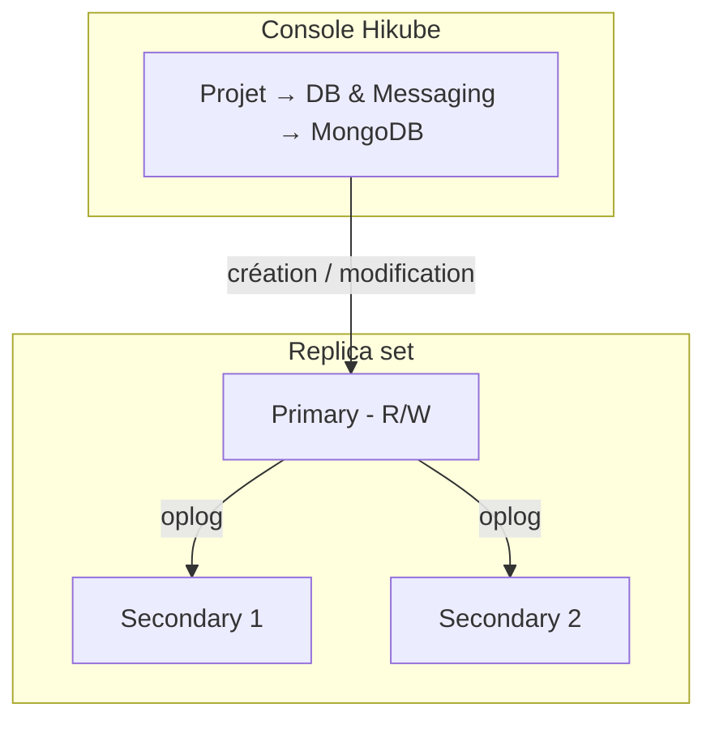

# Concepts — MongoDB

## Architecture

MongoDB sur Hikube est un service managé. Chaque cluster créé depuis la console est, par défaut, un **replica set** : un ensemble de membres qui portent les mêmes données, dont un seul accepte les écritures. Le cluster appartient à un **projet** et consomme les quotas de ce projet.

---

## Terminologie

| Terme | Description |
|-------|-------------|
| **Cluster MongoDB** | Instance managée créée depuis la console. |
| **Projet** | Espace isolé qui regroupe vos ressources et porte les quotas. |
| **Replica set** | Groupe de membres MongoDB qui répliquent les mêmes données. |
| **Primary** | Membre qui accepte les écritures. |
| **Secondary** | Membre qui réplique le primary et peut être élu à sa place en cas de panne. |
| **Oplog** | Journal des opérations du primary, rejoué par les secondaries. |
| **Shard** | Sous-ensemble des données, porté par son propre replica set (topologie shardée). |
| **Serveurs de configuration** | Membres qui stockent les métadonnées de la topologie shardée. |
| **Mongos** | Routeur qui reçoit les requêtes des clients et les dirige vers les bons shards. |
| **Préconfiguration (Preset)** | Gabarit de ressources (CPU, mémoire) alloué à chaque nœud. |

---

## Réplication et haute disponibilité

Les secondaries rejouent en continu l'oplog du primary. Si le primary devient indisponible, les membres restants élisent un nouveau primary ; une majorité de membres doit être disponible pour que l'élection aboutisse.

Le **Nombre de réplicas** se choisit à la création :

| Valeur proposée | Usage |
|-----------------|-------|
| **1 (Standalone)** | Développement, tests |
| **3 (Haute disponibilité max)** | Production : tolère la perte d'un membre |
| **5 (Très haute disponibilité)** | Production critique : tolère la perte de deux membres |

:::warning
Le nombre de réplicas, la préconfiguration et le sharding ne peuvent pas être modifiés après la création. Pour les changer, [contactez le support](mailto:support@hidora.io).
:::

---

## Sharding

L'option **Sharding (Topologie distribuée)** de l'assistant « déploie automatiquement les serveurs de configuration et les routeurs Mongos, et configure les réplicas en tant que Shards ». La console crée alors :

- **2 shards**, chacun composé du nombre de réplicas choisi et d'un disque de la taille choisie ;
- des **serveurs de configuration**, avec le même nombre de réplicas et la même taille de disque ;
- des **routeurs Mongos**, avec le même nombre de réplicas.

La consommation de ressources et le coût estimé en tiennent compte. Voir [Configurer le sharding](./how-to/configure-sharding.md).

---

## Utilisateurs, bases et rôles

La page d'un cluster MongoDB comporte une section **Utilisateurs** ; il n'y a pas d'onglet dédié aux bases de données. Les droits se gèrent par utilisateur :

- **Rôle Global (Optionnel)** : **Aucun rôle global**, **Administrateur** ou **Lecture seule (globale)** ;
- **Accès spécifiques (Bases de données)** : une liste de couples **Nom de la base** / **Droits** (**Administrateur (Admin)** ou **Lecture seule (Read-only)**).

Un utilisateur doit avoir au moins un rôle : sans rôle global ni accès spécifique, la console affiche « Veuillez attribuer au moins un rôle (global ou spécifique) à l'utilisateur. » et refuse l'enregistrement.

Les utilisateurs déclarés dans l'assistant de création du cluster reçoivent le **Rôle** choisi sur la base `admin`, visible dans la colonne **Bases de données** de la liste des utilisateurs : **Administrateur** correspond aux rôles MongoDB `readWrite` et `dbAdmin` sur cette base, **Lecture seule** au rôle `read`. Ces rôles ne donnent accès à aucune autre base : accordez ensuite l'accès à vos bases applicatives via **Gérer les accès**. Tous les utilisateurs sont créés dans la base `admin`, qui sert de base d'authentification (`authSource=admin`).

Le mot de passe d'un utilisateur est généré par la plateforme et affiché **une seule fois**. En cas de perte, générez-en un nouveau avec **Changer le mot de passe**.

### Règles de nommage

| Élément | Règle |
|---------|-------|
| Nom du cluster | 3 à 16 caractères : minuscules, chiffres et tirets ; commence par une lettre, se termine par une lettre ou un chiffre |
| Nom d'utilisateur | Minuscules, chiffres et tirets ; commence par une lettre, se termine par une lettre ou un chiffre (3 à 16 caractères dans l'assistant de création du cluster) |
| Nom de base de données | 1 à 63 caractères : minuscules, chiffres et tirets ; commence par une lettre, se termine par une lettre ou un chiffre |

:::note
Les tirets bas (`_`) et les majuscules ne sont pas acceptés dans les noms de base ni dans les noms d'utilisateur.
:::

---

## Préconfigurations

La **Préconfiguration (Preset)** définit la capacité allouée à **chaque nœud**. La liste affichée par l'assistant fait foi ; à titre indicatif :

| Preset | CPU | Mémoire |
|--------|-----|---------|
| `nano` | 250m | 128Mi |
| `micro` | 500m | 256Mi |
| `small` | 1 | 512Mi |
| `medium` | 1 | 1Gi |
| `large` | 2 | 2Gi |
| `xlarge` | 4 | 4Gi |
| `2xlarge` | 8 | 8Gi |

---

## Accès réseau

- **Accès externe désactivé** (par défaut) : le cluster n'est pas exposé sur Internet. Le champ **Hôte (Host)** de la carte **Connexion et réseau** affiche **Non défini**.
- **Accès externe activé** : la plateforme attribue une adresse publique, affichée dans le champ **Hôte (Host)**. Le port est le port MongoDB standard, `27017`. L'assistant fournit une chaîne de connexion de la forme `mongodb://<utilisateur>:<password>@<hôte>`.

---

## Sauvegarde et restauration

La configuration des sauvegardes et la restauration ne sont pas proposées dans la console ; [contactez le support](mailto:support@hidora.io).

---

## Quotas et coût

L'assistant affiche le **Coût estimé** et l'impact du cluster sur les quotas du projet. Si le cluster dépasse les quotas disponibles, le bouton **Suivant** reste inactif.

| Paramètre | Valeur |
|-----------|--------|
| Versions | 6.0, 7.0, 8.0 |
| Réplicas | 1, 3 ou 5 |
| Taille du disque | 1 à 4 096 Go, dans la limite du quota de stockage du projet |

---

## Pour aller plus loin

- [Vue d'ensemble](./overview.md) : présentation du service
- [Démarrage rapide](./quick-start.md) : créer votre premier cluster
