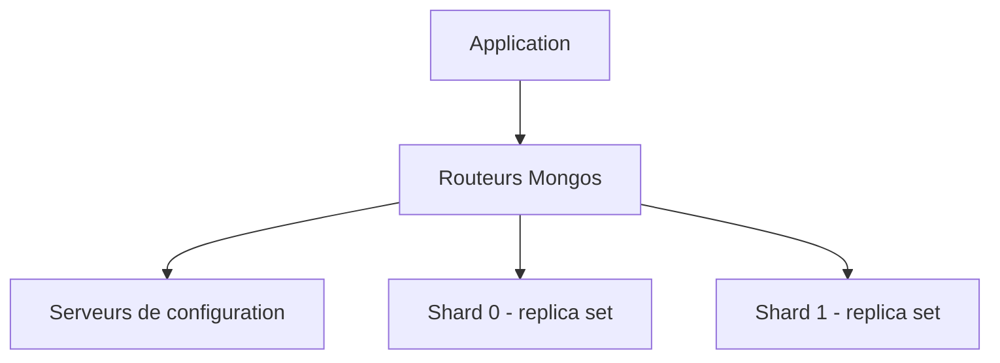

# Comment configurer le sharding MongoDB

Ce guide explique comment créer un cluster MongoDB shardé depuis la [console Hikube](https://console.hikube.cloud) et comment répartir vos collections entre les shards.

## Prérequis

- Un **projet** Hikube disposant de quotas suffisants : une topologie shardée consomme nettement plus de ressources qu'un replica set (voir ci-dessous)
- Le shell **`mongosh`** et un utilisateur disposant du droit **Administrateur** sur la base concernée

:::warning
Le sharding se décide **à la création** : il ne peut pas être activé ou désactivé ensuite. Pour transformer un cluster existant, [contactez le support](mailto:support@hidora.io).
:::

## Comprendre la topologie déployée

Lorsque l'option **Sharding (Topologie distribuée)** est activée, la console déploie :

| Composant | Nombre | Ressources |
|-----------|--------|------------|
| Shards | 2 | Chacun avec le **Nombre de réplicas** et la **Taille du disque (Go)** choisis |
| Serveurs de configuration | 1 groupe | Même nombre de réplicas et même taille de disque |
| Routeurs Mongos | 1 groupe | Même nombre de réplicas |

Vos applications se connectent aux routeurs **Mongos**, qui dirigent chaque requête vers le ou les shards concernés.



## Étapes

### 1. Créer le cluster shardé

1. Ouvrez **DB & Messaging** → **MongoDB**, puis cliquez sur **Créer un cluster**.
2. Étape **Général** : saisissez le **Nom du cluster**.
3. Étape **Configuration** : choisissez la **Version MongoDB**, la **Préconfiguration (Preset)**, la **Taille du disque (Go)** et le **Nombre de réplicas** (`3` recommandé), puis activez **Sharding (Topologie distribuée)**.
4. Contrôlez le **Coût estimé** et l'impact sur les quotas, qui tiennent compte des composants supplémentaires.
5. Étape **Utilisateurs** : ajoutez au moins un utilisateur avec le **Rôle** **Administrateur**.
6. Étape **Vérification** : vérifiez que la ligne **Sharding** indique **Activé**, puis cliquez sur **Déployer**.

### 2. Vérifier la topologie

Une fois le cluster au statut **Prêt**, la carte **Connexion et réseau** de sa page indique **Sharding** : **Activé**.

### 3. Activer le sharding sur une collection

:::warning Droits nécessaires
Le droit **Administrateur** attribué depuis la console correspond aux rôles MongoDB `readWrite` et `dbAdmin` sur une base. Il ne donne pas les privilèges de cluster qu'exigent `sh.status()` et `sh.shardCollection()` (actions `listShards` et `enableSharding`). Pour sharder une collection, [contactez le support](mailto:support@hidora.io) en indiquant la collection et la clé de sharding voulue.
:::

Le sharding se configure collection par collection, en choisissant une **clé de sharding**. Exemples des commandes exécutées par un compte disposant de ces privilèges :

```javascript
// Clé hachée : répartition uniforme des écritures
sh.shardCollection("myapp.events", { deviceId: "hashed" })

// Clé par plage : efficace pour les requêtes par intervalle
sh.shardCollection("myapp.orders", { customerId: 1, createdAt: 1 })
```

:::tip
Choisissez une clé à forte cardinalité, présente dans la plupart de vos requêtes. Une clé monotone (date de création seule, identifiant incrémental) concentre les écritures sur un seul shard.
:::

## Vérification

```javascript
db.events.getShardDistribution()
```

**Résultat attendu :** les documents et les chunks se répartissent entre les deux shards.

## Pour aller plus loin

- [Concepts MongoDB](../concepts.md) : replica set et sharding
- [Documentation MongoDB sur le sharding](https://www.mongodb.com/docs/manual/sharding/)
