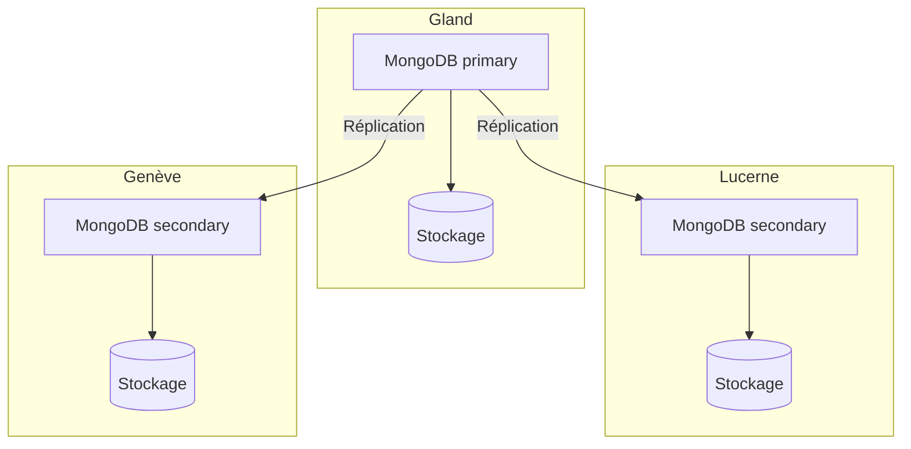

import NavigationFooter from '@site/src/components/NavigationFooter';

# MongoDB sur Hikube

Hikube propose un service **MongoDB managé**, basé sur l'opérateur **Percona Operator for MongoDB**. MongoDB est une base de données orientée documents : les données sont stockées sous forme de documents JSON (BSON), sans schéma imposé, ce qui la rend adaptée aux modèles de données évolutifs.

Le service déploie un **replica set** répliqué et auto-réparant, avec en option une topologie **shardée** pour répartir les données sur plusieurs groupes de nœuds. Vous créez et administrez vos clusters depuis la [console Hikube](https://console.hikube.cloud) (menu **DB & Messaging** → **MongoDB**).

---

## Architecture et fonctionnement

### Replica set (par défaut)

- Un **membre primaire** (primary) reçoit toutes les écritures.
- Les **membres secondaires** répliquent en continu les opérations du primaire et peuvent servir les lectures.
- En cas de panne du primaire, les membres restants **élisent** automatiquement un nouveau primaire.

### Topologie shardée (option)

Lorsque l'option **Sharding (Topologie distribuée)** est activée à la création, la plateforme déploie automatiquement les **serveurs de configuration** et les **routeurs Mongos**, et configure les réplicas en tant que **shards**. Voir [Configurer le sharding](./how-to/configure-sharding.md).

---

## Ce que vous gérez depuis la console

| Fonction | Disponible |
|----------|------------|
| Création d'un cluster (version 6.0, 7.0 ou 8.0, préconfiguration, taille du disque, 1, 3 ou 5 réplicas, accès externe, sharding) | Oui |
| Utilisateurs, rôle global et accès par base (admin / lecture seule), rotation du mot de passe | Oui |
| Modification de la version, de la taille du disque et de l'accès externe | Oui |
| Modification de la préconfiguration, du nombre de réplicas ou du sharding après création | Non, [contactez le support](mailto:support@hidora.io) |
| Sauvegardes et restauration | Non, [contactez le support](mailto:support@hidora.io) |

---

## Cas d'usage

- **Catalogues produits et contenus** dont la structure varie d'un élément à l'autre
- **Applications web et mobiles** manipulant nativement du JSON
- **Profils utilisateurs, préférences, paniers** et données de session enrichies
- **Collecte d'évènements et IoT**, avec la topologie shardée pour les gros volumes
- **Prototypage rapide**, sans migration de schéma à chaque évolution

<NavigationFooter
  nextSteps={[
    {label: "Concepts", href: "../concepts"},
    {label: "Démarrage rapide", href: "../quick-start"},
  ]}
  seeAlso={[
    {label: "Toutes les bases de données", href: "../../"},
  ]}
/>
