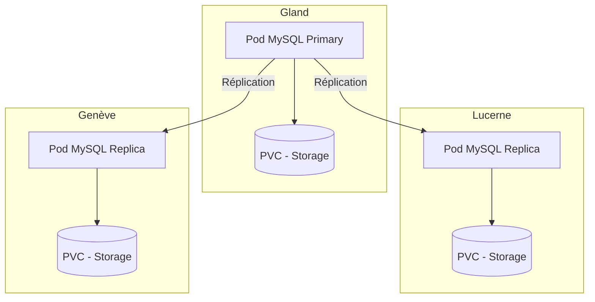

# MySQL sur Hikube

Hikube propose un service **MySQL managé**, basé sur l’opérateur **MariaDB-Operator**.  
Il assure le déploiement d’un cluster répliqué et auto-réparant, garantissant **haute disponibilité**, **simplicité de gestion** et **performances fiables**, sans effort côté utilisateur.

---

## 🏗️ Architecture et Fonctionnement

Le service **MySQL managé** sur Hikube repose sur l’opérateur **MariaDB-Operator**, qui automatise la gestion complète du cycle de vie de la base de données : déploiement, mise à jour, réplication et reprise après incident.  

L’architecture repose sur un **cluster répliqué** :  

- Un **nœud primaire** (primary) gère toutes les opérations d’écriture et assure la cohérence des données.  
- Un ou plusieurs **réplicas** (standby) reçoivent en temps réel les transactions via la réplication asynchrone ou semi-synchrone.  
- Un mécanisme d’**auto-failover** promeut automatiquement un réplica en tant que nouveau primaire en cas de défaillance, garantissant une **haute disponibilité**.  

Cette approche offre :  

- **Résilience** en cas de panne matérielle ou logicielle  
- **Scalabilité en lecture** grâce à la distribution des requêtes entre les réplicas  
- **Simplicité de gestion**, car la plateforme prend en charge la coordination et la maintenance du cluster  

---

## 💡 Cas d’usage

Le service **MySQL managé sur Hikube** est particulièrement adapté pour :  

- **Applications web transactionnelles (OLTP)** : e-commerce, ERP, CRM, où la fiabilité et la rapidité des transactions sont essentielles.  
- **Applications SaaS multi-clients** : chaque client peut disposer de sa base isolée tout en bénéficiant de la haute disponibilité.  
- **Workloads à forte charge en lecture** : la présence de réplicas permet de répartir les requêtes et d’améliorer les performances globales.  
- **Scénarios de reprise après incident** : grâce au mécanisme d’auto-failover et aux sauvegardes S3 intégrées.  
