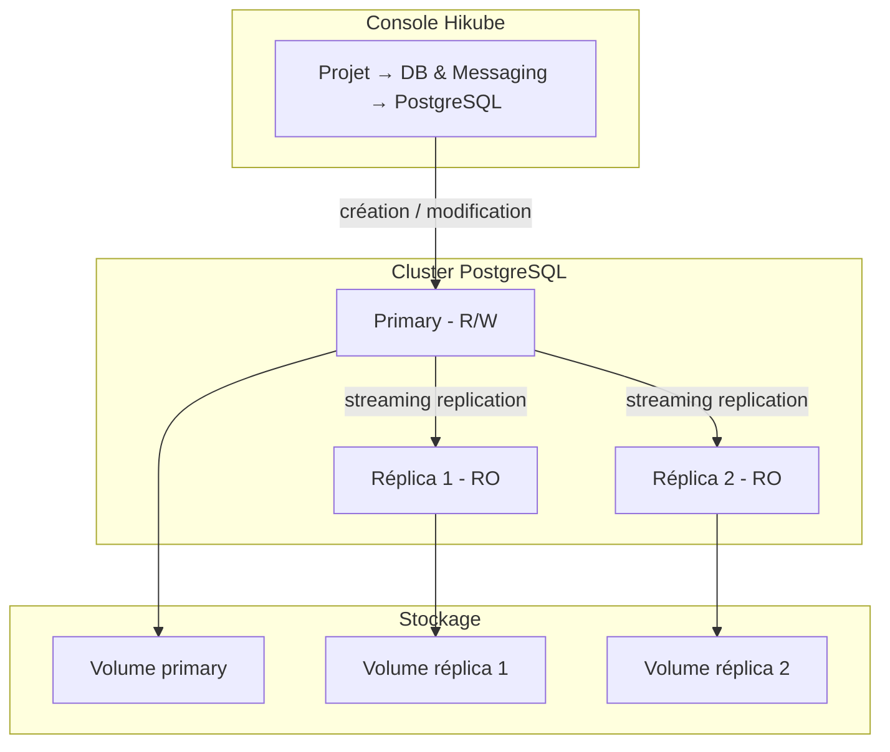
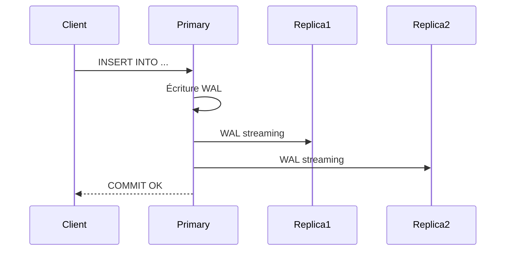

# Concepts — PostgreSQL

## Architecture

PostgreSQL sur Hikube est un service managé basé sur l'opérateur **CloudNativePG**. Chaque cluster créé depuis la console est un ensemble d'instances PostgreSQL répliquées, avec failover automatique et réplication streaming. Il appartient à un **projet** et consomme les quotas de ce projet (CPU, mémoire, stockage).

---

## Terminologie

| Terme | Description |
|-------|-------------|
| **Cluster PostgreSQL** | Instance managée créée depuis la console, composée d'un primary et de réplicas éventuels. |
| **Projet** | Espace isolé qui regroupe vos ressources et porte les quotas. |
| **Primary** | Instance principale qui accepte les lectures et écritures. |
| **Réplica** | Instance en lecture seule, synchronisée par streaming replication depuis le primary. |
| **CloudNativePG** | Opérateur qui gère le cycle de vie des clusters PostgreSQL (déploiement, failover). |
| **Preset d'instance** | Gabarit de ressources (CPU, mémoire) alloué à chaque nœud du cluster. |
| **Accès externe** | Option qui expose le cluster sur Internet via une adresse IP publique. |
| **Extension** | Module PostgreSQL (par exemple `pgcrypto`, `vector`) activé par base de données. |
| **WAL** | Write-Ahead Log — journal des transactions PostgreSQL, base de la réplication. |

---

## Réplication et haute disponibilité

CloudNativePG assure la haute disponibilité via :

1. **Streaming replication** : les réplicas reçoivent les WAL en continu depuis le primary
2. **Failover automatique** : si le primary tombe, un réplica est promu automatiquement

Le nombre de réplicas se choisit à la création, dans le champ **Nombre de réplicas** :

| Valeur proposée | Usage |
|-----------------|-------|
| **1 (Standalone)** | Développement, tests |
| **2 (Haute disponibilité)** | Production avec un standby |
| **3 (Haute disponibilité max)** | Production critique |

:::warning
Le nombre de réplicas ne peut pas être modifié après la création (« Le mode ne peut pas être modifié après création »). Choisissez-le en fonction de votre besoin de disponibilité. Pour le changer, [contactez le support](mailto:support@hidora.io).
:::

La réplication synchrone (quorum) n'est pas proposée dans la console ; contactez le support.

---

## Bases de données, utilisateurs et droits

Chaque cluster dispose :

- d'une base **`postgres`** créée automatiquement ;
- des **bases de données** que vous ajoutez, à la création ou ensuite (onglet **Bases de données**), avec leurs **extensions** ;
- des **utilisateurs** que vous créez (onglet **Utilisateurs**). Chaque utilisateur reçoit, base par base, l'un des deux droits suivants :
  - **Administrateur (Admin)** : lecture et écriture ;
  - **Lecture seule (Read-only)** : lecture uniquement.

Le mot de passe d'un utilisateur est généré par la plateforme et affiché **une seule fois**, à la création ou après une rotation. Il n'est plus consultable ensuite : en cas de perte, générez-en un nouveau avec **Changer le mot de passe**.

### Règles de nommage

| Élément | Règle |
|---------|-------|
| Nom du cluster | 3 à 16 caractères : minuscules, chiffres et tirets ; commence par une lettre, se termine par une lettre ou un chiffre |
| Nom d'utilisateur | 3 à 16 caractères : minuscules, chiffres et tirets bas (`_`) ; commence par une lettre minuscule ou un tiret bas. Pas de tiret (`-`). |
| Nom de base de données | 1 à 63 caractères : minuscules, chiffres et tirets bas |

Les noms d'utilisateur `postgres`, `admin`, `root`, `owner`, `superuser`, `streaming_replica`, `cnpg_pooler_pgbouncer` ainsi que ceux commençant par `pg_` sont réservés.

---

## Presets d'instance

Le **Preset d'instance** définit la capacité allouée à **chaque nœud** du cluster. La liste affichée par l'assistant fait foi ; à titre indicatif :

| Preset | CPU | Mémoire |
|--------|-----|---------|
| `nano` | 250m | 128Mi |
| `micro` | 500m | 256Mi |
| `small` | 1 | 512Mi |
| `medium` | 1 | 1Gi |
| `large` | 2 | 2Gi |
| `xlarge` | 4 | 4Gi |
| `2xlarge` | 8 | 8Gi |

Le preset par défaut de l'assistant est `small`. La définition de ressources CPU/mémoire libres (hors preset) n'est pas proposée dans la console ; contactez le support.

---

## Accès réseau

- **Accès externe désactivé** (par défaut) : le cluster n'est pas exposé sur Internet. Le champ **Hôte (Host)** de la page du cluster affiche **Non défini**.
- **Accès externe activé** : la plateforme attribue une adresse IP publique, affichée dans le champ **Hôte (Host)**. Le port est le port PostgreSQL standard, `5432`.

L'accès externe peut être activé ou désactivé après la création, depuis **Modifier**. Son coût (adresse IP publique) est inclus dans le **Coût estimé** de l'assistant.

---

## Sauvegarde et restauration

La configuration des sauvegardes et la restauration ne sont pas proposées dans la console ; contactez le support. Voir [Configurer les sauvegardes](./how-to/configure-backups.md).

---

## Quotas et coût

L'assistant de création affiche, dès l'étape **Configuration**, le **Coût estimé** (mensuel et horaire) et l'impact du cluster sur les quotas du projet (CPU, mémoire, stockage). La consommation tient compte du preset, du nombre de réplicas et de la taille du disque. Si le cluster dépasse les quotas disponibles, le bouton **Suivant** reste inactif.

| Paramètre | Valeur |
|-----------|--------|
| Taille du disque | 1 à 4 096 Go, dans la limite du quota de stockage du projet |
| Réplicas | 1, 2 ou 3 |

---

## Pour aller plus loin

- [Vue d'ensemble](./overview.md) : présentation du service
- [Démarrage rapide](./quick-start.md) : créer votre premier cluster
