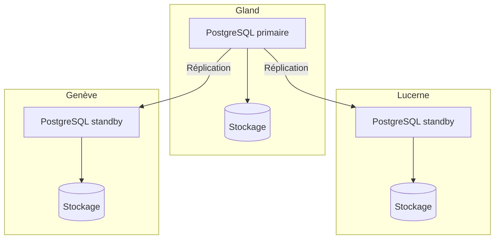

import NavigationFooter from '@site/src/components/NavigationFooter';

# PostgreSQL sur Hikube

Hikube propose un service PostgreSQL managé, basé sur l'opérateur **CloudNativePG**, reconnu et largement adopté par la communauté.
La plateforme prend en charge le déploiement et la gestion d'un cluster PostgreSQL **répliqué et auto-réparant**, que vous créez et administrez depuis la [console Hikube](https://console.hikube.cloud) (menu **DB & Messaging** → **PostgreSQL**).

---

## Architecture et fonctionnement

L'opérateur **CloudNativePG** automatise la gestion du cycle de vie de la base de données : création, mise à jour, réplication et reprise après incident.

L'architecture est construite autour d'un **cluster répliqué** :

- Un **nœud primaire** (primary) qui traite les écritures et sert de référence pour la cohérence des données.
- Un ou plusieurs **réplicas** (standby) qui reçoivent en continu les modifications par réplication.
- Un mécanisme d'**auto-failover**, qui promeut automatiquement un réplica en nouveau primaire en cas de panne, sans intervention manuelle.

Cette approche garantit :

- **Résilience** face aux pannes matérielles ou logicielles
- **Scalabilité en lecture** grâce à la répartition des requêtes entre les réplicas
- **Simplicité opérationnelle**, car la plateforme gère la coordination et la maintenance du cluster

---

## Ce que vous gérez depuis la console

| Fonction | Disponible |
|----------|------------|
| Création d'un cluster (version 15 à 18, preset, taille du disque, 1 à 3 réplicas, accès externe) | Oui |
| Bases de données et extensions PostgreSQL | Oui |
| Utilisateurs, droits par base (admin / lecture seule), rotation du mot de passe | Oui |
| Modification de la version, du preset, de la taille du disque et de l'accès externe | Oui |
| Modification du nombre de réplicas après création | Non, [contactez le support](mailto:support@hidora.io) |
| Sauvegardes et restauration | Non, [contactez le support](mailto:support@hidora.io) |

---

## Cas d'usage

- **Applications métiers critiques** nécessitant une base fiable et hautement disponible
- **E-commerce et ERP**, où la continuité de service est indispensable
- **SaaS multi-tenant**, permettant de répartir les charges entre primaire et réplicas
- **Business Intelligence et reporting**, grâce à la lecture optimisée sur les réplicas
- **Applications cloud natives**, déployées sur vos clusters Kubernetes Hikube

<NavigationFooter
  nextSteps={[
    {label: "Concepts", href: "../concepts"},
    {label: "Démarrage rapide", href: "../quick-start"},
  ]}
  seeAlso={[
    {label: "Toutes les bases de données", href: "../../"},
  ]}
/>
