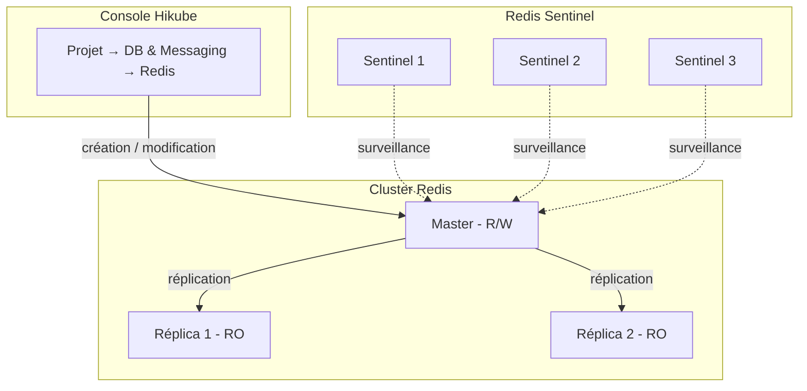
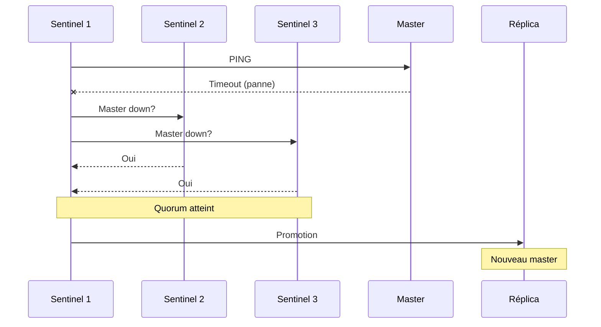

# Concepts — Redis

## Architecture

Redis sur Hikube est un service managé. Chaque cluster créé depuis la console est un ensemble master-réplicas, supervisé par **Redis Sentinel** pour le failover automatique. Il appartient à un **projet** et consomme les quotas de ce projet.

---

## Terminologie

| Terme | Description |
|-------|-------------|
| **Cluster Redis** | Instance managée créée depuis la console, composée d'un master et de réplicas éventuels. |
| **Projet** | Espace isolé qui regroupe vos ressources et porte les quotas. |
| **Master** | Instance principale qui accepte les lectures et écritures. |
| **Réplica** | Instance en lecture seule, synchronisée depuis le master. |
| **Sentinel** | Processus de supervision qui détecte les pannes du master et orchestre le failover automatique. |
| **Préconfiguration** | Gabarit de ressources (CPU, mémoire) alloué à chaque nœud du cluster. |
| **Réseau public** | Option (aussi appelée **Accès externe**) qui expose le cluster sur Internet via une adresse IP publique. |
| **Authentification** | Protection de l'accès par un mot de passe global au cluster. |

---

## Haute disponibilité avec Sentinel

Redis Sentinel assure la haute disponibilité en :

1. **Surveillant** en permanence le master et les réplicas
2. **Détectant** la panne du master par consensus entre Sentinels
3. **Promouvant** automatiquement un réplica en nouveau master
4. **Reconfigurant** les autres réplicas pour suivre le nouveau master

Le **Nombre de réplicas** se choisit à la création (de 1 à 8).

:::tip
Choisissez au moins **3 réplicas** pour la production : c'est le minimum qui permet au quorum Sentinel de fonctionner et au failover d'être automatique.
:::

:::warning
Le nombre de réplicas ne peut pas être modifié après la création (« Le mode ne peut pas être modifié après création »). Pour le changer, [contactez le support](mailto:support@hidora.io).
:::

---

## Persistance

Chaque nœud dispose d'un volume persistant dont la capacité est fixée par le champ **Taille du volume (Go)** (« La taille de stockage allouée à chaque nœud du cluster »). Redis écrit ses données sur disque via ses mécanismes natifs, ce qui leur permet de survivre aux redémarrages.

---

## Authentification

L'option **Activer l'authentification** est active par défaut dans l'assistant :

- **Activée** : un mot de passe est généré à la création et affiché une seule fois, avec l'utilisateur `default`. Vous pouvez le renouveler à tout moment depuis la section **Sécurité** de la page du cluster (**Effectuer une rotation**).
- **Désactivée** : le cluster accepte les connexions sans mot de passe. À éviter, en particulier avec le réseau public activé.

Redis sur Hikube n'expose pas de gestion d'utilisateurs multiples (ACL) dans la console : l'accès repose sur ce mot de passe global.

---

## Accès réseau

- **Réseau public désactivé** (par défaut, « Privé » dans le récapitulatif) : le cluster n'est pas exposé sur Internet. La section **Connexion** de la page du cluster affiche « En attente d'attribution... » à la place de l'hôte.
- **Réseau public activé** (« Public ») : la plateforme attribue une adresse IP publique, affichée dans le champ **Hôte**. Elle donne accès au master sur le port Redis standard, `6379`.

---

## Préconfigurations

La **Préconfiguration** définit la capacité allouée à **chaque nœud** du cluster. La liste affichée par l'assistant fait foi ; à titre indicatif :

| Preset | CPU | Mémoire |
|--------|-----|---------|
| `nano` | 250m | 128Mi |
| `micro` | 500m | 256Mi |
| `small` | 1 | 512Mi |
| `medium` | 1 | 1Gi |
| `large` | 2 | 2Gi |
| `xlarge` | 4 | 4Gi |
| `2xlarge` | 8 | 8Gi |

La mémoire du preset borne la taille du jeu de données que Redis peut conserver en mémoire. La définition de ressources CPU/mémoire libres n'est pas proposée dans la console ; contactez le support.

---

## Quotas et coût

L'assistant affiche le **Coût estimé** et l'impact du cluster sur les quotas du projet. Si le cluster dépasse les quotas disponibles, le bouton **Suivant** reste inactif.

| Paramètre | Valeur |
|-----------|--------|
| Réplicas | 1 à 8 |
| Taille du volume | 1 à 4 096 Go par nœud, dans la limite du quota du projet |
| Bases Redis | Base logique `0` par défaut |

---

## Pour aller plus loin

- [Vue d'ensemble](./overview.md) : présentation du service
- [Démarrage rapide](./quick-start.md) : créer votre premier cluster
