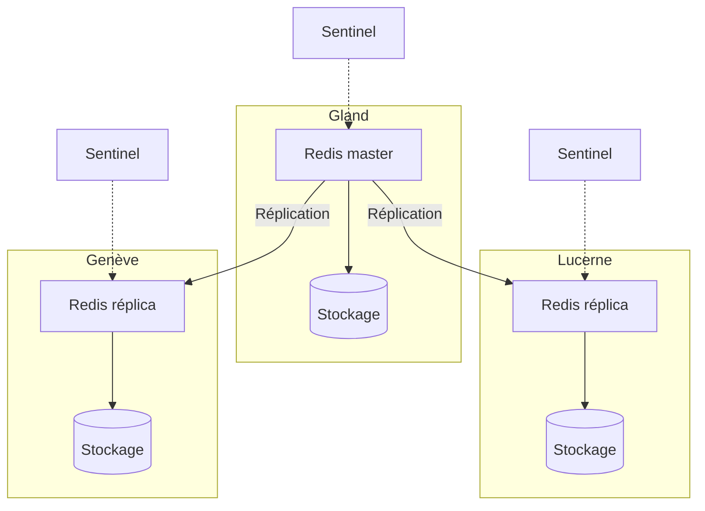

import NavigationFooter from '@site/src/components/NavigationFooter';

# Redis sur Hikube

Hikube propose un service **Redis managé**, basé sur l'opérateur **[Spotahome Redis Operator](https://github.com/spotahome/redis-operator)**, largement utilisé dans la communauté.
La plateforme prend en charge le déploiement et la gestion d'un cluster Redis **répliqué et auto-réparant**, s'appuyant sur **Redis Sentinel** pour la détection des pannes et l'auto-failover. Vous créez et administrez vos clusters depuis la [console Hikube](https://console.hikube.cloud) (menu **DB & Messaging** → **Redis**).

---

## Architecture et fonctionnement

Le service Redis managé sur Hikube est conçu pour offrir **haute disponibilité** et **résilience** grâce à une architecture répliquée :

- Un **nœud master** gère toutes les écritures et sert de source de vérité pour les données.
- Un ou plusieurs **nœuds réplicas** reçoivent les données en réplication pour assurer la scalabilité en lecture.
- **Redis Sentinel** surveille en permanence l'état du cluster, détecte les pannes et peut promouvoir automatiquement un réplica en nouveau master (**auto-failover**).

Cette combinaison garantit :

- **Disponibilité continue** même en cas de panne du master
- **Performances élevées** avec la répartition des lectures entre réplicas
- **Simplicité opérationnelle**, la gestion étant automatisée par la plateforme

---

## Ce que vous gérez depuis la console

| Fonction | Disponible |
|----------|------------|
| Création d'un cluster (version 7 ou 8, préconfiguration, 1 à 8 réplicas, taille du volume, réseau public, authentification) | Oui |
| Rotation du mot de passe | Oui |
| Modification de la version, de la préconfiguration, de la taille du volume, de l'accès externe et de l'authentification | Oui |
| Modification du nombre de réplicas après création | Non, [contactez le support](mailto:support@hidora.io) |

---

## Cas d'usage

- **Cache applicatif** : accélérer les applications web (e-commerce, SaaS, API) en réduisant le temps de réponse grâce au stockage en mémoire.
- **Sessions distribuées** : gérer les sessions utilisateurs de manière rapide et fiable dans des environnements multi-instances.
- **File d'attente et streaming léger** : pub/sub, listes et streams pour des communications temps réel.
- **Analytics temps réel** : traitement rapide de métriques, compteurs ou évènements.
- **Gaming et IoT** : classements, états temporaires et données volatiles à faible latence.

<NavigationFooter
  nextSteps={[
    {label: "Concepts", href: "../concepts"},
    {label: "Démarrage rapide", href: "../quick-start"},
  ]}
  seeAlso={[
    {label: "Toutes les bases de données", href: "../../"},
  ]}
/>
