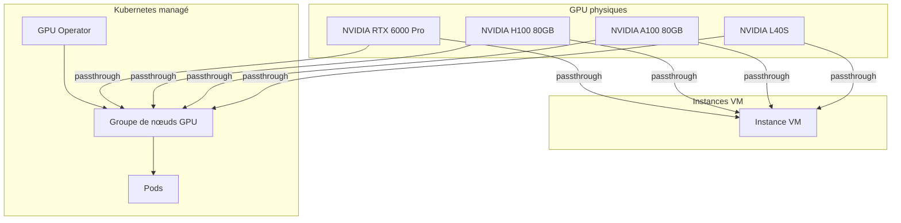
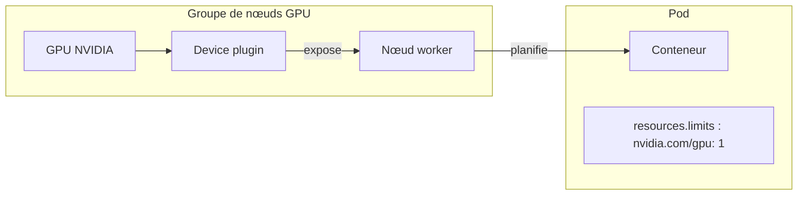

# Concepts — GPU

## Architecture

Hikube attache des GPU NVIDIA physiques aux machines virtuelles et aux nœuds des clusters Kubernetes. Côté VM, le GPU est attribué en **passthrough PCI**. Côté Kubernetes, le nœud reçoit le GPU de la même façon, puis le **NVIDIA GPU Operator** l'expose aux pods.

---

## Terminologie

| Terme | Description |
|-------|-------------|
| **Accélération Matérielle (GPU)** | Section de l'assistant VM où l'on choisit les GPU de l'instance. |
| **Groupe de nœuds** | Ensemble de nœuds worker d'un cluster Kubernetes partageant un type d'instance et, le cas échéant, des GPU. |
| **Passthrough PCI** | Attribution d'un GPU physique directement à une VM ou à un nœud, avec des performances natives. |
| **GPU Operator** | Addon Kubernetes NVIDIA qui installe les drivers, le device plugin et le runtime GPU sur les nœuds. Activé automatiquement dès qu'un groupe de nœuds a des GPU. |
| **Device plugin** | Composant qui expose les GPU aux pods comme ressource planifiable `nvidia.com/gpu`. |
| **HAMi** | Addon de virtualisation de GPU : partage d'un même GPU entre plusieurs pods. Nécessite le GPU Operator. |
| **CUDA** | Plateforme de calcul parallèle NVIDIA, utilisée pour l'accélération (ML, HPC, rendu). |

---

## Modèles et disponibilité

| Modèle | Mémoire |
|--------|---------|
| **NVIDIA L40S** | 48 Go |
| **NVIDIA A100 80GB** | 80 Go |
| **NVIDIA H100 80GB** | 80 Go |
| **NVIDIA RTX 6000 Pro** | 96 Go |

Le sélecteur de GPU affiche tous les modèles de la plateforme. Un modèle sans unité libre est marqué **Indisponible** et ne peut pas être sélectionné. La disponibilité est globale : la console n'affiche pas le nombre d'unités libres.

:::note Co-localisation
Une VM, comme un nœud Kubernetes, s'exécute sur un seul serveur physique. Quand vous demandez plusieurs GPU pour une même VM (ou pour chaque nœud d'un groupe), ils doivent tous être disponibles sur un même serveur. Sinon, la création échoue avec le message **Les GPUs suivants ne sont pas disponibles : …**, même si chaque modèle apparaît disponible.
:::

---

## GPU sur machine virtuelle

- Sélection à l'étape **Configuration** de l'assistant, sous **Accélération Matérielle (GPU)** : cliquez sur une carte pour ajouter un GPU, puis utilisez **+** et **−** pour en changer le nombre. Le badge indique le total (par exemple **2 GPU au total**).
- La section n'apparaît que si la plateforme propose des GPU.
- Les GPU se modifient après coup dans **Modifier** > **Ressources (CPU / RAM)** ; la VM redémarre.
- **Arrêter** une VM libère ses GPU. Au redémarrage, s'ils ont été attribués ailleurs, la console propose de **Sélectionner un GPU alternatif**.
- Les drivers NVIDIA ne sont pas préinstallés dans les images.

:::tip Ratio CPU/GPU
Prévoyez **8 à 16 vCPU par GPU**. Pour un GPU, un `u1.2xlarge` (8 vCPU, 32 Go) est un bon point de départ.
:::

---

## GPU sur Kubernetes

- Sélection à l'étape **Nœuds** de l'assistant de cluster, section **GPU** de chaque groupe de nœuds. Chaque nœud du groupe reçoit les GPU sélectionnés.
- Dès qu'un groupe a des GPU, l'addon **GPU Operator** est activé et ne peut plus être désactivé (**Requis lorsqu'un groupe de nœuds a des GPU**).
- Les pods demandent un GPU via `resources.limits` (`nvidia.com/gpu: 1`).
- Un groupe créé **sans** GPU ne peut pas en recevoir ; un groupe créé **avec** GPU peut changer de modèle ou de nombre mais doit garder au moins un GPU. Pour changer de catégorie, ajoutez un nouveau groupe de nœuds.

---

## Comparaison VM et Kubernetes

| Critère | GPU sur VM | GPU sur Kubernetes |
|---------|-----------|-------------------|
| **Accès** | GPU dédié à la VM | GPU attribué aux pods par le scheduler |
| **Drivers** | Installés par vous dans l'OS | Installés par le GPU Operator |
| **Multi-GPU** | Plusieurs GPU dans la VM | Plusieurs GPU par nœud, `resources.limits` par pod |
| **Partage** | Non | Oui avec HAMi |
| **Cas d'usage** | Stations de travail, environnements interactifs | Pipelines ML, inférence à grande échelle |

---

## Pour aller plus loin

- [Vue d'ensemble](./overview.md)
- [Provisionner un GPU sur une VM](./how-to/provision-gpu-vm.md)
- [Provisionner un GPU sur Kubernetes](./how-to/provision-gpu-kubernetes.md)
