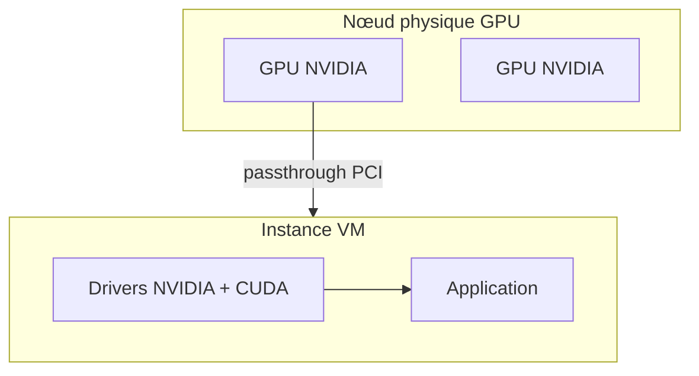
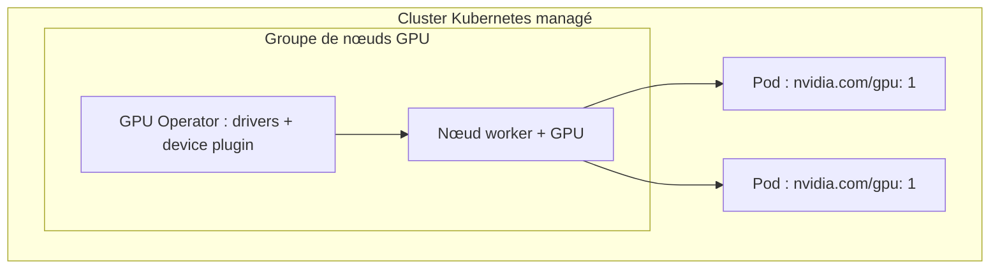

import NavigationFooter from '@site/src/components/NavigationFooter';

# GPU sur Hikube

Hikube propose des accélérateurs **NVIDIA** attachés en passthrough, pour deux types de workloads : les **machines virtuelles** et les **nœuds de clusters Kubernetes**. Il n'y a pas de page GPU dans la console : le GPU se choisit dans l'assistant de la ressource qui l'utilise.

---

## Modes d'utilisation

### GPU sur machine virtuelle

Le GPU physique est attribué à la VM en passthrough PCI : la VM y a un accès exclusif et des performances natives.

- Choix dans l'assistant **Créer une Instance**, étape **Configuration**, section **Accélération Matérielle (GPU)**.
- Un ou plusieurs GPU par VM, de un ou plusieurs modèles.
- Les drivers NVIDIA s'installent dans l'OS de la VM (voir [Installer CUDA](../compute/how-to/install-cuda-drivers.md)).

**Cas d'usage :** environnements de développement CUDA, applications nécessitant un contrôle complet du GPU, rendu graphique, workloads spécialisés.

### GPU sur Kubernetes

Les GPU sont attachés aux nœuds d'un **groupe de nœuds** du cluster, puis attribués aux pods via `resources.limits`.

- Choix dans l'assistant **Créer un cluster** (ou **Modifier**), étape **Nœuds**, section **GPU** du groupe de nœuds.
- L'addon **GPU Operator** est activé automatiquement dès qu'un groupe a des GPU ; il installe les drivers et le device plugin.
- L'addon **HAMi** permet de partager un même GPU entre plusieurs pods.

**Cas d'usage :** IA/ML conteneurisée, inférence à l'échelle, jobs parallèles.

---

## Modèles proposés

| Modèle (libellé de la console) | Mémoire | Architecture | Usage typique |
|--------------------------------|---------|--------------|---------------|
| **NVIDIA L40S** | 48 Go | Ada Lovelace | Inférence, IA générative, rendu temps réel, prototypage |
| **NVIDIA A100 80GB** | 80 Go | Ampere | Entraînement ML, fine-tuning, calcul scientifique |
| **NVIDIA H100 80GB** | 80 Go | Hopper | Entraînement et inférence de grands modèles |
| **NVIDIA RTX 6000 Pro** | 96 Go | Blackwell | LLM, calcul intensif |

Chaque carte du sélecteur affiche le nom du modèle et sa mémoire (par exemple **48 Go VRAM**). Un modèle qui n'a plus d'unité libre est grisé et marqué **Indisponible**.

:::note Disponibilité
La console indique seulement si un modèle est disponible ou non, sans afficher le nombre d'unités libres. Les GPU sont des ressources partagées entre les clients de la plateforme : un GPU libéré (VM arrêtée, nœud supprimé) peut être attribué à un autre workload. Pour un besoin de capacité GPU spécifique, contactez [sales@hidora.io](mailto:sales@hidora.io).
:::

---

## Architecture

### GPU sur VM

```mermaid
flowchart TD
    subgraph NODE["Nœud physique GPU"]
        GPU1["GPU NVIDIA"]
        GPU2["GPU NVIDIA"]
    end

    subgraph VM1["Instance VM"]
        DRV["Drivers NVIDIA + CUDA"]
        APP1["Application"]
    end

    GPU1 -->|passthrough PCI| VM1
    DRV --> APP1
```

Une VM s'exécute sur un seul nœud physique : tous les GPU demandés pour une VM doivent être disponibles **sur le même nœud**.

### GPU sur Kubernetes

```mermaid
flowchart TD
    subgraph CLUSTER["Cluster Kubernetes managé"]
        subgraph NG["Groupe de nœuds GPU"]
            W1["Nœud worker + GPU"]
            OP["GPU Operator : drivers + device plugin"]
        end
        POD1["Pod : nvidia.com/gpu: 1"]
        POD2["Pod : nvidia.com/gpu: 1"]
    end

    OP --> W1
    W1 --> POD1
    W1 --> POD2
```

---

## Comparaison

| Aspect | GPU sur VM | GPU sur Kubernetes |
|--------|-----------|-------------------|
| **Isolation** | GPU dédié à la VM | GPU attribué aux pods par le scheduler |
| **Performances** | Natives (passthrough) | Natives (device plugin) |
| **Drivers** | À installer dans l'OS | Installés par le GPU Operator |
| **Scaling** | Vertical (modifier la VM) | Horizontal (nombre de nœuds du groupe) |
| **Partage d'un GPU** | Non | Oui, avec l'addon HAMi |
| **Modification** | Ajouter, retirer ou changer de GPU (redémarrage) | Un groupe existant garde au moins un GPU ; un groupe sans GPU ne peut pas en recevoir |

---

## Facturation et quotas

L'estimation de coût affichée dans les assistants VM et Kubernetes inclut les GPU sélectionnés. Le GPU d'une VM est libéré quand la VM est arrêtée.

---

## Prochaines étapes

- [Démarrage rapide : une VM avec GPU](./quick-start.md)
- [Provisionner un GPU sur Kubernetes](./how-to/provision-gpu-kubernetes.md)
- [Concepts](./concepts.md)

<NavigationFooter
  nextSteps={[
    {label: "Concepts", href: "../concepts"},
    {label: "Démarrage rapide", href: "../quick-start"},
  ]}
  seeAlso={[
    {label: "Ressources de calcul", href: "../../compute/"},
  ]}
/>
