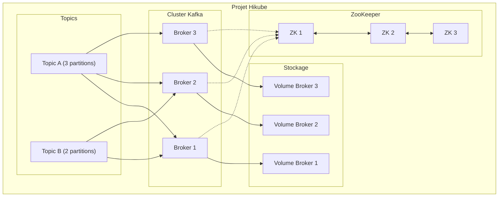
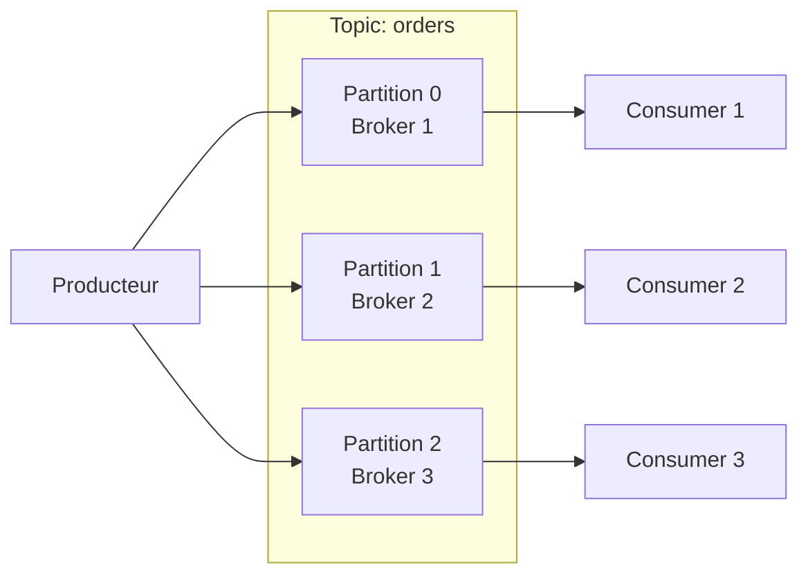

# Concepts — Kafka

:::info Disponibilité
Kafka n'est pas encore disponible en libre-service dans la [console Hikube](https://console.hikube.cloud).
Pour en provisionner une instance ou modifier sa configuration, [contactez le support](mailto:support@hidora.io).
:::

## Architecture

Kafka sur Hikube est un service managé de streaming distribué. Chaque instance est un cluster de **brokers** coordonnés par **ZooKeeper**, rattaché à un projet Hikube, avec un stockage persistant pour chaque broker.

---

## Terminologie

| Terme | Description |
|-------|-------------|
| **Kafka (instance)** | Cluster Kafka managé par Hikube, rattaché à un projet. Sa configuration est définie à la création et modifiée sur demande auprès du support. |
| **Broker** | Instance Kafka qui stocke les messages et sert les producteurs/consommateurs. |
| **ZooKeeper** | Service de coordination distribué qui gère les métadonnées du cluster, l'élection du leader et la configuration des topics. |
| **Topic** | Canal de messages nommé. Les producteurs écrivent dans un topic, les consommateurs lisent depuis un topic. |
| **Partition** | Subdivision d'un topic. Chaque partition est un log ordonné de messages, distribué sur un broker. |
| **Replication Factor** | Nombre de copies de chaque partition sur différents brokers. |
| **Consumer Group** | Groupe de consommateurs qui se répartissent les partitions d'un topic pour le traitement parallèle. |
| **Retention** | Durée ou taille maximale de conservation des messages dans un topic. |
| **Preset de ressources** | Profil CPU/mémoire prédéfini (nano à 2xlarge) appliqué aux brokers et à ZooKeeper. |

---

## Topics et partitions

### Fonctionnement

Un **topic** est divisé en **partitions**, chacune distribuée sur un broker différent :

- Plus de partitions = plus de parallélisme
- Chaque partition a un **leader** (un broker) et des **followers** (réplicas)
- Le facteur de réplication détermine le nombre de copies de chaque partition

### Configuration des topics

Les topics gérés font partie de la configuration de l'instance. Pour chaque topic, les paramètres suivants peuvent être définis :

| Paramètre | Description |
|-----------|-------------|
| Partitions | Nombre de partitions du topic |
| Réplicas | Nombre de copies de chaque partition (ne peut pas dépasser le nombre de brokers) |
| `retention.ms` | Durée de rétention en ms (ex. `604800000` = 7 jours) |
| `cleanup.policy` | `delete` (suppression après rétention) ou `compact` (conservation du dernier message par clé) |
| `min.insync.replicas` | Nombre minimum de réplicas synchronisés pour confirmer une écriture |

Cette option n'est pas proposée dans la console ; contactez le support.

---

## ZooKeeper

ZooKeeper assure la coordination du cluster Kafka :

- **Élection du leader** pour chaque partition
- **Stockage des métadonnées** (topics, partitions, offsets)
- **Détection des pannes** des brokers

:::tip
Un nombre impair d'instances ZooKeeper (3 en général) est nécessaire pour garantir le quorum. Précisez-le lors de votre demande d'instance.
:::

Les ressources de ZooKeeper (nombre d'instances, preset, taille de stockage) sont définies indépendamment de celles des brokers.

---

## Presets de ressources

Les presets s'appliquent séparément aux **brokers Kafka** et au **ZooKeeper** :

| Preset | CPU | Mémoire |
|--------|-----|---------|
| `nano` | 250m | 128Mi |
| `micro` | 500m | 256Mi |
| `small` | 1 | 512Mi |
| `medium` | 1 | 1Gi |
| `large` | 2 | 2Gi |
| `xlarge` | 4 | 4Gi |
| `2xlarge` | 8 | 8Gi |

---

## Limites et quotas

| Paramètre | Valeur |
|-----------|--------|
| Brokers Kafka max | Selon les quotas du projet |
| Instances ZooKeeper | 3 recommandé (impair) |
| Topics par cluster | Illimité (selon ressources) |
| Partitions par topic | Configurable |
| Taille stockage | Définie séparément pour les brokers et pour ZooKeeper |

---

## Pour aller plus loin

- [Vue d'ensemble](./overview.md) : présentation du service
- [Démarrage rapide](./quick-start.md) : demander une instance et la tester
