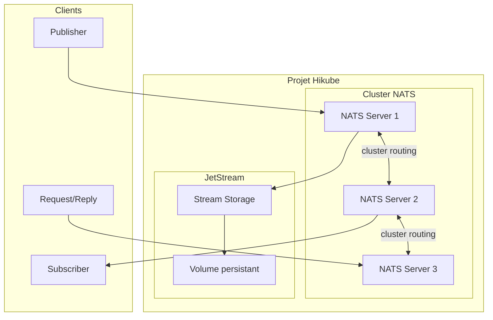
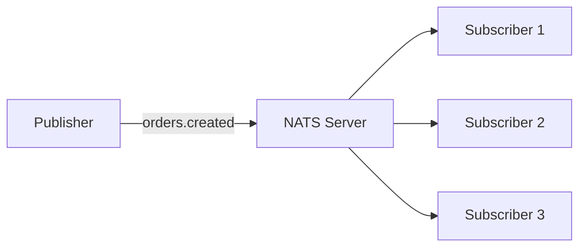
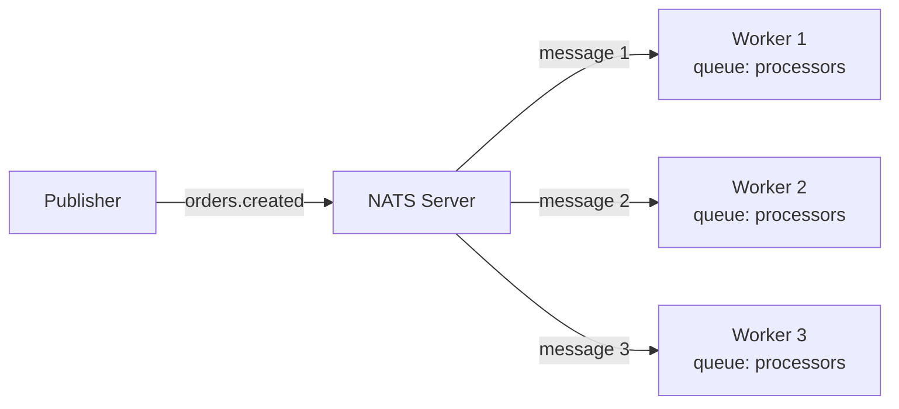
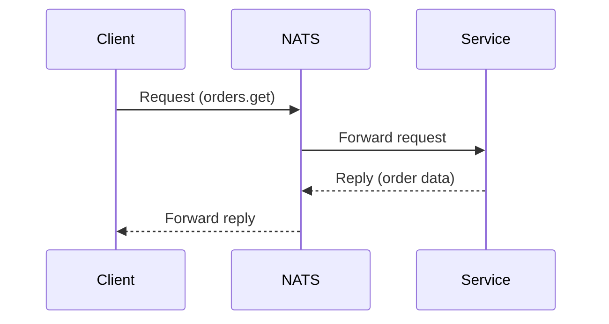

# Concepts — NATS

:::info Disponibilité
NATS n'est pas encore disponible en libre-service dans la [console Hikube](https://console.hikube.cloud).
Pour en provisionner une instance ou modifier sa configuration, [contactez le support](mailto:support@hidora.io).
:::

## Architecture

NATS sur Hikube est un service de messaging managé, ultra-léger et haute performance. Chaque instance est un cluster de serveurs NATS rattaché à un projet Hikube, avec support optionnel de **JetStream** pour la persistance des messages.

---

## Terminologie

| Terme | Description |
|-------|-------------|
| **NATS (instance)** | Cluster NATS managé par Hikube, rattaché à un projet. Sa configuration est définie à la création et modifiée sur demande auprès du support. |
| **Subject** | Adresse de routage des messages (ex. `orders.created`). Supporte les wildcards (`*`, `>`). |
| **Publish/Subscribe** | Modèle de communication où les publishers envoient des messages à un subject et les subscribers les reçoivent. |
| **JetStream** | Extension de persistance de NATS — stockage durable des messages avec replay, acknowledgment et consumers. |
| **Stream** | Collection persistante de messages dans JetStream, avec politique de rétention configurable. |
| **Consumer** | Abonnement durable dans JetStream avec suivi de la position (offset) et acknowledgment. |
| **Request/Reply** | Modèle de communication synchrone — un client envoie une requête et attend une réponse. |
| **Preset de ressources** | Profil CPU/mémoire prédéfini (nano à 2xlarge). |

---

## Modèles de communication

NATS supporte trois modèles de communication :

### Publish/Subscribe

Le modèle le plus simple — un publisher envoie un message, tous les subscribers reçoivent une copie :

### Queue Groups

Les subscribers d'un même queue group se répartissent les messages (load balancing) :

### Request/Reply

Communication synchrone avec réponse attendue :

---

## JetStream

JetStream ajoute la **persistance** à NATS :

- Les messages sont stockés sur disque dans des **streams**
- Les **consumers** suivent leur position et peuvent relire les messages
- Support du **at-least-once** et **exactly-once** delivery
- Rétention configurable par durée, nombre de messages ou taille

L'activation de JetStream et la taille de son volume font partie de la configuration de l'instance. Les streams et consumers se créent ensuite depuis vos clients (CLI `nats` ou SDK).

:::tip
JetStream n'est utile que si vous avez besoin de persistance. Pour du pub/sub éphémère, le NATS de base est plus léger.
:::

---

## Gestion des utilisateurs

Les utilisateurs NATS (nom et mot de passe) font partie de la configuration de l'instance. Leur création ou leur modification se demande au support, qui vous transmet les identifiants.

---

## Presets de ressources

| Preset | CPU | Mémoire |
|--------|-----|---------|
| `nano` | 250m | 128Mi |
| `micro` | 500m | 256Mi |
| `small` | 1 | 512Mi |
| `medium` | 1 | 1Gi |
| `large` | 2 | 2Gi |
| `xlarge` | 4 | 4Gi |
| `2xlarge` | 8 | 8Gi |

---

## Limites et quotas

| Paramètre | Valeur |
|-----------|--------|
| Réplicas max | Selon les quotas du projet |
| Empreinte mémoire minimale | Faible (quelques Mo par instance sans JetStream) |
| Taille stockage JetStream | Définie à la création de l'instance |
| Latence typique | < 1 ms (même datacenter) |

---

## Pour aller plus loin

- [Vue d'ensemble](./overview.md) : présentation du service
- [Démarrage rapide](./quick-start.md) : demander une instance et la tester
