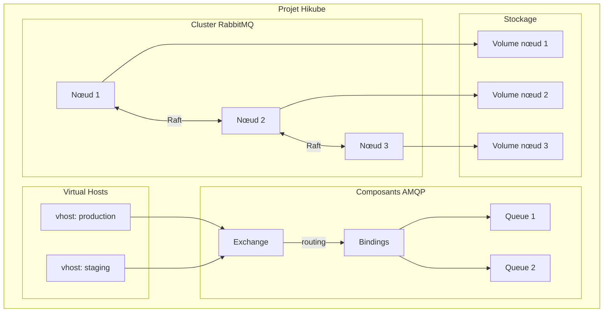
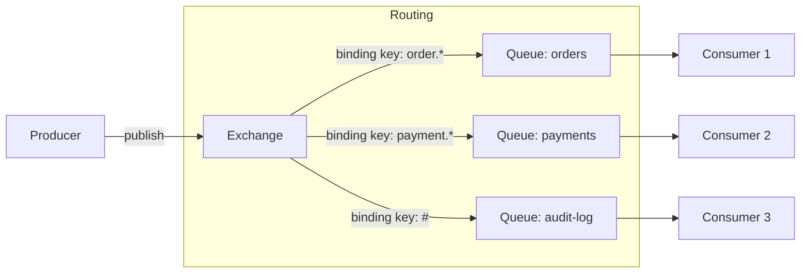
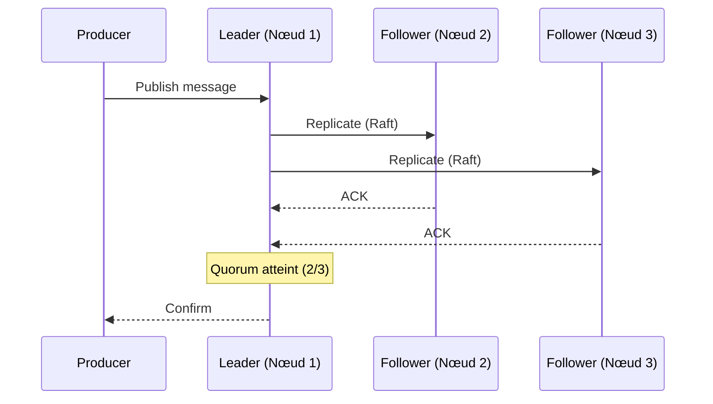

# Concepts — RabbitMQ

## Architecture

RabbitMQ sur Hikube est un service de messagerie managé basé sur le protocole **AMQP**. Chaque cluster créé depuis la [console Hikube](https://console.hikube.cloud) appartient à un **projet** et consomme les quotas de ce projet (CPU, mémoire, stockage).

---

## Terminologie

| Terme | Description |
|-------|-------------|
| **Cluster RabbitMQ** | Instance RabbitMQ managée, créée et gérée depuis la console (menu **DB & Messaging** → **RabbitMQ**). |
| **AMQP** | Advanced Message Queuing Protocol, protocole standard de messagerie supporté par RabbitMQ. |
| **Exchange** | Point d'entrée des messages. Route les messages vers les queues via des bindings. |
| **Queue** | File d'attente qui stocke les messages en attendant qu'un consumer les traite. |
| **Binding** | Règle de routage entre un exchange et une queue (basée sur une routing key). |
| **Quorum Queue** | Type de queue utilisant le protocole **Raft** pour répliquer les messages sur plusieurs nœuds. |
| **Virtual Host (vhost)** | Espace de noms logique qui isole les exchanges, queues et permissions au sein d'un même cluster. |
| **Consumer** | Application qui lit et traite les messages d'une queue. |
| **Préconfiguration (Preset)** | Profil de ressources CPU/mémoire prédéfini, choisi à la création du cluster. |
| **Réplicas** | Nombre de nœuds RabbitMQ du cluster. Détermine le mode de déploiement. |

---

## Modes de déploiement

Le champ **Nombre de réplicas** de l'assistant propose trois valeurs :

| Valeur | Libellé dans la console | Mode |
|--------|-------------------------|------|
| 1 | **1 (Standalone)** | Un seul nœud. Le volume de données est répliqué au niveau du stockage de la plateforme. |
| 3 | **3 (Haute disponibilité max)** | Cluster de 3 nœuds. La réplication des messages est assurée par RabbitMQ (quorum queues). |
| 5 | **5 (Très haute disponibilité)** | Cluster de 5 nœuds, tolérant la perte de deux nœuds. |

:::warning Mode fixé à la création
Le mode (standalone ou cluster) et le nombre de réplicas ne peuvent pas être modifiés après la création : la console affiche « Le mode ne peut pas être modifié après création ». Pour changer de mode, créez un nouveau cluster.
:::

---

## Routage des messages

RabbitMQ utilise un modèle de routage flexible basé sur les exchanges et les bindings :

### Types d'exchanges

| Type | Routage |
|------|---------|
| **direct** | Routing key exacte |
| **topic** | Pattern matching avec wildcards (`*`, `#`) |
| **fanout** | Broadcast à toutes les queues liées |
| **headers** | Routage basé sur les headers du message |

Les exchanges, queues et bindings sont créés par vos applications, avec un client AMQP connecté au vhost voulu. La console gère le cluster, les vhosts et les utilisateurs, pas les objets AMQP eux-mêmes.

---

## Quorum queues et haute disponibilité

Les quorum queues utilisent le protocole **Raft** pour répliquer les messages :

1. Un nœud est élu **leader** pour chaque queue
2. Les messages sont répliqués sur les **followers** avant confirmation
3. En cas de panne du leader, un follower est automatiquement promu

:::tip
Choisissez **3 (Haute disponibilité max)** ou **5 (Très haute disponibilité)** réplicas pour garantir le quorum Raft, et déclarez vos queues critiques comme quorum queues (argument `x-queue-type: quorum` côté client).
:::

---

## Virtual hosts

Les **vhosts** isolent les ressources au sein d'un même cluster :

- Chaque vhost a ses propres exchanges, queues et permissions
- Un utilisateur peut avoir un droit différent sur chaque vhost
- Utile pour séparer les environnements (production, staging) ou les applications sur un même cluster

L'assistant de création demande au moins un vhost. D'autres vhosts peuvent être ajoutés ensuite depuis la page du cluster (bouton **Ajouter un VHost**).

---

## Utilisateurs et droits

Chaque utilisateur RabbitMQ reçoit un **mot de passe généré par la plateforme**, affiché **une seule fois** à la création (ou après une rotation). Ses droits sont définis **par vhost** :

| Droit dans la console | Effet |
|-----------------------|-------|
| **Administrateur** | Lecture, écriture et configuration sur le vhost |
| **Lecture seule** | Lecture seule sur le vhost |
| **Aucun accès** | L'utilisateur n'a pas accès au vhost |

Un utilisateur ne peut avoir qu'un seul droit par vhost. Les droits se modifient à tout moment avec l'action **Gérer les accès**.

---

## Préconfigurations de ressources

La **Préconfiguration (Preset)** fixe les ressources CPU et mémoire de chaque nœud. La console affiche les valeurs de chaque preset dans la liste déroulante.

| Preset | CPU | Mémoire |
|--------|-----|---------|
| **Micro** | 0,5 | 256 Mi |
| **Small** | 1 | 512 Mi |
| **Medium** | 1 | 1 Gi |
| **Large** | 2 | 2 Gi |
| **Extra Large** | 4 | 4 Gi |
| **2x Extra Large** | 8 | 8 Gi |

La préconfiguration **Small** est sélectionnée par défaut. Elle **ne peut pas être modifiée après création**.

---

## Limites

| Paramètre | Valeur |
|-----------|--------|
| Nom du cluster | 3 à 16 caractères : minuscules, chiffres et tirets ; commence par une lettre, se termine par une lettre ou un chiffre |
| Versions proposées | 4.2, 4.1, 4.0, 3.13 |
| Réplicas | 1, 3 ou 5 (fixé à la création) |
| Taille du disque | 1 à 4096 Go par nœud, dans la limite du quota de stockage du projet ; augmentation seulement |
| Accès externe | Activable à la création ou ensuite |
| Port AMQP | 5672, sans TLS |

---

## Pour aller plus loin

- [Vue d'ensemble](./overview.md) : présentation du service
- [Démarrage rapide](./quick-start.md) : créer votre premier cluster
- [Gérer les vhosts et utilisateurs](./how-to/manage-vhosts-users.md)
