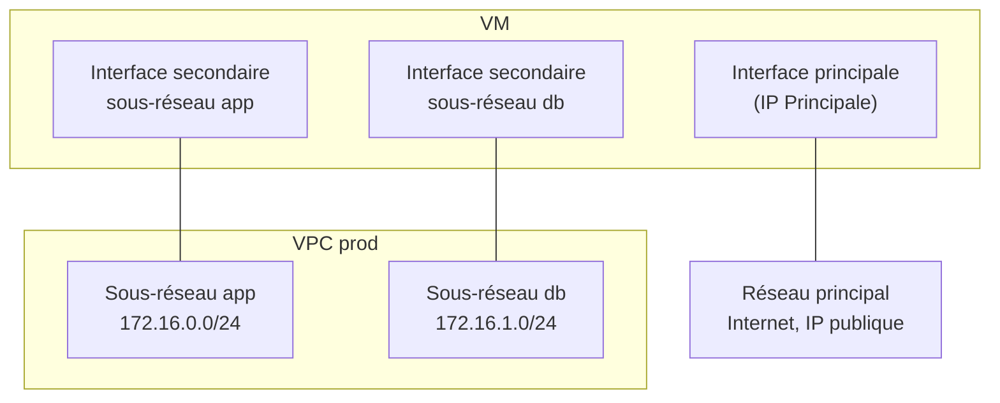

# Concepts — Réseau

## Architecture

Chaque VM Hikube dispose d'un **réseau principal**, géré par la plateforme : c'est par lui que passent l'accès Internet et, si elle est activée, l'IP publique. Les **VPC** ajoutent des réseaux privés **secondaires** : chaque sous-réseau auquel une VM est reliée lui apporte une interface réseau supplémentaire.

Les VPC reposent sur un réseau défini par logiciel : chaque VPC est un routeur virtuel isolé, chaque sous-réseau un commutateur virtuel.

---

## Terminologie

| Terme | Description |
|-------|-------------|
| **VPC** | Réseau privé isolé du projet. Il n'a pas de plage d'adresses propre : ce sont ses sous-réseaux qui en portent. |
| **Sous-réseau** | Plage d'adresses IPv4 privée (bloc CIDR) au sein d'un VPC. Une VM se relie à un ou plusieurs sous-réseaux. |
| **Bloc CIDR** | Notation d'une plage d'adresses, par exemple `172.16.0.0/24` (256 adresses, de `172.16.0.0` à `172.16.0.255`). |
| **Réseau principal** | Réseau par défaut de toute VM, avec la passerelle par défaut et l'IP publique éventuelle. Affiché comme adresse **Principale** sur la page de détail de la VM. |
| **Interface secondaire** | Interface réseau ajoutée à la VM pour chaque sous-réseau relié. Ses adresses apparaissent comme **Secondaire**. |

---

## Règles de nommage

| Élément | Règle |
|---------|-------|
| **Nom du VPC** | 3 à 16 caractères : minuscules, chiffres et tirets ; doit commencer par une lettre et se terminer par une lettre ou un chiffre. Unique dans le projet. |
| **Nom du sous-réseau** | 1 à 63 caractères : minuscules, chiffres et tirets. Unique dans le VPC. |

---

## Plages d'adresses

Un sous-réseau doit utiliser une plage **IPv4 privée** (RFC 1918) :

| Plage autorisée | Exemple de sous-réseau |
|-----------------|------------------------|
| `10.0.0.0/8` | `10.10.0.0/24` |
| `172.16.0.0/12` | `172.16.0.0/24` (valeur proposée par défaut) |
| `192.168.0.0/16` | `192.168.10.0/24` |

Contraintes vérifiées à la création :

- deux sous-réseaux d'un **même** VPC ne peuvent pas se chevaucher ;
- un sous-réseau ne peut pas chevaucher les plages réservées par la plateforme `10.244.0.0/16` et `10.96.0.0/12` ;
- deux VPC **différents** peuvent utiliser les mêmes plages, puisqu'ils sont isolés.

:::tip Recommandation
Utilisez des sous-ensembles de `172.16.0.0/12`, par exemple un `/24` par sous-réseau (`172.16.0.0/24`, `172.16.1.0/24`…). Vous évitez ainsi les plages réservées en `10.x`.
:::

---

## Isolation

- Un VPC appartient à un projet ; il n'est visible que dans ce projet.
- Deux VPC sont isolés l'un de l'autre. Pour faire transiter des flux entre deux VPC, reliez une VM aux deux et configurez-y le routage dans l'OS.
- Un VPC n'a pas d'accès Internet propre : le trafic Internet de la VM passe par son réseau principal.

---

## Cycle de vie

| Action | Comportement |
|--------|--------------|
| **Créer un VPC** | Assistant en trois étapes : **Général** (nom), **Sous-réseaux** (au moins un, jusqu'à dix), **Vérification**. |
| Ajouter un sous-réseau | **Voir les sous-réseaux** > **Créer un sous-réseau**, ou depuis l'assistant VM. |
| Supprimer un sous-réseau | Refusé tant qu'une VM y est reliée (**Suppression impossible**, avec la liste des VM). |
| Supprimer un VPC | Supprime aussi tous ses sous-réseaux. Refusé tant qu'une VM y est reliée. |
| Modifier un VPC ou un sous-réseau | Non proposé : créez-en un nouveau. |

Statuts d'un VPC dans la liste : **En création**, **En attente**, **Disponible**, **Prêt**, **Actif**, **Erreur**, **Échec**, **Suppression en cours**.

---

## Pour aller plus loin

- [Vue d'ensemble](./overview.md)
- [Démarrage rapide](./quick-start.md)
- [Concepts des machines virtuelles](../compute/concepts.md)
