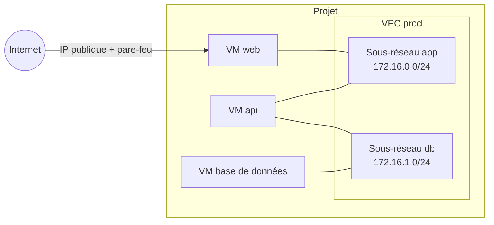

import NavigationFooter from '@site/src/components/NavigationFooter';

# Réseaux privés sur Hikube

Un **VPC** (*Virtual Private Cloud*) est un réseau virtuel isolé, propre à votre projet. Il se compose d'un ou plusieurs **sous-réseaux**, chacun portant une plage d'adresses IPv4 privée. Une VM reliée à un sous-réseau reçoit une interface réseau supplémentaire et une adresse dans cette plage : elle peut alors joindre les autres VM du même sous-réseau en privé.

Dans la [console Hikube](https://console.hikube.cloud), les VPC se gèrent depuis le menu **Infrastructure** > **Réseau** (page **Virtual Private Clouds**).

---

## Ce que vous pouvez faire depuis la console

| Besoin | Où le faire |
|--------|-------------|
| Créer un VPC et ses premiers sous-réseaux | **Réseau** > **Créer un VPC** |
| Consulter et ajouter des sous-réseaux | Menu **Actions** d'un VPC > **Voir les sous-réseaux** > **Créer un sous-réseau** |
| Relier une VM à un VPC | Assistant VM, étape **Réseau**, section **Réseaux VPC (Secondaires)** ; ou **Modifier** sur une VM existante |
| Créer un VPC ou un sous-réseau sans quitter l'assistant VM | Bouton **+ VPC** et **Ajouter un sous-réseau** de la section **Réseaux VPC (Secondaires)** |
| Supprimer un sous-réseau ou un VPC | Menu **Actions** > **Supprimer** (refusé tant que des VM l'utilisent) |

---

## Comment ça s'articule

- Chaque VM garde son **réseau principal** (celui de l'IP publique et de l'accès Internet). Les sous-réseaux VPC s'ajoutent en interfaces **secondaires**.
- Une VM peut être reliée à plusieurs sous-réseaux, y compris de VPC différents.
- Un VPC n'est pas exposé sur Internet : l'accès entrant depuis l'extérieur passe par l'**IP publique** et le **pare-feu** de la VM (voir [Configurer le réseau d'une VM](../compute/how-to/configure-network.md)).

---

## Cas d'usage

- **Architecture multi-tiers** : seule la VM frontale a une IP publique ; les VM applicatives et de base de données ne communiquent qu'en privé.
- **Bastion** : une VM d'administration exposée en SSH, qui rebondit vers des VM sans IP publique.
- **Segmentation** : séparer les flux par environnement ou par fonction, avec un sous-réseau par rôle.

---

## Limites

- Les VPC concernent les **instances VM**. Les clusters Kubernetes et les bases de données managées ne s'y rattachent pas depuis la console.
- Un VPC ne se renomme pas et ne se modifie pas : on y ajoute ou on y supprime des sous-réseaux.
- L'interconnexion de deux VPC (*peering*) et les routes statiques ne sont pas proposées dans la console ; contactez le [support](mailto:support@hidora.io).

---

## Prochaines étapes

- [Concepts](./concepts.md)
- [Démarrage rapide](./quick-start.md)
- [Relier une VM existante à un VPC](./how-to/attach-vm-to-vpc.md)

<NavigationFooter
  nextSteps={[
    {label: "Concepts", href: "../concepts"},
    {label: "Démarrage rapide", href: "../quick-start"},
  ]}
  seeAlso={[
    {label: "Ressources de calcul", href: "../../compute/"},
  ]}
/>
