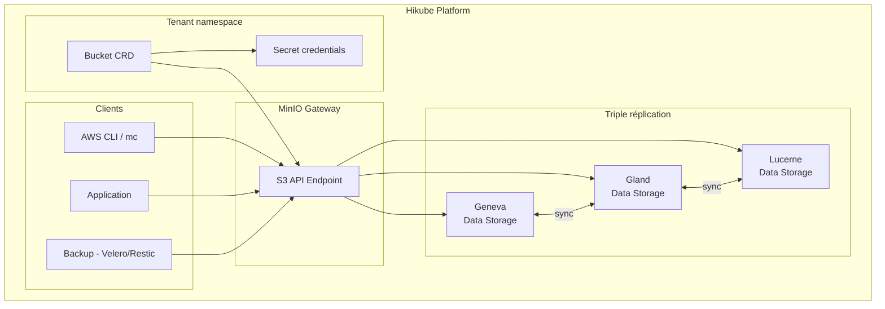

# Concepts — Buckets S3

## Architecture

Le service Object Storage d'Hikube repose sur **MinIO**, une solution de stockage objet compatible S3. Les données sont **triple-répliquées** automatiquement sur 3 datacenters géographiquement distincts, garantissant une haute disponibilité même en cas de perte complète d'un datacenter.



---

## Terminologie

| Terme | Description |
|-------|-------------|
| **Bucket** | Ressource Kubernetes (`apps.cozystack.io/v1alpha1`) représentant un bucket S3. Un seul champ requis : le `name`. |
| **Object Storage** | Stockage non structuré basé sur des objets (fichiers) identifiés par une clé unique. |
| **S3-compatible** | API compatible avec le protocole Amazon S3, supportée par la majorité des outils et SDKs. |
| **MinIO** | Serveur de stockage objet open source, compatible S3, utilisé comme backend par Hikube. |
| **Access Key / Secret Key** | Paire d'identifiants pour l'authentification S3, générée automatiquement dans un Secret Kubernetes. |
| **BucketInfo** | Champ JSON dans le Secret contenant l'endpoint S3, le protocole et le port. |
| **Endpoint** | URL du service S3 Hikube : `https://prod.s3.hikube.cloud` |

---

## Fonctionnement

### Création

La création d'un bucket est la plus simple de toutes les ressources Hikube :

```yaml title="bucket.yaml"
apiVersion: apps.cozystack.io/v1alpha1
kind: Bucket
metadata:
  name: my-data
spec: {}
```

L'opérateur crée automatiquement :
1. Le **bucket** dans MinIO
2. Un **Secret Kubernetes** contenant les credentials d'accès

### Credentials automatiques

Le Secret `<bucket-name>-credentials` contient :

| Clé | Description |
|-----|-------------|
| `accessKeyID` | Clé d'accès S3 |
| `accessSecretKey` | Clé secrète S3 |
| `bucketInfo` | JSON avec endpoint, protocole et port |

---

## Triple réplication multi-datacenter

Les données sont automatiquement répliquées sur **3 datacenters** :

| Datacenter | Localisation |
|-----------|-------------|
| Region 1 | Geneva (Genève) |
| Region 2 | Gland |
| Region 3 | Lucerne |

Cette architecture garantit :
- **Zéro perte de données** en cas de panne d'un datacenter
- **Continuité de service** avec basculement automatique
- **Latence optimisée** depuis la Suisse et l'Europe

:::tip
La triple réplication est transparente — vous n'avez rien à configurer. Toutes les données sont automatiquement répliquées.
:::

---

## Outils compatibles

Le service est compatible avec tous les outils supportant le protocole S3 :

| Outil | Cas d'usage |
|-------|-------------|
| **AWS CLI** | Gestion de fichiers en ligne de commande |
| **MinIO Client (mc)** | Client natif MinIO |
| **rclone** | Synchronisation et migration de données |
| **s3cmd** | Gestion S3 alternative |
| **Velero** | Sauvegarde de clusters Kubernetes |
| **Restic** | Sauvegarde de bases de données (PostgreSQL, MySQL, ClickHouse) |
| **SDKs** | boto3 (Python), AWS SDK (Go, Java, Node.js) |

---

## Cas d'usage

| Cas d'usage | Description |
|-------------|-------------|
| **Stockage d'assets** | Images, vidéos, fichiers statiques pour applications web |
| **Sauvegarde** | Destination pour les backups de bases de données et clusters K8s |
| **Data lake** | Stockage de données brutes pour l'analyse |
| **Archivage** | Conservation long terme de documents et logs |

---

## Limites et quotas

| Paramètre | Valeur |
|-----------|--------|
| Taille max par objet | Selon configuration MinIO |
| Nombre de buckets | Selon quota tenant |
| Réplication | Triple (3 DC), automatique |
| Endpoint | `https://prod.s3.hikube.cloud` |

---

## Pour aller plus loin

- [Overview](./overview.md) : présentation détaillée du service
- [Référence API](./api-reference.md) : paramètres de la ressource Bucket
