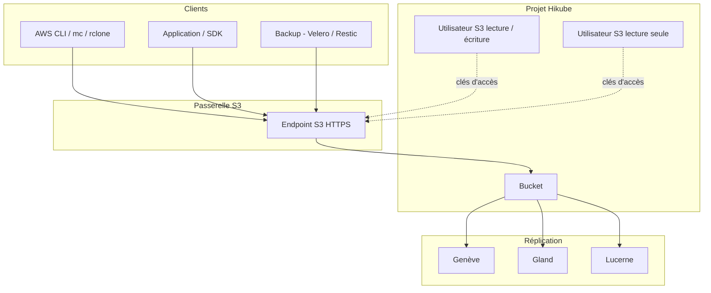

# Concepts — Buckets S3

## Architecture

Le service Object Storage d'Hikube est compatible S3. Les données sont **répliquées** automatiquement sur 3 datacenters géographiquement distincts, ce qui maintient la disponibilité même en cas de perte complète d'un datacenter.

```mermaid
graph TB
    subgraph "Projet Hikube"
        BK[Bucket]
        U1[Utilisateur S3 lecture / écriture]
        U2[Utilisateur S3 lecture seule]
    end

    subgraph "Passerelle S3"
        GW[Endpoint S3 HTTPS]
    end

    subgraph "Réplication"
        DC1[Genève]
        DC2[Gland]
        DC3[Lucerne]
    end

    subgraph "Clients"
        CLI[AWS CLI / mc / rclone]
        APP[Application / SDK]
        BKP[Backup - Velero / Restic]
    end

    U1 -.->|clés d'accès| GW
    U2 -.->|clés d'accès| GW
    CLI --> GW
    APP --> GW
    BKP --> GW
    GW --> BK
    BK --> DC1
    BK --> DC2
    BK --> DC3
```

---

## Terminologie

| Terme | Description |
|-------|-------------|
| **Bucket** | Espace de stockage objet créé depuis la console (menu **Infrastructure** → **Buckets S3**). |
| **Nom du bucket (console)** | Nom choisi à la création. Il identifie le bucket dans la console et ne peut pas être modifié. |
| **Nom du bucket S3** | Nom réel du bucket côté S3, généré par la plateforme. C'est **ce nom** que vos clients S3 doivent utiliser. Il est affiché sur la page du bucket. |
| **Endpoint S3** | Adresse du service S3 (par exemple `prod.s3.hikube.cloud`), affichée sur la page du bucket. |
| **Utilisateur S3** | Identité rattachée à un bucket, avec un droit **Lecture seule** ou **Lecture / Écriture**. Un bucket peut avoir plusieurs utilisateurs. |
| **Access Key ID / Secret Access Key** | Paire de clés d'authentification S3 d'un utilisateur, générée à sa création. La clé secrète n'est affichée qu'une seule fois. |
| **Verrouillage (WORM)** | Object Lock : empêche la suppression ou la modification des objets pendant 365 jours, en mode `COMPLIANCE` (*Write Once, Read Many*). |
| **Chiffrement au repos (LUKS)** | Chiffrement des données stockées sur disque. |

---

## Fonctionnement

### Création

Un bucket se crée avec l'assistant **Créer un bucket**. Seul le nom est obligatoire ; deux options peuvent être activées à la création :

- **Activer le verrouillage (Object Lock / WORM)**
- **Activer le chiffrement au repos (LUKS)**

L'assistant demande aussi de créer **au moins un utilisateur S3**. À la fin, la console affiche pour chaque utilisateur le **Nom du bucket S3**, la **Clé d'accès**, la **Clé secrète** et le **Point de terminaison API (S3)**.

:::warning Options fixées à la création
Le nom, le verrouillage et le chiffrement se choisissent à la création. La console ne permet pas de les modifier ensuite.
:::

### Utilisateurs et droits

| Droit | Libellé dans la console | Effet |
|-------|------------------------|-------|
| Lecture / écriture | **Lecture / Écriture** | Lister, lire, écrire et supprimer des objets du bucket |
| Lecture seule | **Lecture seule** | Lister et lire les objets uniquement |

Le droit d'un utilisateur se change à tout moment avec **Modifier l'accès**. Les clés d'un utilisateur ne peuvent pas être affichées à nouveau : pour obtenir de nouvelles clés, créez un nouvel utilisateur puis supprimez l'ancien.

### Portée des clés

Les clés d'un utilisateur donnent accès **uniquement au bucket auquel il est rattaché**. Elles ne permettent pas de lister tous les buckets de l'endpoint : les commandes doivent toujours cibler le bucket (`s3://<nom-du-bucket-s3>/`).

---

## Réplication multi-datacenter

| Datacenter | Localisation |
|-----------|-------------|
| Region 1 | Genève |
| Region 2 | Gland |
| Region 3 | Lucerne |

:::tip
La réplication est transparente : vous n'avez rien à configurer.
:::

---

## Tarification

L'assistant affiche un **Coût estimé** par Go et par mois (et par heure). Le tarif dépend du chiffrement : un bucket chiffré utilise un tarif distinct d'un bucket standard.

---

## Outils compatibles

| Outil | Cas d'usage |
|-------|-------------|
| **AWS CLI** | Gestion de fichiers en ligne de commande |
| **MinIO Client (mc)** | Client S3 compatible |
| **rclone** | Synchronisation et migration de données |
| **s3cmd** | Gestion S3 alternative |
| **Velero** | Sauvegarde de clusters Kubernetes |
| **Restic** | Sauvegarde de fichiers et de bases de données |
| **SDK** | boto3 (Python), AWS SDK (Go, Java, Node.js) |

---

## Limites

| Paramètre | Valeur |
|-----------|--------|
| Nom du bucket | 3 à 16 caractères : minuscules, chiffres et tirets ; commence par une lettre, se termine par une lettre ou un chiffre |
| Nom d'utilisateur S3 | 3 à 16 caractères, mêmes règles ; certains noms sont réservés |
| Utilisateurs par bucket | Au moins un à la création |
| Réplication | 3 datacenters, automatique |

---

## Pour aller plus loin

- [Vue d'ensemble](./overview.md) : présentation du service
- [Démarrage rapide](./quick-start.md) : créer votre premier bucket
- [Gérer les utilisateurs et les clés d'accès](./how-to/configure-access.md)
