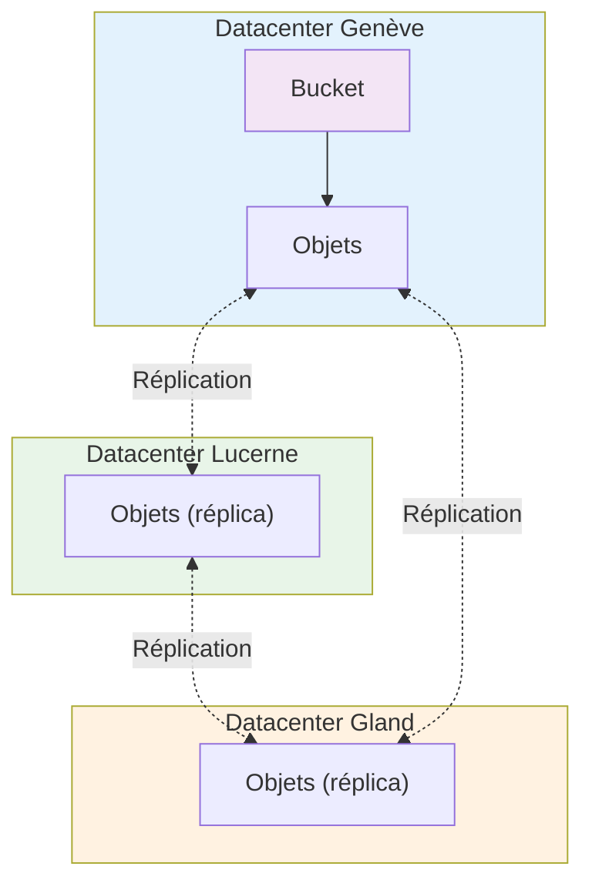

import NavigationFooter from '@site/src/components/NavigationFooter';

# Buckets S3 sur Hikube

Les **Buckets S3** d'Hikube offrent une solution de stockage objet **hautement disponible**, **répliquée** et **compatible S3** pour vos applications cloud-native, backups, artefacts CI/CD ou données analytiques.
La plateforme fournit une alternative souveraine à Amazon S3, opérée en Suisse.

Vous créez et gérez vos buckets en libre-service depuis la [console Hikube](https://console.hikube.cloud), dans le menu **Infrastructure** → **Buckets S3** de votre projet.

---

## Ce que la console vous permet de faire

- **Créer un bucket**, avec en option le **verrouillage des objets (Object Lock / WORM)** et le **chiffrement au repos (LUKS)** ;
- **Créer des utilisateurs S3** pour chaque bucket, en **lecture seule** ou en **lecture / écriture**, avec leur paire de clés d'accès ;
- **Consulter le nom S3 réel et le point de terminaison (endpoint)** du bucket, avec des exemples de commandes prêtes à copier ;
- **Modifier les droits** d'un utilisateur et **supprimer** un utilisateur ou un bucket.

---

## Architecture et fonctionnement

### Stockage objet distribué

Les buckets Hikube reposent sur une architecture S3 **distribuée et répliquée** sur plusieurs datacenters.
Contrairement aux [disques](../disks/overview.md) utilisés par les machines virtuelles, le stockage objet n'est attaché à aucune machine : il est accessible via l'**API S3 standard** depuis n'importe quelle application ou service autorisé.

#### Couche stockage

- Chaque bucket est hébergé sur une **infrastructure multi-nœuds** répartie entre plusieurs datacenters suisses
- Les objets sont **répliqués automatiquement** sur 3 sites physiques distincts
- Le système est conçu pour tolérer la panne d'un datacenter complet sans perte de données

#### Couche accès

- Les buckets sont accessibles via un **endpoint HTTPS** compatible avec la signature S3 v4
- L'accès est authentifié par des **clés d'accès S3** (Access Key ID / Secret Access Key) propres à chaque utilisateur du bucket
- Chaque bucket appartient à un **projet** et ses utilisateurs n'ont accès qu'à ce bucket

---

### Architecture multi-datacenter

Cette architecture garantit la **disponibilité et la durabilité** des données, tout en restant entièrement opérée en Suisse.

---

## Cas d'usage typiques

| **Cas d'usage**                 | **Description**                                                   |
| ------------------------------- | ----------------------------------------------------------------- |
| **Backups**                     | Sauvegardes automatisées d'applications ou de volumes persistants |
| **Artefacts CI/CD**             | Stockage d'images, binaires et pipelines GitOps                   |
| **Contenu statique**            | Fichiers servis par vos applications (assets web, PDF, images)    |
| **Données analytiques**         | Centralisation de fichiers CSV/Parquet/JSON pour ETL et outils BI |
| **Logs et archives**            | Stockage longue durée des journaux applicatifs et d'audit         |
| **Archivage réglementaire**     | Conservation non modifiable avec le verrouillage WORM             |
| **Applications S3-compatibles** | Utilisation directe par des applications via SDK ou AWS CLI       |

---

## Isolation et sécurité

- Chaque utilisateur S3 dispose de **ses propres clés** et n'a accès qu'au bucket auquel il est rattaché
- Le droit **lecture seule** permet de distribuer un accès en consultation sans risque de modification
- Tous les accès passent par **HTTPS** avec authentification par clé S3 ; l'accès anonyme n'est pas possible
- Le **chiffrement au repos (LUKS)** protège les données stockées sur disque
- Le **verrouillage (WORM)** empêche la suppression ou la modification des objets pendant 365 jours

---

## Connectivité et intégration

### Endpoint S3

L'endpoint S3 et le nom réel du bucket sont affichés sur la page du bucket, dans la carte **Accès & Configuration** (par exemple `prod.s3.hikube.cloud`).

### Compatibilité

Les buckets Hikube sont compatibles avec les outils et SDK S3 standards :

- **AWS CLI** : `aws --endpoint-url https://<endpoint> s3 ...`
- **MinIO Client (`mc`)** : alias configuré avec la clé d'accès et la clé secrète
- **rclone, s3cmd, Velero, Restic** : support natif de la signature v4
- **SDK** : boto3 (Python), AWS SDK (Go, Java, Node.js…)

---

## Prochaines étapes

- [Créer votre premier bucket](./quick-start.md)
- [Gérer les utilisateurs et les clés d'accès](./how-to/configure-access.md)

:::tip Recommandation production
Utilisez un bucket dédié par application ou par environnement, et un utilisateur S3 distinct par application.
:::

<NavigationFooter
  nextSteps={[
    {label: "Concepts", href: "../concepts"},
    {label: "Démarrage rapide", href: "../quick-start"},
  ]}
/>
