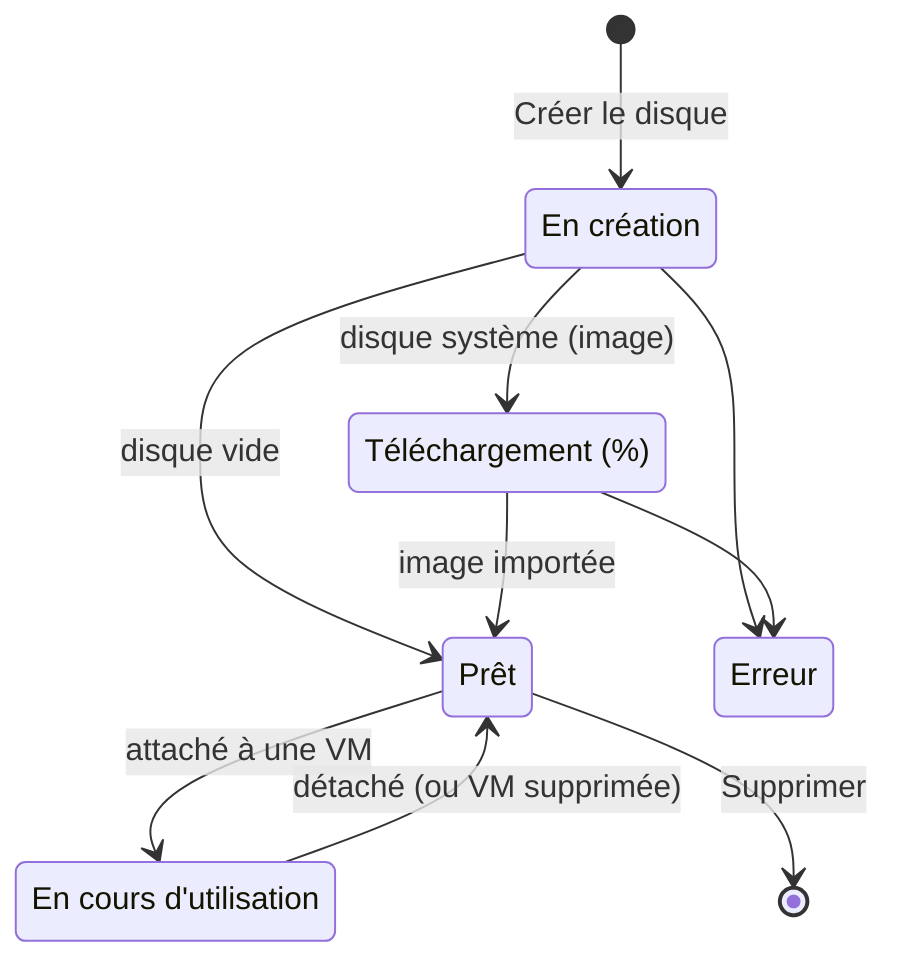

# Concepts — Disques

## Architecture

Un disque Hikube est un **volume bloc persistant** appartenant à un **projet**. Il consomme le quota de **stockage** du projet et peut être attaché à une machine virtuelle du même projet.

---

## Terminologie

| Terme | Description |
|-------|-------------|
| **Disque** | Volume de stockage bloc persistant, géré depuis le menu **Infrastructure** → **Disques**. |
| **Disque Vide** | Disque de données brut, à formater et monter dans la VM (affiché **Disque donnée** dans la liste). |
| **Disque Système** | Disque créé à partir d'une image système, utilisable comme disque de démarrage d'une VM. |
| **Image cloud** | Image de système d'exploitation du catalogue Hikube, choisie par OS et par version. |
| **Image personnalisée** | Image ISO ou QCOW2 importée depuis une URL HTTPS que vous fournissez. |
| **Réplication** | Copie des données du disque sur plusieurs nœuds, en mode synchrone ou asynchrone. |
| **Chiffrement (LUKS)** | Chiffrement des données au repos sur le disque. |
| **Attaché à** | VM qui utilise actuellement le disque. |

---

## Statuts

| Statut | Signification |
|--------|---------------|
| **En création** | Le disque est en cours de provisionnement |
| **Téléchargement** | L'image d'un disque système est en cours d'import ; la progression est affichée en pourcentage |
| **Prêt** | Le disque est provisionné et n'est attaché à aucune VM |
| **En cours d'utilisation** | Le disque est attaché à une VM |
| **Erreur** | Le téléchargement de l'image ou le provisionnement a échoué |
| **Inconnu** | L'état du disque n'a pas encore pu être déterminé |

---

## Source du disque

L'étape **Source** de l'assistant propose deux choix :

- **Disque Vide** : « Un espace de stockage brut qui pourra être formaté et monté sur une machine virtuelle. »
- **Disque Système** : « Un disque contenant un système d'exploitation pré-installé. » Vous choisissez alors une image dans **Image Système / Source** :
  - une **image cloud** du catalogue (OS puis **Version**) ;
  - ou **Image perso** : une **URL de l'image (ISO/QCOW2)**. L'URL doit utiliser HTTPS ; les adresses IP privées ou locales sont refusées.

:::note Windows
Un disque système Windows doit faire au moins **50 Go**. Son coût estimé inclut la licence Windows.
:::

---

## Réplication

| Mode | Libellé | Comportement | RTO | RPO |
|------|---------|--------------|-----|-----|
| Asynchrone | **Réplication Asynchrone** (Recommandé) | Réplication différée : en cas de panne simultanée de plusieurs nœuds, une faible quantité de données récentes peut être perdue | < 5 min | < 5 min |
| Synchrone | **Réplication Synchrone** | Réplication en temps réel sur plusieurs nœuds : perte de données minimale en cas de panne | < 5 min | < 1 min |

La **Réplication Asynchrone** est sélectionnée par défaut.

---

## Chiffrement

L'interrupteur **Chiffrement du disque** active le chiffrement **LUKS** des données au repos. Un disque chiffré est signalé par le badge **Chiffré** dans la liste et utilise un tarif distinct.

:::warning Options fixées à la création
La source, la réplication et le chiffrement se choisissent à la création. Seule la **taille** d'un disque peut être modifiée ensuite, et uniquement à la hausse.
:::

---

## Taille et quota

- Taille minimale : **20 Go** (50 Go pour un disque système Windows).
- La taille est limitée par le **quota de stockage** du projet ; l'assistant affiche la jauge **Usage projet estimé**.
- Un disque peut être **agrandi**, jamais réduit (voir [Redimensionner un disque](./how-to/resize.md)).

---

## Tarification

L'assistant affiche un **Coût estimé** : le tarif par Go et par mois, et le coût mensuel du disque. Le tarif dépend du chiffrement ; un disque système Windows ajoute le coût de la licence.

---

## Limites

| Paramètre | Valeur |
|-----------|--------|
| Nom du disque | 3 à 16 caractères : minuscules, chiffres et tirets ; commence par une lettre, se termine par une lettre ou un chiffre |
| Taille | À partir de 20 Go, dans la limite du quota de stockage du projet |
| Attachement | Une seule VM à la fois |
| Réduction de taille | Non supportée |

---

## Pour aller plus loin

- [Démarrage rapide](./quick-start.md) : créer un disque et l'utiliser dans une VM
- [Attacher un disque à une VM](./how-to/attach-to-vm.md)
- [Créer un disque système à partir d'une image](./how-to/create-from-image.md)
