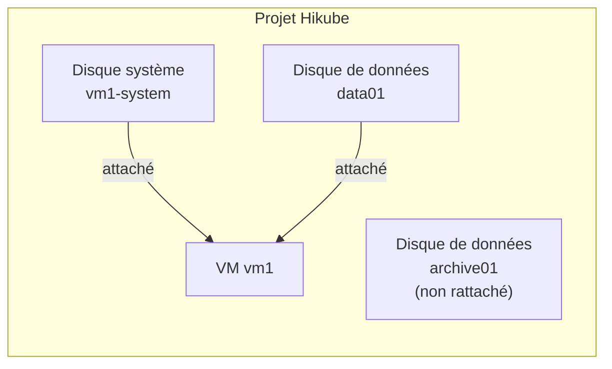

import NavigationFooter from '@site/src/components/NavigationFooter';

# Disques sur Hikube

Les **disques** Hikube sont des **volumes de stockage bloc persistants**, répliqués, que vous attachez à vos [machines virtuelles](../../compute/overview.md). Un disque existe indépendamment de la VM qui l'utilise : vous pouvez le créer à l'avance, l'attacher, le détacher, l'agrandir ou le réattacher à une autre VM, sans perdre ses données.

Vous gérez vos disques en libre-service depuis la [console Hikube](https://console.hikube.cloud), dans le menu **Infrastructure** → **Disques** de votre projet.

---

## Ce que la console vous permet de faire

- **Créer un disque vide** (disque de données) ou un **disque système** à partir d'une image (image cloud du catalogue ou image personnalisée ISO/QCOW2) ;
- **Choisir la réplication** (**Réplication Asynchrone** ou **Réplication Synchrone**) et activer le **chiffrement (LUKS)** ;
- **Suivre l'état** de chaque disque, y compris la progression du téléchargement d'une image ;
- **Voir à quelle VM** un disque est attaché ;
- **Agrandir** un disque ;
- **Supprimer** un disque qui n'est attaché à aucune VM.

L'attachement d'un disque à une VM se fait depuis l'assistant de création ou la page de modification de la VM (voir [Attacher un disque à une VM](./how-to/attach-to-vm.md)).

---

## Types de disques

| Type | Libellé dans la console | Usage |
|------|------------------------|-------|
| Disque de données | **Disque Vide** / **Disque donnée** | Espace de stockage brut à formater et monter dans une VM |
| Disque système | **Disque Système** | Disque contenant un système d'exploitation pré-installé, utilisé comme disque de démarrage d'une VM |

---

## Disques et VM

- Un disque est attaché à **une seule VM** à la fois.
- La liste **Disques de Stockage** affiche pour chaque disque la VM à laquelle il est **Attaché à**.
- Supprimer une VM **détache** ses disques sans les supprimer : ils restent dans la liste et peuvent être réutilisés.

---

## Réplication et sécurité

- **Réplication Asynchrone** (recommandée) : réplication différée, RTO < 5 min, RPO < 5 min.
- **Réplication Synchrone** : réplication en temps réel sur plusieurs nœuds, RTO < 5 min, RPO < 1 min.
- **Chiffrement du disque** : chiffrement LUKS des données au repos.

Le détail est présenté dans les [concepts](./concepts.md).

---

## Cas d'usage typiques

| Cas d'usage | Description |
|-------------|-------------|
| **Données applicatives** | Volume dédié pour une base de données ou des fichiers, séparé du disque système |
| **Préparation d'une VM** | Disque système créé à l'avance depuis une image, puis attaché à une nouvelle VM |
| **Migration entre VM** | Détacher un disque d'une VM et l'attacher à une autre |
| **Données sensibles** | Disque chiffré (LUKS) avec réplication synchrone |

:::tip
Pour du stockage de fichiers accessible par API depuis plusieurs applications, utilisez plutôt les [Buckets S3](../buckets/overview.md).
:::

<NavigationFooter
  nextSteps={[
    {label: "Concepts", href: "../concepts"},
    {label: "Démarrage rapide", href: "../quick-start"},
  ]}
  seeAlso={[
    {label: "Machines virtuelles", href: "../../../compute/overview"},
  ]}
/>
