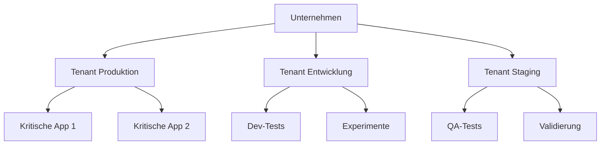
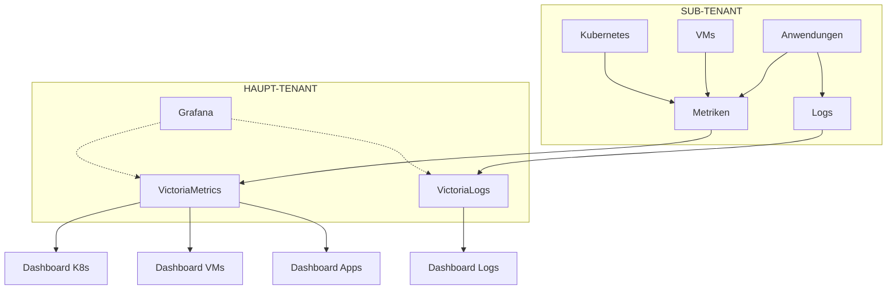

# Schlüsselkonzepte von Hikube

Diese Seite erklärt Ihnen die **grundlegenden Konzepte**, die Hikube zu einer einzigartigen Cloud-Plattform machen. Das Verständnis dieser Konzepte ermöglicht es Ihnen, das Beste aus Ihrer Infrastruktur herauszuholen und fundierte Entscheidungen zu treffen.

---

## Tenants: Ihr privater Bereich

### **Was ist ein Tenant?**
Ein **Tenant** ist Ihre isolierte und gesicherte Umgebung innerhalb von Hikube. Es ist wie Ihr eigenes "virtuelles Rechenzentrum" mit:
- **Isoliertem Netzwerk**
- **Separaten Benutzern und Berechtigungen**
- **Angepassten Sicherheitsrichtlinien**
- **Verfügbaren Sub-Tenants**

### **Warum dieser Ansatz?**

**Konkrete Vorteile:**
- **Vollständige Isolation**: Keine Auswirkungen zwischen Umgebungen
- **Teamverwaltung**: Granulare Berechtigungen pro Tenant
- **Differenzierte Richtlinien**: Produktion vs. Entwicklung
- **Separate Abrechnung**: Kostenverfolgung pro Projekt

### **Typische Anwendungsfälle**
| Tenant | Verwendung |
|--------|------------|
| **Produktion** | Kritische Anwendungen |
| **Staging** | Vorproduktionstests |
| **Development** | Aktive Entwicklung |
| **Sandbox** | Schulung/Demonstration |

---

## Infrastructure as Code (IaC)

### **Für die Industrialisierung konzipiert**
Hikube ist für die Automatisierung und Industrialisierung Ihrer Infrastruktur konzipiert. Alle Funktionen sind zugänglich über:

- **Vollständige API**: Native Integration in Ihre CI/CD-Pipelines
- **Leistungsstarke CLI**: Automatisierung und Skripte für Ihre DevOps-Teams
- **Deklarativ**: Beschreiben Sie den gewünschten Zustand, Hikube kümmert sich um den Rest

### **Vorteile des industriellen Ansatzes**
- **Reproduzierbarkeit**: Identische Deployments jedes Mal
- **Versionierung**: Vollständige Nachverfolgung von Infrastrukturänderungen
- **Zusammenarbeit**: Geteilter Code zwischen Entwicklungs- und Ops-Teams
- **Automatisierung**: Nahtlose Integration in Ihre Workflows

---

## Observability und Monitoring

### **Vollständiger Monitoring-Stack**

Hikube ermöglicht es Ihnen, Ihren eigenen Monitoring-Stack in Ihrem Tenant mit **Grafana + VictoriaMetrics + VictoriaLogs** bereitzustellen. Dieser Stack kann die Daten all Ihrer Sub-Tenants zentralisieren und bietet einen globalen Überblick über Ihre Infrastruktur.

### **Multi-Tenant-Monitoring-Architektur**

#### **Intelligente Zentralisierung**
- **Haupt-Tenant**: Hostet den Stack Grafana + VictoriaMetrics + VictoriaLogs
- **Sub-Tenants**: Generieren automatisch Metriken und Logs
- **Sichere Übertragung**: Zentralisierte Aggregation mit Datenisolation
- **Globale Ansicht**: Einheitliches Dashboard Ihrer gesamten Infrastruktur

#### **Dashboards nach Ressource**

Hikube bietet **vorkonfigurierte Dashboards** für jeden Ressourcentyp:

| **Ressourcentyp** | **Enthaltenes Dashboard** | **Wichtige Metriken** |
|---------------------------|-------------------------|------------------------|
| **Kubernetes** | Cluster, Nodes, Pods, Services | CPU, RAM, Netzwerk, Speicher |
| **Virtuelle Maschinen** | Host, VM, Performance | Auslastung, I/O, Verfügbarkeit |
| **Datenbanken** | MySQL, PostgreSQL, Redis | Verbindungen, Abfragen, Cache |
| **Anwendungen** | Performance, Fehler | Latenz, Durchsatz, 5xx |
| **Netzwerk** | LoadBalancer, VPN | Traffic, Latenz, Verbindungen |
| **Speicher** | Buckets, Volumes | Kapazität, IOPS, Transfers |

---

## Nächste Schritte

Jetzt, da Sie die Konzepte von Hikube beherrschen, können Sie:

### **In die Praxis umsetzen**
- **[Kubernetes bereitstellen](../services/kubernetes/overview.md)** → Erstellen Sie Ihren ersten Cluster
- **[VMs konfigurieren](../services/compute/overview.md)** → Hybride Infrastruktur
- **[Speicher verwalten](../services/storage/buckets/overview.md)** → Persistente Daten

### **Automatisieren**
- **[Terraform](../tools/terraform.md)** → Infrastructure as Code
<!--- **[CLI](../tools/cli.md)** → Skripte und Automatisierung-->

### **Vertiefen**
- **[FAQ](../resources/faq.md)** → Häufig gestellte Fragen
- **[Troubleshooting](../resources/troubleshooting.md)** → Problemlösung

---

**Empfehlung:** Beginnen Sie mit der Erkundung der **[Kubernetes-Services](../services/kubernetes/overview.md)** oder **[Compute-Services](../services/compute/overview.md)**, um zu sehen, wie diese Konzepte konkret auf jede Komponente von Hikube angewendet werden.
