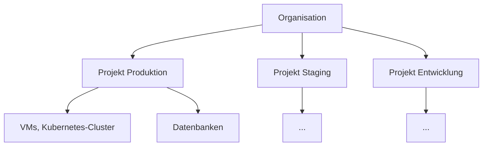

# Schlüsselkonzepte von Hikube

Diese Seite stellt die Begriffe vor, die Sie für die Nutzung von Hikube kennen sollten: wie Ihre Ressourcen organisiert sind, wie Sie sie steuern und was die Plattform für Sie übernimmt.

---

## Die Hikube-Konsole

Alle gängigen Vorgänge erledigen Sie in der **Webkonsole**: [https://console.hikube.cloud](https://console.hikube.cloud). Sie melden sich dort mit Ihrem Hikube-Konto an (Single Sign-on). In der Konsole erstellen, ändern und löschen Sie Ihre Ressourcen, sehen deren Zustand und geschätzte Kosten ein und rufen die Verbindungsinformationen ab.

Das Seitenmenü eines Projekts gruppiert die Services:

| Bereich | Services |
|---------|----------|
| **Dashboard** | Projektübersicht, Quotas, Kosten, zuletzt verwendete Ressourcen |
| **Infrastructure** | **VM Instances**, **Disks**, **S3 Buckets**, **Kubernetes**, **Networking** |
| **DB & Messaging** | **PostgreSQL**, **MariaDB**, **MongoDB**, **Redis**, **RabbitMQ** |

---

## Organisation und Projekte

```mermaid
graph TB
    O[Organisation] --> P1[Projekt Produktion]
    O --> P2[Projekt Staging]
    O --> P3[Projekt Entwicklung]

    P1 --> R1[VMs, Kubernetes-Cluster]
    P1 --> R2[Datenbanken]
    P2 --> R3[...]
    P3 --> R4[...]
```

### Organisation

Die **Organisation** repräsentiert Ihr Unternehmen. Sie wird von Hidora bei der Eröffnung Ihres Kontos erstellt und bündelt Ihre Benutzer und Ihre Projekte. Wenn Sie Zugriff auf mehrere Organisationen haben, wechseln Sie diese über das Profilmenü (**Change organization**).

### Projekt

Ein **Projekt** ist ein isolierter Bereich innerhalb der Organisation. Jede Ressource (VM, Disk, Cluster, Datenbank …) gehört zu genau einem Projekt. Ein Projekt bietet:

- **Isolation**: Die Ressourcen eines Projekts sehen die Ressourcen anderer Projekte nicht;
- **Quotas**: Limits für CPU, Arbeitsspeicher und Speicher, die den Verbrauch des Projekts deckeln;
- **Kostenübersicht**: Das Dashboard des Projekts schätzt die monatlichen Kosten seiner Ressourcen.

Üblich ist es, ein Projekt pro Umgebung (Produktion, Staging, Entwicklung) oder pro Team anzulegen.

:::note Frühere Terminologie
In früheren Versionen der Dokumentation hieß ein Projekt **Tenant**.
:::

### Quotas

Die Quotas eines Projekts werden bei seiner Erstellung festgelegt (Schritt **Quotas** des Assistenten) und anschließend in den Projekteinstellungen geändert. Die Erstellungsassistenten zeigen vor dem Anlegen an, wie sich jede neue Ressource auf die Quota auswirkt. Eine Quota kann nicht unter den aktuellen Verbrauch des Projekts gesenkt werden: Geben Sie zuerst Ressourcen frei.

### Ein Projekt löschen

Das Löschen eines Projekts (Projekteinstellungen → **Danger Zone** → **Delete this project**) zerstört endgültig alle seine Ressourcen: VMs, Kubernetes-Cluster, Datenbanken, Disks, S3-Buckets und Netzwerke. Diese Aktion ist den Administratoren des Projekts oder der Organisation vorbehalten.

---

## Verwaltete Services

Hikube betreibt für Sie die zugrunde liegende Infrastruktur jedes Services: Hochverfügbarkeit, Replikation des Speichers zwischen Rechenzentren, Updates der Plattform. Sie wählen Größe und Konfiguration; die Plattform stellt bereit und wartet.

| Kategorie | Services |
|-----------|----------|
| Compute | [Virtuelle Maschinen](../services/compute/overview.md), [GPU](../services/gpu/overview.md) |
| Container | [Verwaltetes Kubernetes](../services/kubernetes/overview.md) |
| Speicher | [Disks](../services/storage/disks/overview.md), [S3-Buckets](../services/storage/buckets/overview.md) |
| Netzwerk | [VPC und Subnetze](../services/networking/overview.md) |
| Datenbanken | [PostgreSQL](../services/databases/postgresql/overview.md), [MariaDB](../services/databases/mariadb/overview.md), [MongoDB](../services/databases/mongodb/overview.md), [Redis](../services/databases/redis/overview.md) |
| Messaging | [RabbitMQ](../services/messaging/rabbitmq/overview.md) |

Einige Services (ClickHouse, Kafka, NATS) werden in der Konsole noch nicht als Self-Service angeboten: Sie werden auf Anfrage vom Support bereitgestellt.

---

## Souveränität und Verfügbarkeit

- **Daten in der Schweiz**: Alle Daten bleiben auf Schweizer Staatsgebiet gehostet.
- **Drei Rechenzentren**: Der replizierte Speicher ist auf drei geografisch getrennte Rechenzentren verteilt.
- **Netzwerkisolation**: Jedes Projekt verfügt über einen eigenen Netzwerkperimeter.

---

## Nächste Schritte

- **[Schnellstart](./quick-start.md)**: Erstellen Sie Ihr erstes Projekt und Ihren ersten Cluster
- **[Virtuelle Maschinen](../services/compute/overview.md)**: Stellen Sie eine Linux- oder Windows-VM bereit
- **[FAQ](../resources/faq.md)**: häufige Fragen
