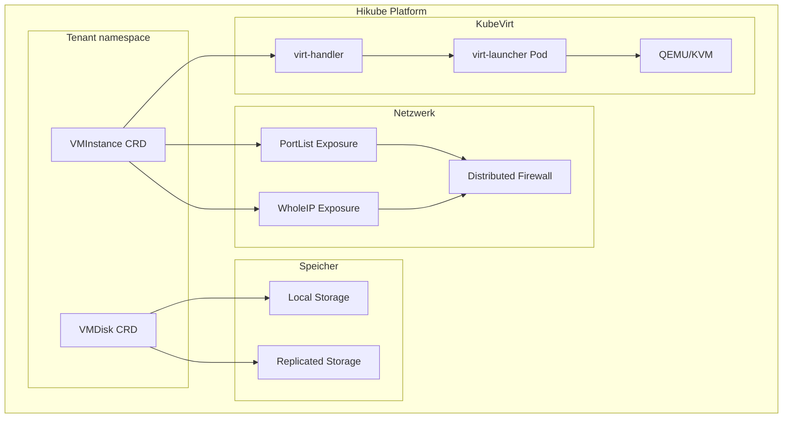
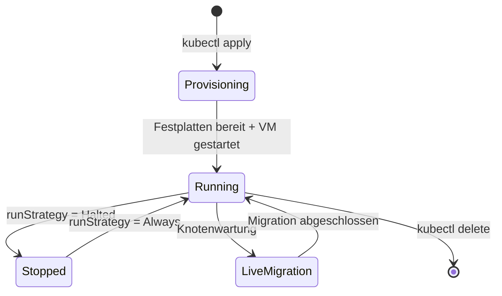

# Konzepte — Virtuelle Maschinen

## Architektur

Hikube stellt virtuelle Maschinen (VM) dank **KubeVirt** bereit, einer Technologie, die es ermöglicht, VMs direkt innerhalb der Kubernetes-Infrastruktur auszuführen. Jede VM wird als native Kubernetes-Ressource verwaltet und bietet eine nahtlose Integration mit dem Cloud-nativen Ökosystem.

---

## Terminologie

| Begriff | Beschreibung |
|---------|-------------|
| **VMInstance** | Kubernetes-Ressource (`apps.cozystack.io/v1alpha1`), die eine virtuelle Maschine repräsentiert. Verwaltet den Lebenszyklus, Festplatten, Netzwerk und cloud-init. |
| **VMDisk** | Kubernetes-Ressource, die eine virtuelle Festplatte repräsentiert. Kann aus einem Golden Image, einer HTTP-Quelle oder leer erstellt werden. |
| **Golden Image** | Vorkonfiguriertes und für KubeVirt optimiertes OS-Image (AlmaLinux, Rocky, Debian, Ubuntu, usw.). |
| **Instance Type** | CPU/RAM-Ressourcenprofil, definiert durch eine Serie (S, U, M) und eine Größe. |
| **cloud-init** | Mechanismus zur automatischen Initialisierung von VMs beim ersten Start (Benutzer, Pakete, Skripte). |
| **PortList** | Netzwerk-Expositionsmethode, die spezifische Ports mit automatischem Firewalling auf der dedizierten IP exponiert (empfohlen). |
| **WholeIP** | Netzwerk-Expositionsmethode, die der VM eine dedizierte öffentliche IP zuweist. |

---

## Instanztypen

Hikube bietet drei Instanzserien mit unterschiedlichen CPU/RAM-Verhältnissen:

| Serie | CPU:RAM-Verhältnis | Anwendungsfall |
|-------|---------------|-------------|
| **S (Standard)** | 1:2 | Allgemeine Workloads, geteilte CPU, burstable |
| **U (Universal)** | 1:4 | Ausgewogene Workloads, mehr Speicher |
| **M (Memory)** | 1:8 | Speicherintensive Anwendungen (Caches, Datenbanken) |

Jede Serie reicht von `small` (1-2 vCPU) bis `8xlarge` (32-64 vCPU).

---

## Speicher

Zwei Speicherklassen stehen für VM-Festplatten zur Verfügung:

| Klasse | Eigenschaft | Anwendungsfall |
|--------|-----------------|-------------|
| **local** | Speicher auf dem physischen Knoten, maximale Leistung | Ephemere Daten, Caches, Tests |
| **replicated** | Replikation über mehrere Knoten/Regionen | Produktionsdaten, Hochverfügbarkeit |

:::tip
Verwenden Sie `storageClass: replicated` für Systemfestplatten in der Produktion. Der `local`-Speicher bietet bessere I/O-Leistung, übersteht aber keinen Knotenausfall.
:::

---

## Netzwerk und Exposition

### PortList (empfohlen)

Der **PortList**-Modus exponiert nur die angegebenen Ports über eine dedizierte IP der VM mit automatischem Firewalling auf dem Service. Dies ist die empfohlene Methode, da sie:
- Die Angriffsfläche begrenzt
- Der VM eine dedizierte IP zuweist
- Standard-TCP-Ports unterstützt (22, 80, 443, usw.)

### WholeIP

Der **WholeIP**-Modus weist eine dedizierte öffentliche IP mit allen offenen Ports zu. Nützlich wenn:
- Die VM über dynamische Ports erreichbar sein muss
- Ein Protokoll eine dedizierte IP erfordert (VPN, SIP, usw.)
- Die VM als Gateway oder VPN dient

---

## Lebenszyklus einer VM

Hikube-VMs unterstützen:
- **Starten/Stoppen** über das Feld `spec.runStrategy`
- **Live Migration** transparent während Wartungsarbeiten
- **Auto-Restart** bei Ausfall des Host-Knotens
- **Snapshots** für punktuelle Sicherungen

---

## Isolation und Sicherheit

Jede VM profitiert von einer mehrstufigen Isolation:

- **Kernel-Isolation**: KubeVirt führt jede VM in ihrem eigenen QEMU/KVM-Prozess aus
- **Netzwerk-Isolation**: Verteilte Firewall zwischen den Tenants
- **Speicher-Isolation**: Jede Festplatte ist ein dediziertes Volume

---

## Limits und Quotas

| Parameter | Limit |
|-----------|--------|
| vCPU pro VM | Bis zu 64 (Serie S `s1.8xlarge`) |
| RAM pro VM | Bis zu 256 GB (Serie M `m1.8xlarge`) |
| Festplatten pro VM | Mehrere (System + Daten) |
| Festplattengröße | Variabel, abhängig vom Tenant-Quota |

---

## Weiterführende Informationen

- [Übersicht](./overview.md): Detaillierte Vorstellung des Dienstes
- [API-Referenz](./api-reference.md): Vollständige Liste der VMInstance- und VMDisk-Parameter
