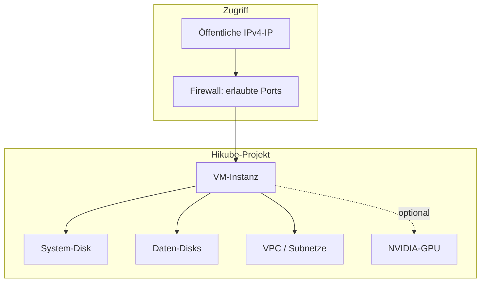
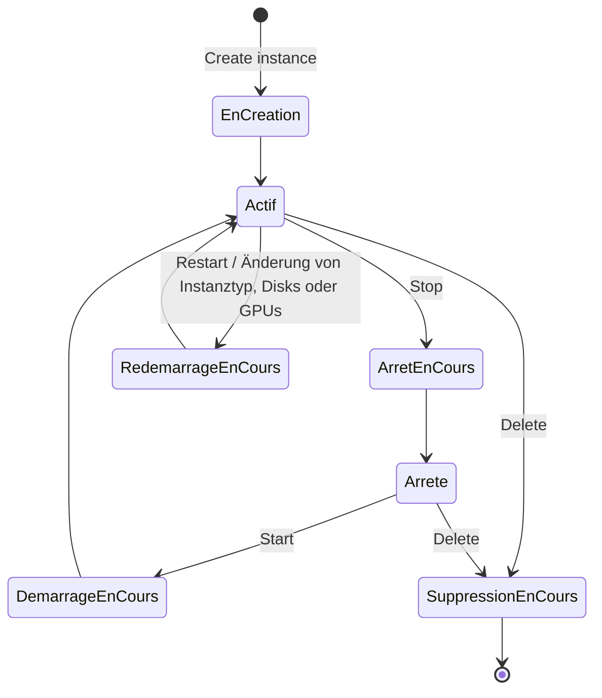

# Konzepte — Virtuelle Maschinen

## Architektur

Eine Hikube-**VM-Instanz** fasst eine Rechenvorlage (vCPU und RAM), eine oder mehrere Disks, eine Netzwerkkonfiguration und optional GPUs zusammen. Sie steuern diese über die Konsole.

```mermaid
graph TB
    subgraph "Hikube-Projekt"
        VM[VM-Instanz]
        SYS[System-Disk]
        DATA[Daten-Disks]
        VPC[VPC / Subnetze]
        GPU[NVIDIA-GPU]
    end

    subgraph "Zugriff"
        PUB[Öffentliche IPv4-IP]
        FW[Firewall: erlaubte Ports]
    end

    VM --> SYS
    VM --> DATA
    VM --> VPC
    VM -.optional.-> GPU
    PUB --> FW --> VM
```

---

## Terminologie

| Begriff | Beschreibung |
|-------|-------------|
| **Projekt** | Isolierter Bereich, der Ihre Ressourcen zusammenfasst und Quotas trägt (CPU, Memory, Storage). Früher *Tenant* genannt. |
| **VM-Instanz** | Virtuelle Maschine. Ihr Name (3 bis 16 Zeichen, Kleinbuchstaben, Ziffern und Bindestriche, beginnend mit einem Buchstaben) kann nach der Erstellung nicht mehr geändert werden. |
| **Instanztyp** | CPU/RAM-Vorlage, definiert durch eine Serie (S, U, M) und eine Größe (zum Beispiel `u1.xlarge`). |
| **System-Image** | Auf der System-Disk installiertes Betriebssystem (Ubuntu, Debian, Rocky Linux, Windows Server…). |
| **System-Disk** | Erste Disk der VM, von der gebootet wird. Sie trägt standardmäßig den Namen der VM. |
| **Daten-Disk** | Zusätzliche Disk, bei der Erstellung leer. Sie erscheint im Betriebssystem als zusätzliches Blockgerät (`/dev/vdb`, `/dev/vdc`…). |
| **Replikation** | Modus, in dem die Daten einer Disk auf mehrere Knoten kopiert werden: **Asynchronous** oder **Synchronous**. |
| **Firewall** | Filterung des eingehenden Datenverkehrs auf der öffentlichen IP: Nur die erlaubten Ports sind geöffnet. |
| **VPC** | Privates Netzwerk des Projekts, in Subnetze unterteilt, mit dem eine VM verbunden werden kann. Siehe [Netzwerk](../networking/concepts.md). |
| **cloud-init (User Data)** | Initialisierungsskript, das beim Start der VM ausgeführt wird (Pakete, Benutzer, Befehle). Für Windows nicht verfügbar. |

---

## Instanztypen

| Serie | Bezeichnung in der Konsole | Verhältnis vCPU:RAM | Größen |
|-------|-------------------------|----------------|---------|
| `s1` | **Standard (S)** | 1:2 | `small` (1 vCPU) bis `8xlarge` (64 vCPU) |
| `u1` | **Universal (U)** | 1:4 | `medium` (1 vCPU) bis `8xlarge` (32 vCPU) |
| `m1` | **Memory (M)** | 1:8 | `large` (2 vCPU) bis `8xlarge` (32 vCPU) |

Die Einzelheiten zu den Größen finden Sie in der [Übersicht](./overview.md#instanztypen).

---

## Speicher

Jede mit der VM erstellte Disk wird im Schritt **Storage** des Assistenten konfiguriert:

| Parameter | Werte | Hinweise |
|-----------|---------|-----------|
| **Volume Name** | Aus dem Namen der VM generiert (`ma-vm`, `ma-vm-2`…) | Änderbar |
| **Size (GB)** | Mindestens 20 GB, höchstens 4096 GB | Mindestens 50 GB für Windows, 40 GB für Oracle Linux |
| **Replication Type** | **Asynchronous Replication** (Recommended) oder **Synchronous Replication** | Siehe unten |
| **Disk Encryption** | Aktiviert / deaktiviert | LUKS-Verschlüsselung der Daten im Ruhezustand |

| Modus | RTO | RPO | Verwendung |
|------|-----|-----|-------|
| **Asynchronous Replication** | < 5 min | < 5 min | Standardauswahl, für die meisten Anwendungsfälle geeignet |
| **Synchronous Replication** | < 5 min | < 1 min | Daten, bei denen der maximal tolerierte Verlust minimal sein muss |

Eine Disk kann auch **Existing** sein: Sie wird dann aus den Disks des Projekts ausgewählt, die an keine VM angebunden sind. Die System-Disk kann nur eine Disk sein, die ein Image enthält; Daten-Disks können nur Disks ohne Image sein.

Disks sind eigenständige Ressourcen, die im Menü **Disks** verwaltet werden: siehe [Disks](../storage/disks/concepts.md).

---

## Netzwerk

| Option des Assistenten | Standard | Wirkung |
|-----------------------|--------|-------|
| **Public IPv4 Address** | Aktiviert | Die VM erhält eine öffentliche IP, die aus dem Internet erreichbar ist. |
| **Enable Firewall** | Aktiviert | Eingehend sind nur die **Allowed Ports** geöffnet (SSH 22 standardmäßig angehakt; HTTP 80, HTTPS 443 und eigene Ports optional). |
| Firewall deaktiviert | — | Alle Ports der öffentlichen IP sind geöffnet. Schützen Sie die VM dann mit einer Firewall im Betriebssystem. |
| **VPC Networks (Secondary)** | Keine | Jedes ausgewählte Subnetz fügt der VM eine private Netzwerkschnittstelle hinzu. |

---

## Lebenszyklus

```mermaid
stateDiagram-v2
    [*] --> EnCreation: Create instance
    EnCreation --> Actif
    Actif --> ArretEnCours: Stop
    ArretEnCours --> Arrete
    Arrete --> DemarrageEnCours: Start
    DemarrageEnCours --> Actif
    Actif --> RedemarrageEnCours: Restart / Änderung von Instanztyp, Disks oder GPUs
    RedemarrageEnCours --> Actif
    Actif --> SuppressionEnCours: Delete
    Arrete --> SuppressionEnCours: Delete
    SuppressionEnCours --> [*]
```

In der Konsole angezeigte Status: **Creating**, **Running**, **Starting**, **Stopping**, **Stopped**, **Restarting**, **Deleting**, **Error**, **Failed**, **Unknown**.

Die Option **Automatic Restart** (Schritt **Configuration** des Assistenten oder **Advanced Configuration** beim Bearbeiten) startet die VM bei einem unerwarteten Absturz automatisch neu. Sie ist standardmäßig deaktiviert.

---

## Was nach der Erstellung änderbar ist

| Element | Änderbar | Wirkung |
|---------|-----------|-------|
| Name, System-Image | Nein | — |
| Instanztyp | Ja | Neustart der VM |
| Disks (Hinzufügen, Trennen) | Ja | Neustart der VM |
| GPU | Ja | Neustart der VM |
| Öffentliche IP, Firewall, Ports, VPC | Ja | Ohne Neustart angewendet |
| SSH-Schlüssel | Ja | Angebot, die User Data neu zu laden; beim nächsten Neustart angewendet |
| cloud-init-Skript, automatischer Neustart | Ja | Skript wird nach **Reload UserData** und Neustart erneut ausgeführt |

---

## Quotas

Jedes Projekt verfügt über Quotas für **CPU**, **Memory** und **Storage**. Der Assistent zeigt den aktuellen Verbrauch, den geplanten Zuwachs und die Summe an; die Schaltfläche **Next** bleibt deaktiviert, solange die neue VM ein Quota überschreitet. Dieselbe Prüfung gilt für die Schaltfläche **Save** beim Bearbeiten.

Der Assistent zeigt außerdem eine Kostenschätzung für die VM an: Instanztyp, neue Disks, GPUs, gegebenenfalls Windows-Lizenz und öffentliche IP.

---

## Weiterführende Informationen

- [Übersicht](./overview.md)
- [Schnellstart](./quick-start.md)
- [Disks](../storage/disks/overview.md)
- [Netzwerk: VPC und Subnetze](../networking/overview.md)
