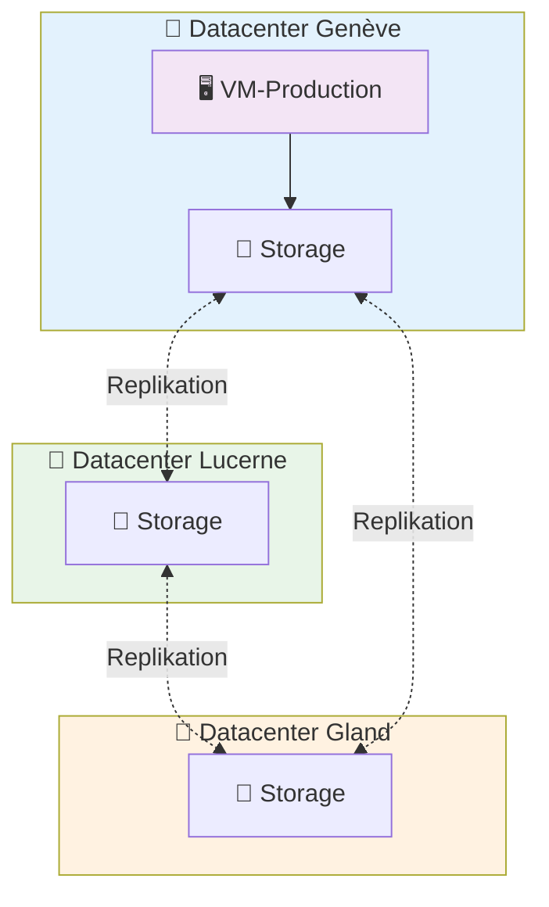

# Virtuelle Maschinen auf Hikube

Die **Virtuellen Maschinen (VMs)** von Hikube bieten eine vollständige Virtualisierung der Hardware-Infrastruktur und gewährleisten die Ausführung heterogener Betriebssysteme und Geschäftsanwendungen in isolierten Umgebungen, die den Sicherheitsanforderungen von Unternehmen entsprechen.

---

## 🏗️ Architektur und Funktionsweise

### **Trennung von Compute und Speicher**

Hikube verwendet eine **entkoppelte** Architektur zwischen Compute und Speicher, die eine optimale Resilienz gewährleistet:

**💻 Compute-Schicht**

- Die VM läuft auf **physischen Servern** in einem der 3 Rechenzentren
- Wenn ein Knoten ausfällt, wird die VM **automatisch** auf einem anderen Knoten **neu gestartet**
- Wenn ein Rechenzentrum ausfällt, wird die VM **automatisch** auf einem anderen Knoten in einem der 2 verbleibenden Rechenzentren **neu gestartet**
- Die Ausfallzeit beschränkt sich auf den Neustart (in der Regel < 2 Minuten)

**💾 Speicherschicht (Persistent)**

- Die VM-Festplatten werden **automatisch repliziert** über mehrere physische Knoten mit dem "replicated"-Speicher
- **Kein Datenverlust** selbst bei mehrfachem Hardware-Ausfall
- Die Festplatten überstehen Ausfälle und bleiben an die verlagerte VM anbindbar

Diese Trennung gewährleistet, dass **Ihre Daten immer sicher sind**, selbst wenn der physische Server, der Ihre VM hostet, nicht verfügbar wird oder ein Rechenzentrum ausfällt.
Wir garantieren die Ressourcen!

### **Multi-Datacenter-Architektur**

---

## ⚙️ Instanztypen

### **Vollständige Palette für alle Anforderungen**

Hikube bietet drei Instanzserien, die für verschiedene Nutzungsprofile optimiert sind und angepasste Leistung für jeden Workload gewährleisten:

### **Serie S - Standard (Verhältnis 1:2)**

**Compute-orientierte** Instanzen mit einem CPU/Speicher-Verhältnis von 1:2, ideal für CPU-intensive Lasten.

| **Instanz** | **vCPU** | **RAM** | **Typische Anwendungsfälle** |
|--------------|----------|---------|---------------------------|
| `s1.small`   | 1        | 2 GB    | Leichte Dienste, Proxies |
| `s1.medium`  | 2        | 4 GB    | Workers, Batch-Verarbeitung |
| `s1.large`   | 4        | 8 GB    | Wissenschaftliche Berechnungen |
| `s1.xlarge`  | 8        | 16 GB   | Rendering, Kompilierung |
| `s1.3large`  | 12       | 24 GB   | Intensive Anwendungen |
| `s1.2xlarge` | 16       | 32 GB   | HPC, Simulationen |
| `s1.3xlarge` | 24       | 48 GB   | Verteiltes Rechnen |
| `s1.4xlarge` | 32       | 64 GB   | Massives Rechnen |
| `s1.8xlarge` | 64       | 128 GB  | Exascale-Rechnen |

### **Serie U - Universal (Verhältnis 1:4)**

**Vielseitige** Instanzen mit einem optimalen Gleichgewicht zwischen CPU und Speicher für die Mehrheit der Unternehmensanwendungen.

| **Instanz** | **vCPU** | **RAM** | **Typische Anwendungsfälle** |
|--------------|----------|---------|---------------------------|
| `u1.medium`  | 1        | 4 GB    | Entwicklung, Tests, Microservices |
| `u1.large`   | 2        | 8 GB    | Webanwendungen, APIs |
| `u1.xlarge`  | 4        | 16 GB   | Geschäftsanwendungen |
| `u1.2xlarge` | 8        | 32 GB   | Intensive Workloads |
| `u1.4xlarge` | 16       | 64 GB   | Kritische Anwendungen |
| `u1.8xlarge` | 32       | 128 GB  | Enterprise-Anwendungen |

### **Serie M - Memory (Verhältnis 1:8)**

**Speicheroptimierte** Instanzen mit einem CPU/Speicher-Verhältnis von 1:8 für RAM-intensive Anwendungen.

| **Instanz** | **vCPU** | **RAM** | **Typische Anwendungsfälle** |
|--------------|----------|---------|---------------------------|
| `m1.large`   | 2        | 16 GB   | Redis-Caches, Memcached |
| `m1.xlarge`  | 4        | 32 GB   | In-Memory-Datenbanken |
| `m1.2xlarge` | 8        | 64 GB   | Analytics, Big Data |
| `m1.4xlarge` | 16       | 128 GB  | SAP HANA, Oracle |
| `m1.8xlarge` | 32       | 256 GB  | Data Warehouses |

:::tip **Auswahlhilfe**

- **Intensive Berechnungen, CI/CD** → Serie **S** (Verhältnis 1:2, CPU-optimiert)
- **Klassische Webanwendungen** → Serie **U** (Verhältnis 1:4, ausgewogen)
- **Datenbanken, Analytics** → Serie **M** (Verhältnis 1:8, speicheroptimiert)
:::

---

## 🔒 Isolation und Sicherheit

### **Multi-Tenant by Design**

Jede VM profitiert von einer **vollständigen Isolation** dank einer sicheren Architektur, die Ressourcen zwischen verschiedenen Tenants strikt trennt. Diese Isolation basiert auf mehreren komplementären Schutzebenen:

- **Tenant**: Logische Trennung der Ressourcen auf Anwendungsebene, wobei jeder Tenant über seinen eigenen Ausführungsbereich verfügt
- **Kernel-Isolation**: Netzwerk- und Prozessisolation auf Linux-Kernel-Ebene, die sicherstellt, dass keine VM auf die Ressourcen einer anderen zugreifen kann
- **Storage Classes**: Automatische Verschlüsselung und Datenisolation mit kryptographischer Trennung der Volumes pro Tenant

---

## 🌐 Konnektivität und Zugang

### **Native Zugriffsmethoden**

Der Zugriff auf die virtuellen Maschinen von Hikube erfolgt über native, in die Plattform integrierte Mechanismen, die komplexe Netzwerkinfrastruktur überflüssig machen. Die **serielle Konsole** bietet einen direkten Low-Level-Zugriff unabhängig vom Netzwerk, ideal für Debugging und Systemwartung. Für grafische Umgebungen ermöglicht **VNC** eine Verbindung zur Benutzeroberfläche der VM über sichere Tunnel. Der traditionelle **SSH**-Zugang bleibt verfügbar, entweder über `virtctl ssh`, das die Konnektivität automatisch verwaltet, oder direkt über die zugewiesene externe IP. Anwendungsdienste können selektiv über **kontrollierte Portlisten** exponiert werden, die den Datenverkehr intelligent filtern, ohne die Sicherheit des Tenants zu gefährden.

### **Software-Defined Networking**

Die Netzwerkarchitektur von Hikube basiert auf einem Software-Defined-Ansatz, der die Netzwerkschicht vollständig virtualisiert. Jede VM erhält automatisch eine **private IP** in einem pro Tenant isolierten Netzwerksegment, das Isolation gewährleistet und gleichzeitig interne Kommunikation ermöglicht. Das System kann optional eine **öffentliche IPv4-IP** für die externe Exposition zuweisen, mit automatischem Routing, das die sichere Segmentierung aufrechterhält. Die **verteilte Firewall** wendet granulare Sicherheitsrichtlinien direkt auf VM-Ebene an, mit standardmäßig restriktiven Regeln, die sich dynamisch an die Anforderungen der Anwendung anpassen.

---

## 📦 Migration und Portabilität

### **Import bestehender Workloads**

Die Hikube-Plattform erleichtert die Migration bestehender Infrastrukturen durch universelle Import-Mechanismen, die die Integrität der Workloads bewahren. **Standardisierte Cloud-Images** (Ubuntu Cloud Images, CentOS Cloud) integrieren sich nativ für eine sofortige Bereitstellung mit Cloud-nativen Optimierungen. Für benutzerdefinierte Installationen ermöglicht der Import von **ISO-Images** die Wiederherstellung maßgeschneiderter Umgebungen unter Beibehaltung aller spezifischen Konfigurationen. **VMware-Snapshots** werden automatisch vom VMDK-Format in RAW konvertiert und gewährleisten einen nahtlosen Übergang von traditionellen Virtualisierungsinfrastrukturen. Die Kompatibilität mit **Proxmox- und OpenStack-Formaten** (QCOW2) garantiert die Interoperabilität mit der Mehrheit der bestehenden Cloud-Lösungen.

### **Lifecycle-Management**

Das Lifecycle-Management-System integriert automatisierte Mechanismen, die die Betriebskontinuität der virtuellen Maschinen sicherstellen. **Snapshots** erfassen sofort den vollständigen VM-Zustand, einschließlich Speicher und Storage, um präzise Rollbacks bei Wartung oder Vorfällen zu ermöglichen. Das **automatische Backup** orchestriert geplante Festplattensicherungen mit konfigurierbarer Aufbewahrung, die automatisch über die drei Rechenzentren repliziert werden, um die Wiederherstellung im Katastrophenfall zu gewährleisten. Die **Live-Migration** verschiebt VMs zwischen physischen Knoten ohne Dienstunterbrechung und erleichtert die Hardware-Wartung sowie die Lastoptimierung ohne Auswirkungen auf kritische Anwendungen.

---

## 🚀 Nächste Schritte

Jetzt, da Sie die Architektur der Hikube-VMs verstehen:

**🏃‍♂️ Sofortiger Start**
→ [Erstellen Sie Ihre erste VM in 5 Minuten](./quick-start.md)

**📖 Erweiterte Konfiguration**
→ [Vollständige API-Referenz](./api-reference.md)

:::tip Empfohlene Architektur
Verwenden Sie für die Produktion immer die Speicherklasse `replicated` und dimensionieren Sie Ihre VMs mit mindestens 2 vCPU für bessere Leistung.
:::
