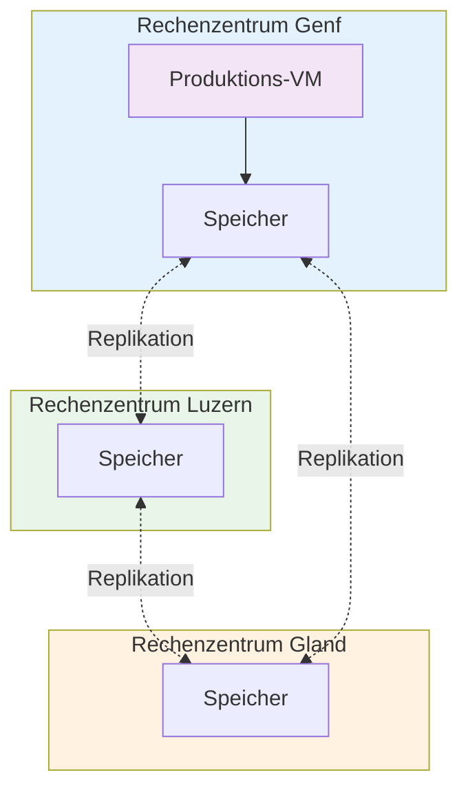

import NavigationFooter from '@site/src/components/NavigationFooter';

# Virtuelle Maschinen auf Hikube

Die **virtuellen Maschinen (VMs)** von Hikube bieten eine vollständige Virtualisierung der Hardware-Infrastruktur, um heterogene Betriebssysteme und Geschäftsanwendungen in abgeschotteten Umgebungen auszuführen.

In der [Hikube-Konsole](https://console.hikube.cloud) verwalten Sie VMs über das Menü **Infrastructure** > **VM Instances**: geführte Erstellung, Starten und Stoppen, Änderung der Ressourcen, Disks und des Netzwerks, Löschen.

---

## Was Sie in der Konsole tun können

| Anforderung | Wo |
|--------|-------------|
| Eine VM erstellen (Image, Instanztyp, Disks, Netzwerk, SSH-Schlüssel, cloud-init, GPU) | **VM Instances** > **Create an Instance** |
| Starten, stoppen, neu starten | Menü **Actions** in der Liste oder Abschnitt **Actions** auf der Detailseite |
| Instanztyp wechseln, eine Disk oder eine GPU hinzufügen, offene Ports ändern | Detailseite > **Edit** |
| Das cloud-init-Skript erneut ausführen | **Reload UserData**, dann **Restart** |
| Den kopierfertigen SSH-Befehl abrufen | Detailseite, Abschnitt **Network & Security** > **SSH Connection** |
| Die VM mit einem privaten Netzwerk verbinden | Schritt **Network** des Assistenten oder Menü **Networking** (siehe [VPC und Subnetze](../networking/overview.md)) |

---

## Architektur und Funktionsweise

### Trennung von Rechenleistung und Speicher

Hikube entkoppelt Rechenleistung und Speicher:

**Rechenschicht**

- Die VM läuft auf physischen Servern, die auf 3 Rechenzentren verteilt sind.
- Fällt der Knoten aus, auf dem sie läuft, wird die VM auf einem anderen Knoten neu gestartet.
- Die Nichtverfügbarkeit beschränkt sich auf die Dauer des Neustarts.

**Speicherschicht**

- Die Disks der VMs werden über mehrere physische Knoten **repliziert**, im synchronen oder asynchronen Modus (Auswahl pro Disk im Assistenten).
- Die Disks überstehen Hardwareausfälle und bleiben an die verlagerte VM anbindbar.
- Sie existieren unabhängig von der VM: Beim Löschen einer VM werden ihre Disks getrennt, aber nicht gelöscht. Sie bleiben im Menü **Disks** sichtbar (siehe [Disks](../storage/disks/overview.md)).

### Multi-Rechenzentrums-Architektur

```mermaid
flowchart TD
    subgraph DC1["Rechenzentrum Genf"]
        VM1["Produktions-VM"]
        STORAGE1["Speicher"]
    end

    subgraph DC2["Rechenzentrum Luzern"]
        STORAGE2["Speicher"]
    end

    subgraph DC3["Rechenzentrum Gland"]
        STORAGE3["Speicher"]
    end

    VM1 --> STORAGE1

    STORAGE1 <-.->|"Replikation"| STORAGE2
    STORAGE2 <-.->|"Replikation"| STORAGE3
    STORAGE1 <-.->|"Replikation"| STORAGE3

    style DC1 fill:#e3f2fd
    style DC2 fill:#e8f5e8
    style DC3 fill:#fff2e1
    style VM1 fill:#f3e5f5
```

---

## Instanztypen

Im Schritt **Configuration** des Assistenten bietet die Konsole drei Serien an. Wählen Sie zuerst die Serie, dann die Größe der Instanz.

### Serie Standard (S) — Verhältnis 1:2

*Kostengünstig, für Entwicklung und Tests.*

| Instanz | vCPU | RAM |
|----------|------|-----|
| `s1.small` | 1 | 2 GB |
| `s1.medium` | 2 | 4 GB |
| `s1.large` | 4 | 8 GB |
| `s1.xlarge` | 8 | 16 GB |
| `s1.3large` | 12 | 24 GB |
| `s1.2xlarge` | 16 | 32 GB |
| `s1.3xlarge` | 24 | 48 GB |
| `s1.4xlarge` | 32 | 64 GB |
| `s1.8xlarge` | 64 | 128 GB |

### Serie Universal (U) — Verhältnis 1:4

*Allgemeine Nutzung: Webserver, Anwendungen.*

| Instanz | vCPU | RAM |
|----------|------|-----|
| `u1.medium` | 1 | 4 GB |
| `u1.large` | 2 | 8 GB |
| `u1.xlarge` | 4 | 16 GB |
| `u1.2xlarge` | 8 | 32 GB |
| `u1.4xlarge` | 16 | 64 GB |
| `u1.8xlarge` | 32 | 128 GB |

### Serie Memory (M) — Verhältnis 1:8

*Speicheroptimiert: Datenbanken, Caches.*

| Instanz | vCPU | RAM |
|----------|------|-----|
| `m1.large` | 2 | 16 GB |
| `m1.xlarge` | 4 | 32 GB |
| `m1.2xlarge` | 8 | 64 GB |
| `m1.3xlarge` | 12 | 96 GB |
| `m1.4xlarge` | 16 | 128 GB |
| `m1.8xlarge` | 32 | 256 GB |

:::tip Auswahlhilfe
- **Entwicklung, Tests, leichte Dienste**: Serie **S**.
- **Web- und Geschäftsanwendungen**: Serie **U**.
- **Datenbanken, Caches, Analytik**: Serie **M**.

Der Instanztyp lässt sich nachträglich über **Edit** ändern; die VM wird neu gestartet, um die Änderung anzuwenden.
:::

---

## Betriebssysteme

Die System-Disk wird aus einem von Hikube bereitgestellten Image erstellt. Der Assistent zeigt die verfügbaren Images als Karten mit einer Versionsauswahl an:

| Image | Versionen |
|-------|----------|
| AlmaLinux | 8, 9 |
| CentOS Stream | 9, 10 |
| CloudLinux | 8, 9 |
| Debian | 12, 13 |
| openSUSE | 15.6, 16.0 |
| Oracle Linux | 8, 9, 10 |
| Rocky Linux | 8, 9, 10 |
| Ubuntu | 22.04, 24.04 |
| Windows Server | 2022, 2025 |

Maßgeblich ist die in der Konsole angezeigte Liste: Sie ändert sich mit den unterstützten Versionen.

:::note Eigenes Image
Ein eigenes Image (ISO oder QCOW2 von einer HTTPS-URL) importieren Sie, indem Sie im Menü **Disks** eine Disk erstellen. Diese Disk kann anschließend als System-Disk einer neuen VM gewählt werden (Option **Existing**). Siehe [System-Disk aus einem Image erstellen](../storage/disks/how-to/create-from-image.md).
:::

---

## Konnektivität und Zugriff

- **Öffentliche IP**: Option **Public IPv4 Address**, standardmäßig aktiviert. Die VM ist dann aus dem Internet erreichbar.
- **Firewall**: Option **Enable Firewall**, standardmäßig aktiviert. Eingehend sind nur die angehakten Ports geöffnet (standardmäßig 22; optional 80, 443 oder ein beliebiger eigener Port). Ohne Firewall sind alle Ports der öffentlichen IP geöffnet.
- **Private Netzwerke**: Die VM kann mit einem oder mehreren [VPCs](../networking/overview.md) verbunden werden, um privat mit anderen VMs des Projekts zu kommunizieren.
- **SSH**: Die Detailseite zeigt den kopierfertigen Befehl `ssh <user>@<ip>` an. Der Zugriff erfolgt mit den im Assistenten eingegebenen öffentlichen SSH-Schlüsseln.
- **Windows**: Bei der Erstellung wird ein Administratorpasswort generiert und nur ein einziges Mal angezeigt. Der Zugriff erfolgt per RDP.

:::note Serielle Konsole und VNC
Ein Zugriff über serielle Konsole oder VNC wird in der Konsole nicht angeboten; wenden Sie sich an den [Support](mailto:support@hidora.io), wenn Sie ihn für eine Diagnose benötigen.
:::

---

## Isolation und Sicherheit

- Jedes **Projekt** ist ein isolierter Bereich: Die VMs eines Projekts sehen die eines anderen nicht.
- Jede VM läuft in ihrem eigenen Virtualisierungsprozess, der auf Kernel-Ebene isoliert ist.
- Die Disks können **im Ruhezustand verschlüsselt** werden (LUKS), Option **Disk Encryption** bei der Erstellung.

---

## Nächste Schritte

- [Ihre erste VM erstellen](./quick-start.md)
- [Die Konzepte verstehen](./concepts.md)
- [Netzwerk und Firewall konfigurieren](./how-to/configure-network.md)

<NavigationFooter
  nextSteps={[
    {label: "Konzepte", href: "../concepts"},
    {label: "Schnellstart", href: "../quick-start"},
  ]}
/>
