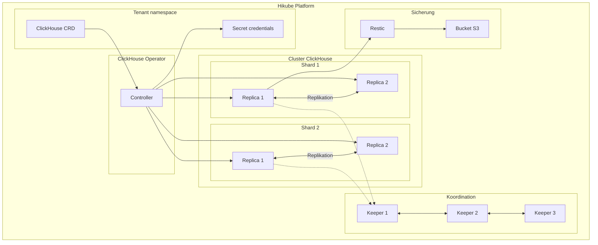
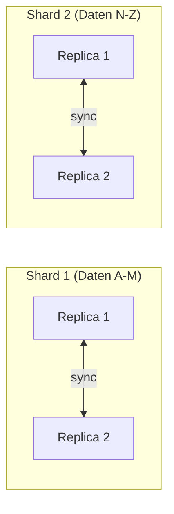

# Konzepte — ClickHouse

## Architektur

ClickHouse auf Hikube ist ein verwalteter Dienst basierend auf dem **ClickHouse Operator**. Es handelt sich um eine spaltenorientierte SQL-Datenbank, die für die Datenanalyse (OLAP) optimiert ist. Die Architektur basiert auf **Shards** (horizontale Partitionierung) und **Replikas** (Hochverfügbarkeit), koordiniert durch **ClickHouse Keeper**.

---

## Terminologie

| Begriff | Beschreibung |
|---------|-------------|
| **ClickHouse** | Kubernetes-Ressource (`apps.cozystack.io/v1alpha1`), die einen verwalteten ClickHouse-Cluster darstellt. |
| **Shard** | Horizontale Partition der Daten. Jeder Shard enthält eine Teilmenge der Gesamtdaten. |
| **Replica** | Kopie eines Shards. Gewährleistet Redundanz und ermöglicht paralleles Lesen. |
| **ClickHouse Keeper** | Verteilter Koordinationsdienst (Alternative zu ZooKeeper), der die Replikation und den Konsens zwischen den Knoten verwaltet. |
| **Restic** | Sicherungstool zum Erstellen verschlüsselter Snapshots auf S3-Speicher. |
| **OLAP** | Online Analytical Processing — Datenzugriffsmodell, optimiert für analytische Abfragen (Aggregationen, Spaltenscans). |
| **resourcesPreset** | Vordefiniertes Ressourcenprofil (nano bis 2xlarge). |

---

## Sharding und Replikation

### Sharding

Sharding verteilt die Daten horizontal auf mehrere Knoten:

- Jeder **Shard** enthält einen Teil der Daten
- `SELECT`-Abfragen werden parallel auf allen Shards ausgeführt
- Der Parameter `shards` im Manifest bestimmt die Anzahl der Partitionen

### Replikation

Jeder Shard kann mehrere Replikas haben:

- Die Replikas eines Shards enthalten **identische Daten**
- Die Koordination wird durch **ClickHouse Keeper** gewährleistet
- Bei Ausfall eines Replikas werden Lesevorgänge auf die anderen umgeleitet

:::tip
Für kleine Datenvolumen reicht ein einzelner Shard mit 2 Replikas aus. Fügen Sie Shards hinzu, wenn das Volumen die Kapazitäten eines einzelnen Knotens übersteigt.
:::

---

## ClickHouse Keeper

ClickHouse Keeper ersetzt ZooKeeper für die Cluster-Koordination:

- Verwaltet den **Konsens** zwischen den Replikas (Raft-Protokoll)
- Speichert die **Metadaten** des Clusters (verteilte Tabellen, Replikation)
- Erfordert eine **ungerade** Anzahl von Instanzen (3 empfohlen) für das Quorum

| Keeper-Parameter | Beschreibung |
|-------------------|-------------|
| `keeper.replicas` | Anzahl der Keeper-Instanzen (3 empfohlen) |
| `keeper.resources` / `keeper.resourcesPreset` | Dem Keeper zugewiesene Ressourcen |
| `keeper.size` | Keeper-Speichergröße |

---

## Sicherung

ClickHouse auf Hikube verwendet **Restic** für Sicherungen, mit dem gleichen Modell wie MySQL:

- **Verschlüsselte** Snapshots, gespeichert in einem S3-Bucket
- Planung über Cron (`backup.schedule`)
- Konfigurierbare Aufbewahrungsstrategie (`backup.cleanupStrategy`)

---

## Benutzerverwaltung

Benutzer werden im Manifest deklariert mit:

- **Passwort** für die Authentifizierung
- **Flag readonly**: `true` für Nur-Lese-Zugriff, `false` für Vollzugriff

Ein `admin`-Benutzer wird automatisch mit Vollrechten erstellt.

---

## Ressourcen-Presets

| Preset | CPU | Speicher |
|--------|-----|----------|
| `nano` | 250m | 128Mi |
| `micro` | 500m | 256Mi |
| `small` | 1 | 512Mi |
| `medium` | 1 | 1Gi |
| `large` | 2 | 2Gi |
| `xlarge` | 4 | 4Gi |
| `2xlarge` | 8 | 8Gi |

---

## Limits und Kontingente

| Parameter | Wert |
|-----------|------|
| Max. Shards | Je nach Tenant-Kontingent |
| Replikas pro Shard | Je nach Tenant-Kontingent |
| Speichergröße (`size`) | Variabel (in Gi) |
| Keeper-Instanzen | 3 empfohlen (ungerade) |

---

## Weiterführende Informationen

- [Übersicht](./overview.md): Vorstellung des Dienstes
- [API-Referenz](./api-reference.md): Alle Parameter der ClickHouse-Ressource
