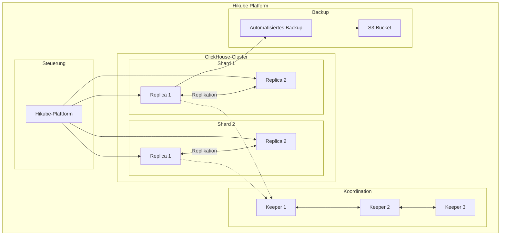
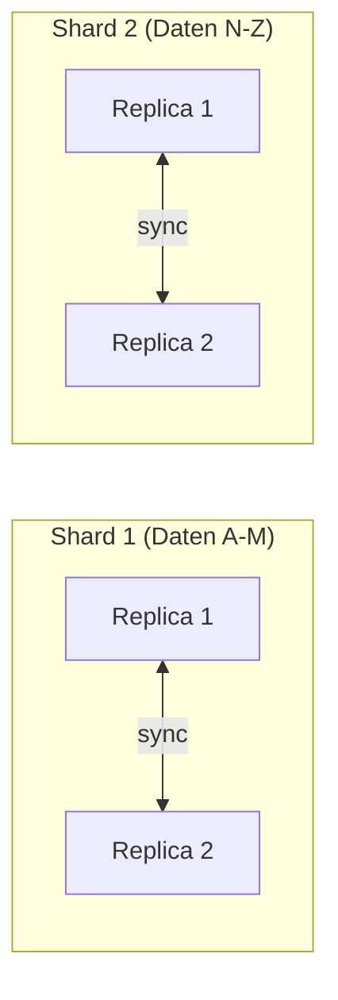

# Konzepte — ClickHouse

:::info Verfügbarkeit
ClickHouse ist in der [Hikube-Konsole](https://console.hikube.cloud) noch nicht als Self-Service verfügbar.
Um eine Instanz bereitzustellen oder ihre Konfiguration zu ändern, [wenden Sie sich an den Support](mailto:support@hidora.io).
:::

## Architektur

ClickHouse auf Hikube ist ein Managed Service. Es handelt sich um eine spaltenorientierte SQL-Datenbank, die für die Datenanalyse (OLAP) optimiert ist. Die Architektur beruht auf **Shards** (horizontale Partitionierung) und **Replicas** (Hochverfügbarkeit), die von **ClickHouse Keeper** koordiniert werden.

```mermaid
graph TB
    subgraph "Hikube Platform"
        subgraph "Steuerung"
            OP[Hikube-Plattform]
        end

        subgraph "ClickHouse-Cluster"
            subgraph "Shard 1"
                S1R1[Replica 1]
                S1R2[Replica 2]
            end
            subgraph "Shard 2"
                S2R1[Replica 1]
                S2R2[Replica 2]
            end
        end

        subgraph "Koordination"
            K1[Keeper 1]
            K2[Keeper 2]
            K3[Keeper 3]
        end

        subgraph "Backup"
            S3[S3-Bucket]
            RES[Automatisiertes Backup]
        end
    end

    OP --> S1R1
    OP --> S1R2
    OP --> S2R1
    OP --> S2R2
    S1R1 <-->|Replikation| S1R2
    S2R1 <-->|Replikation| S2R2
    K1 <--> K2
    K2 <--> K3
    S1R1 -.-> K1
    S2R1 -.-> K1
    S1R1 --> RES
    RES --> S3
```

---

## Terminologie

| Begriff | Beschreibung |
|-------|-------------|
| **ClickHouse-Cluster** | Verwaltete ClickHouse-Instanz, die auf Anfrage in Ihrem Projekt bereitgestellt wird. |
| **Shard** | Horizontale Partition der Daten. Jeder Shard enthält eine Teilmenge der Gesamtdaten. |
| **Replica** | Kopie eines Shards. Sorgt für Redundanz und ermöglicht paralleles Lesen. |
| **ClickHouse Keeper** | Verteilter Koordinationsdienst (Alternative zu ZooKeeper), der die Replikation und den Konsens zwischen den Knoten verwaltet. |
| **OLAP** | Online Analytical Processing — Datenzugriffsmodell, das für analytische Abfragen optimiert ist (Aggregationen, Spalten-Scans). |
| **Preset** | Vordefiniertes Ressourcenprofil (nano bis 2xlarge), das jeder Replica zugewiesen wird. |

---

## Sharding und Replikation

### Sharding

Sharding verteilt die Daten horizontal auf mehrere Knoten:

- Jeder **Shard** enthält einen Teil der Daten
- `SELECT`-Abfragen werden parallel auf allen Shards ausgeführt
- Die Anzahl der Shards wird bei der Bereitstellung festgelegt

### Replikation

Jeder Shard kann mehrere Replicas haben:

- Die Replicas desselben Shards enthalten **identische Daten**
- Die Koordination übernimmt **ClickHouse Keeper**
- Fällt eine Replica aus, werden die Lesezugriffe auf die anderen umgeleitet

```mermaid
graph LR
    subgraph "Shard 1 (Daten A-M)"
        R1A[Replica 1]
        R1B[Replica 2]
    end
    subgraph "Shard 2 (Daten N-Z)"
        R2A[Replica 1]
        R2B[Replica 2]
    end

    R1A <-->|sync| R1B
    R2A <-->|sync| R2B
```

:::tip
Bei kleinen Datenmengen genügt ein einzelner Shard mit 2 Replicas. Fügen Sie Shards hinzu, wenn das Datenvolumen die Kapazität eines einzelnen Knotens übersteigt.
:::

---

## ClickHouse Keeper

ClickHouse Keeper ersetzt ZooKeeper für die Koordination des Clusters:

- Verwaltet den **Konsens** zwischen den Replicas (Raft-Protokoll)
- Speichert die **Metadaten** des Clusters (verteilte Tabellen, Replikation)
- Benötigt eine **ungerade** Anzahl von Instanzen (3 empfohlen) für das Quorum

Die Anzahl der Keeper-Instanzen, ihre Ressourcen und ihr Speicher werden bei der Bereitstellung festgelegt.

---

## Backup

Die ClickHouse-Backups auf Hikube bieten:

- **Verschlüsselte** Snapshots, die in einem S3-Bucket gespeichert werden
- Regelmäßige Planung
- Konfigurierbare Aufbewahrungsstrategie

Backups werden auf Anfrage beim Support eingerichtet.

---

## Benutzerverwaltung

Die Benutzer werden bei der Bereitstellung festgelegt, mit:

- **Passwort** für die Authentifizierung
- **Nur Lesen** oder **Vollzugriff**

Ein Benutzer `admin` mit vollen Rechten wird automatisch angelegt.

---

## Ressourcen-Presets

| Preset | CPU | Arbeitsspeicher |
|--------|-----|---------|
| `nano` | 250m | 128Mi |
| `micro` | 500m | 256Mi |
| `small` | 1 | 512Mi |
| `medium` | 1 | 1Gi |
| `large` | 2 | 2Gi |
| `xlarge` | 4 | 4Gi |
| `2xlarge` | 8 | 8Gi |

---

## Limits und Quotas

| Parameter | Wert |
|-----------|--------|
| Max. Shards | Abhängig von den Quotas des Projekts |
| Replicas pro Shard | Abhängig von den Quotas des Projekts |
| Speichergröße | Variabel (in GB) |
| Keeper-Instanzen | 3 empfohlen (ungerade) |

---

## Weiterführende Informationen

- [Übersicht](./overview.md): Vorstellung des Dienstes
- [FAQ](./faq.md): häufig gestellte Fragen
