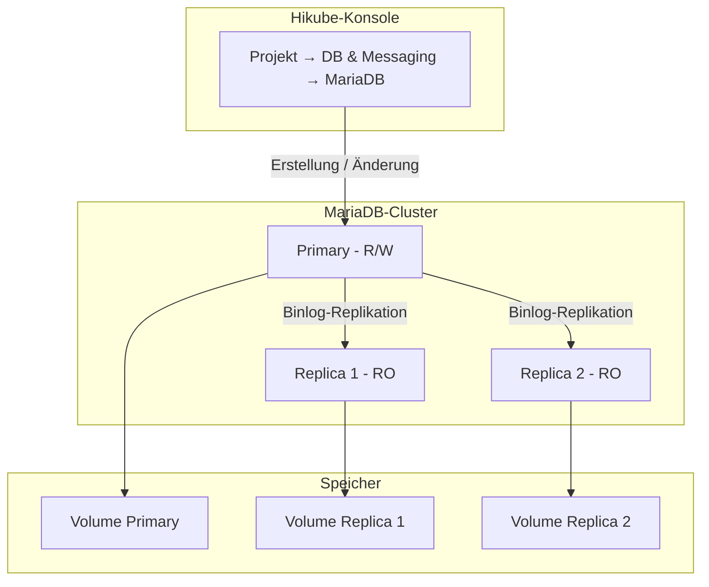
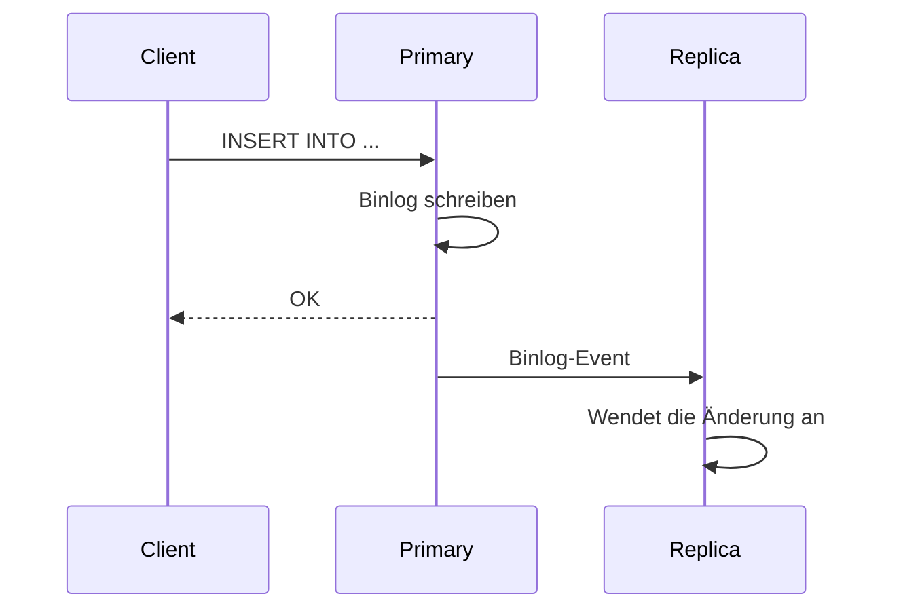

# Konzepte — MariaDB

## Architektur

MariaDB auf Hikube ist ein verwalteter Service. MariaDB ist ein Fork von MySQL, der mit dessen Clients und Protokoll kompatibel ist. Jeder in der Konsole erstellte Cluster ist eine replizierte Gruppe aus einem Primary und gegebenenfalls Replicas. Er gehört zu einem **Projekt** und verbraucht die Quotas dieses Projekts.

---

## Terminologie

| Begriff | Beschreibung |
|-------|-------------|
| **MariaDB-Cluster** | Verwaltete Instanz, die in der Konsole erstellt wird und aus einem Primary und gegebenenfalls Replicas besteht. |
| **Projekt** | Isolierter Bereich, der Ihre Ressourcen bündelt und die Quotas trägt. |
| **Primary** | Hauptknoten, der Lese- und Schreibvorgänge annimmt. |
| **Replica** | Schreibgeschützter Knoten, der über die Binlog-Replikation vom Primary synchronisiert wird. |
| **Preset** | Ressourcenvorlage (CPU, Arbeitsspeicher), die jedem Knoten des Clusters zugewiesen wird. |
| **Externer Zugriff** | Option, die den Cluster über eine öffentliche IP-Adresse im Internet verfügbar macht. |
| **Rolle** | Recht eines Benutzers auf einer Datenbank: **Administrator** oder **Read-only**. |

---

## Replikation und Hochverfügbarkeit

Der Cluster verwendet die **Binlog-Replikation** von MariaDB:

1. **Der Primary** schreibt alle Änderungen in das Binary Log
2. **Die Replicas** lesen das Binlog und wenden die Änderungen an
3. **Bei einem Ausfall** des Primary befördert die Plattform automatisch eine Replica

Die **Number of replicas** wird bei der Erstellung festgelegt:

| Angebotener Wert | Verwendung |
|-----------------|-------|
| **1 (Standalone)** | Entwicklung, Tests |
| **3 (Max High Availability)** | Produktion |
| **5 (Ultra High Availability)** | Kritische Produktion |

:::warning
Die Anzahl der Replicas und das Preset können nach der Erstellung nicht geändert werden. Um sie zu ändern, [wenden Sie sich an den Support](mailto:support@hidora.io).
:::

Ein manueller Wechsel des Primary (Switchover) wird in der Konsole nicht angeboten; wenden Sie sich an den Support.

---

## Benutzer, Datenbanken und Rollen

Die Seite eines MariaDB-Clusters enthält einen Abschnitt **Users**; eine eigene Registerkarte für Datenbanken gibt es nicht. Die Rechte werden pro Benutzer verwaltet:

- **Global Role (Optional)**: **No global role**, **Administrator** oder **Read-only (global)**. Eine globale Rolle wird derzeit beim Speichern abgelehnt (Meldung `invalid database_name`): Belassen Sie **No global role** und verwenden Sie die spezifischen Zugriffe;
- **Specific Access (Databases)**: eine Liste von Paaren aus **Database name** / **Rights** (**Administrator (Admin)** oder **Read-only**). Wird ein Zugriff auf eine noch nicht existierende Datenbank gewährt, wird diese erstellt.

Benutzer, die im Erstellungsassistenten des Clusters angelegt werden, erhalten die gewählte **Role** auf der Systemdatenbank `mysql`, sichtbar in der Spalte **Databases** der Benutzerliste: **Administrator** gewährt dort alle Privilegien (`ALL`, mit Recht zur Weitergabe), **Read-only** das Recht `SELECT`. Gewähren Sie ihnen anschließend über **Manage Access** den Zugriff auf Ihre Anwendungsdatenbanken.

:::warning
Die Datenbank `mysql` enthält die Konten und Rechte des Servers. Ein Zugriff **Administrator** auf diese Datenbank ermöglicht es, die Rechte aller Benutzer zu ändern, und ein Zugriff **Read-only** ermöglicht es, die Passwort-Hashes zu lesen. Beschränken Sie diese Zugriffe auf ein Administrationskonto und entziehen Sie sie den Anwendungskonten über **Manage Access**.
:::

Das Passwort eines Benutzers wird von der Plattform generiert und **nur ein einziges Mal** angezeigt. Bei Verlust generieren Sie mit **Change Password** ein neues.

### Benennungsregeln

| Element | Regel |
|---------|-------|
| Clustername | 3 bis 16 Zeichen: Kleinbuchstaben, Ziffern und Bindestriche; beginnt mit einem Buchstaben, endet mit einem Buchstaben oder einer Ziffer |
| Benutzername | Kleinbuchstaben, Ziffern und Bindestriche; beginnt mit einem Buchstaben, endet mit einem Buchstaben oder einer Ziffer (3 bis 16 Zeichen im Erstellungsassistenten des Clusters) |
| Datenbankname | 1 bis 63 Zeichen: Kleinbuchstaben, Ziffern und Bindestriche; beginnt mit einem Buchstaben, endet mit einem Buchstaben oder einer Ziffer |

:::note
Unterstriche (`_`) werden weder in Datenbanknamen noch in Benutzernamen akzeptiert.
:::

---

## Presets

Das **Preset** legt die Kapazität fest, die **jedem Knoten** des Clusters zugewiesen wird. Maßgeblich ist die im Assistenten angezeigte Liste; zur Orientierung:

| Preset | CPU | Arbeitsspeicher |
|--------|-----|---------|
| `nano` | 250m | 128Mi |
| `micro` | 500m | 256Mi |
| `small` | 1 | 512Mi |
| `medium` | 1 | 1Gi |
| `large` | 2 | 2Gi |
| `xlarge` | 4 | 4Gi |
| `2xlarge` | 8 | 8Gi |

Die Festlegung freier CPU-/Arbeitsspeicher-Ressourcen wird in der Konsole nicht angeboten; wenden Sie sich an den Support.

---

## Netzwerkzugriff

- **Externer Zugriff deaktiviert** (Standard): Der Cluster ist nicht im Internet erreichbar. Das Feld **Host** der Karte **Connection and network** zeigt **Not defined** an.
- **Externer Zugriff aktiviert**: Die Plattform weist eine öffentliche IP-Adresse zu, die im Feld **Host** angezeigt wird. Der Port ist der MySQL-Standardport `3306`.

---

## Backup und Wiederherstellung

Die Konfiguration von Backups und die Wiederherstellung werden in der Konsole nicht angeboten; wenden Sie sich an den Support. Siehe [Backups konfigurieren](./how-to/configure-backups.md).

---

## Quotas und Kosten

Der Assistent zeigt die **Estimated cost** und die Auswirkung des Clusters auf die Quotas des Projekts an. Überschreitet der Cluster die verfügbaren Quotas, bleibt die Schaltfläche **Next** inaktiv.

| Parameter | Wert |
|-----------|--------|
| Versionen | 10.6, 10.11, 11.4, 11.8 |
| Replicas | 1, 3 oder 5 |
| Disk-Größe | 1 bis 4 096 GB, im Rahmen des Speicher-Quotas des Projekts |

---

## Weiterführende Informationen

- [Übersicht](./overview.md): Vorstellung des Service
- [Schnellstart](./quick-start.md): Ihren ersten Cluster erstellen
