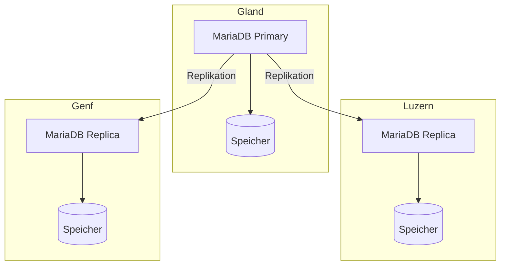

import NavigationFooter from '@site/src/components/NavigationFooter';

# MariaDB auf Hikube

Hikube bietet einen **verwalteten MariaDB**-Service an. MariaDB ist mit dem MySQL-Protokoll und den MySQL-Clients kompatibel: Ihre bestehenden MySQL-Anwendungen und -Werkzeuge (`mysql`, `mysqldump`, JDBC-Konnektoren, PDO usw.) funktionieren ohne Änderungen.

Der Service übernimmt die Bereitstellung eines replizierten und selbstheilenden Clusters, den Sie in der [Hikube-Konsole](https://console.hikube.cloud) erstellen und verwalten (Menü **DB & Messaging** → **MariaDB**).

:::note
Dieser Service wurde in dieser Dokumentation früher unter dem Namen „MySQL“ vorgestellt. Die Engine, MariaDB, ist unverändert.
:::

---

## Architektur und Funktionsweise

Die Plattform automatisiert die Verwaltung des Lebenszyklus der Datenbank: Bereitstellung, Aktualisierung, Replikation und Wiederherstellung nach einem Vorfall.

Die Architektur beruht auf einem **replizierten Cluster**:

- Ein **Primärknoten** (Primary) verarbeitet alle Schreibvorgänge und gewährleistet die Datenkonsistenz.
- Eine oder mehrere **Replicas** erhalten die Transaktionen fortlaufend per Replikation.
- Ein **Auto-Failover**-Mechanismus befördert bei einem Ausfall automatisch eine Replica zum neuen Primary.

Dieser Ansatz bietet:

- **Resilienz** bei Hardware- oder Softwareausfällen
- **Lese-Skalierbarkeit** durch die Verteilung der Anfragen auf die Replicas
- **Einfache Verwaltung**, da die Plattform die Koordination und Wartung des Clusters übernimmt

---

## Was Sie in der Konsole verwalten

| Funktion | Verfügbar |
|----------|------------|
| Erstellung eines Clusters (Version 10.6, 10.11, 11.4 oder 11.8, Preset, Disk-Größe, 1, 3 oder 5 Replicas, externer Zugriff) | Ja |
| Benutzer, globale Rolle und Zugriff pro Datenbank (Admin / nur Lesen), Passwortrotation | Ja |
| Änderung der Version, der Disk-Größe und des externen Zugriffs | Ja |
| Änderung des Presets oder der Anzahl der Replicas nach der Erstellung | Nein, [wenden Sie sich an den Support](mailto:support@hidora.io) |
| Backups und Wiederherstellung | Nein, [wenden Sie sich an den Support](mailto:support@hidora.io) |

---

## Anwendungsfälle

- **Transaktionale Webanwendungen (OLTP)**: E-Commerce, ERP, CRM, bei denen Zuverlässigkeit und Geschwindigkeit der Transaktionen entscheidend sind.
- **CMS und PHP-Anwendungen**: WordPress, Drupal, Magento und allgemein jede für MySQL konzipierte Anwendung.
- **Mandantenfähige SaaS-Anwendungen**: eine isolierte Datenbank pro Kunde, mit der Hochverfügbarkeit der Plattform.
- **Leseintensive Workloads**: Die Replicas ermöglichen es, die Anfragen zu verteilen.

<NavigationFooter
  nextSteps={[
    {label: "Konzepte", href: "../concepts"},
    {label: "Schnellstart", href: "../quick-start"},
  ]}
  seeAlso={[
    {label: "Alle Datenbanken", href: "../../"},
  ]}
/>
