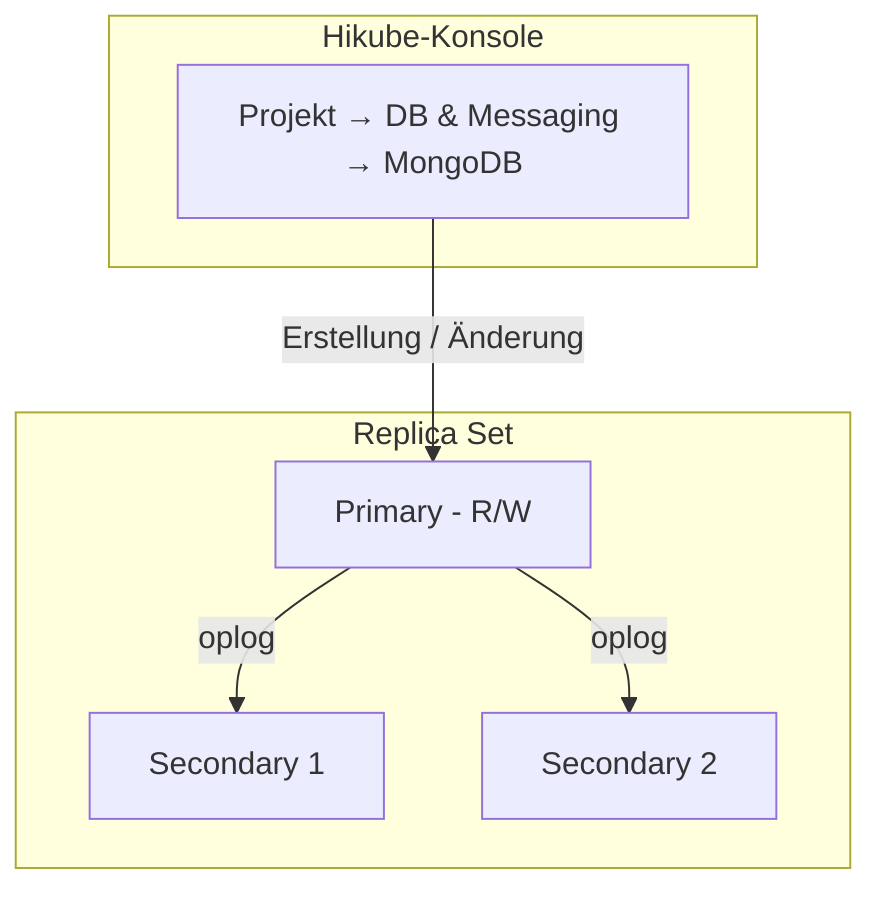

# Konzepte — MongoDB

## Architektur

MongoDB auf Hikube ist ein verwalteter Dienst. Jeder über die Konsole erstellte Cluster ist standardmäßig ein **Replica Set**: eine Gruppe von Mitgliedern, die dieselben Daten tragen und von denen nur eines Schreibvorgänge annimmt. Der Cluster gehört zu einem **Projekt** und verbraucht die Quotas dieses Projekts.

---

## Terminologie

| Begriff | Beschreibung |
|-------|-------------|
| **MongoDB-Cluster** | Verwaltete Instanz, die über die Konsole erstellt wird. |
| **Projekt** | Isolierter Bereich, der Ihre Ressourcen bündelt und die Quotas trägt. |
| **Replica Set** | Gruppe von MongoDB-Mitgliedern, die dieselben Daten replizieren. |
| **Primary** | Mitglied, das Schreibvorgänge annimmt. |
| **Secondary** | Mitglied, das den Primary repliziert und bei einem Ausfall an dessen Stelle gewählt werden kann. |
| **Oplog** | Operationsprotokoll des Primary, das von den Secondaries nachgespielt wird. |
| **Shard** | Teilmenge der Daten, getragen von einem eigenen Replica Set (geshardete Topologie). |
| **Konfigurationsserver** | Mitglieder, die die Metadaten der geshardeten Topologie speichern. |
| **Mongos** | Router, der die Anfragen der Clients entgegennimmt und an die richtigen Shards weiterleitet. |
| **Preset** | Ressourcenprofil (CPU, Arbeitsspeicher), das jedem Knoten zugewiesen wird. |

---

## Replikation und Hochverfügbarkeit

Die Secondaries spielen fortlaufend das Oplog des Primary nach. Wird der Primary unerreichbar, wählen die verbleibenden Mitglieder einen neuen Primary; damit die Wahl gelingt, muss eine Mehrheit der Mitglieder verfügbar sein.

Die **Number of replicas** wird bei der Erstellung gewählt:

| Angebotener Wert | Verwendung |
|-----------------|-------|
| **1 (Standalone)** | Entwicklung, Tests |
| **3 (Max High Availability)** | Produktion: toleriert den Verlust eines Mitglieds |
| **5 (Ultra High Availability)** | Kritische Produktion: toleriert den Verlust von zwei Mitgliedern |

:::warning
Die Anzahl der Replicas, das Preset und das Sharding können nach der Erstellung nicht mehr geändert werden. Um sie zu ändern, [wenden Sie sich an den Support](mailto:support@hidora.io).
:::

---

## Sharding

Die Option **Sharding (Distributed Topology)** des Assistenten „automatically deploys configuration servers and Mongos routers, and configures replica sets as shards“. Die Konsole erstellt dann:

- **2 Shards**, jeweils bestehend aus der gewählten Anzahl Replicas und einer Disk der gewählten Größe;
- **Konfigurationsserver** mit derselben Anzahl Replicas und derselben Disk-Größe;
- **Mongos-Router** mit derselben Anzahl Replicas.

Der Ressourcenverbrauch und die geschätzten Kosten berücksichtigen dies. Siehe [Sharding konfigurieren](./how-to/configure-sharding.md).

---

## Benutzer, Datenbanken und Rollen

Die Seite eines MongoDB-Clusters enthält einen Abschnitt **Users**; eine eigene Registerkarte für Datenbanken gibt es nicht. Die Rechte werden pro Benutzer verwaltet:

- **Global Role (Optional)**: **No global role**, **Administrator** oder **Read-only (global)**;
- **Specific Access (Databases)**: eine Liste von Paaren aus **Database name** / **Rights** (**Administrator (Admin)** oder **Read-only**).

Ein Benutzer muss mindestens eine Rolle haben: Ohne globale Rolle und ohne spezifischen Zugriff zeigt die Konsole „Please assign at least one role (global or specific) to the user.“ an und verweigert das Speichern.

Die im Assistenten zur Cluster-Erstellung angelegten Benutzer erhalten die gewählte **Role** auf der Datenbank `admin`, sichtbar in der Spalte **Databases** der Benutzerliste: **Administrator** entspricht den MongoDB-Rollen `readWrite` und `dbAdmin` auf dieser Datenbank, **Read-only** der Rolle `read`. Diese Rollen gewähren keinen Zugriff auf andere Datenbanken: Gewähren Sie anschließend den Zugriff auf Ihre Anwendungsdatenbanken über **Manage Access**. Alle Benutzer werden in der Datenbank `admin` angelegt, die als Authentifizierungsdatenbank dient (`authSource=admin`).

Das Passwort eines Benutzers wird von der Plattform generiert und **nur einmal** angezeigt. Bei Verlust generieren Sie mit **Change Password** ein neues.

### Benennungsregeln

| Element | Regel |
|---------|-------|
| Cluster-Name | 3 bis 16 Zeichen: Kleinbuchstaben, Ziffern und Bindestriche; beginnt mit einem Buchstaben, endet mit einem Buchstaben oder einer Ziffer |
| Benutzername | Kleinbuchstaben, Ziffern und Bindestriche; beginnt mit einem Buchstaben, endet mit einem Buchstaben oder einer Ziffer (3 bis 16 Zeichen im Assistenten zur Cluster-Erstellung) |
| Datenbankname | 1 bis 63 Zeichen: Kleinbuchstaben, Ziffern und Bindestriche; beginnt mit einem Buchstaben, endet mit einem Buchstaben oder einer Ziffer |

:::note
Unterstriche (`_`) und Großbuchstaben sind weder in Datenbanknamen noch in Benutzernamen zulässig.
:::

---

## Presets

Das **Preset** legt die Kapazität fest, die **jedem Knoten** zugewiesen wird. Maßgeblich ist die im Assistenten angezeigte Liste; zur Orientierung:

| Preset | CPU | Arbeitsspeicher |
|--------|-----|---------|
| `nano` | 250m | 128Mi |
| `micro` | 500m | 256Mi |
| `small` | 1 | 512Mi |
| `medium` | 1 | 1Gi |
| `large` | 2 | 2Gi |
| `xlarge` | 4 | 4Gi |
| `2xlarge` | 8 | 8Gi |

---

## Netzwerkzugriff

- **Externer Zugriff deaktiviert** (Standard): Der Cluster ist nicht im Internet erreichbar. Das Feld **Host** der Karte **Network and Connection** zeigt **Not defined** an.
- **Externer Zugriff aktiviert**: Die Plattform weist eine öffentliche Adresse zu, die bei einem Cluster mit Sharding im Feld **Host** angezeigt wird. Ohne Sharding erhält jedes Mitglied eine eigene öffentliche Adresse, und das Feld bleibt auf **Not defined**: Fordern Sie die Adresse beim [Support](mailto:support@hidora.io) an. Der Port ist der MongoDB-Standardport `27017`. Der Assistent liefert einen Verbindungsstring der Form `mongodb://<user>:<password>@<host>`.

---

## Backup und Wiederherstellung

Die Konfiguration von Backups und die Wiederherstellung werden in der Konsole nicht angeboten; [wenden Sie sich an den Support](mailto:support@hidora.io).

---

## Quotas und Kosten

Der Assistent zeigt die **Estimated Cost** und die Auswirkung des Clusters auf die Quotas des Projekts an. Überschreitet der Cluster die verfügbaren Quotas, bleibt die Schaltfläche **Next** inaktiv.

| Parameter | Wert |
|-----------|--------|
| Versionen | 6.0, 7.0, 8.0 |
| Replicas | 1, 3 oder 5 |
| Disk-Größe | 1 bis 4 096 GB, im Rahmen des Speicher-Quotas des Projekts |

---

## Weiterführende Informationen

- [Übersicht](./overview.md): Vorstellung des Dienstes
- [Schnellstart](./quick-start.md): Ihren ersten Cluster erstellen
