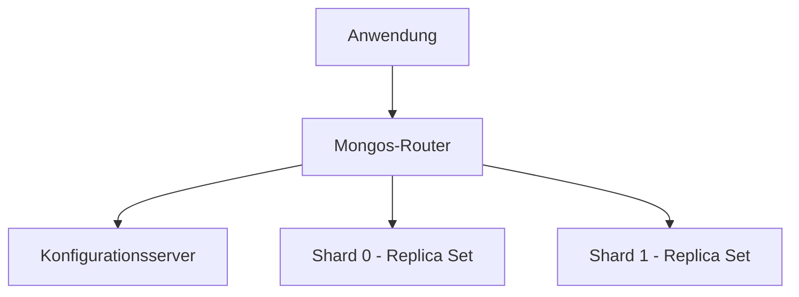

# MongoDB-Sharding konfigurieren

Diese Anleitung erklärt, wie Sie über die [Hikube-Konsole](https://console.hikube.cloud) einen geshardeten MongoDB-Cluster erstellen und Ihre Collections auf die Shards verteilen.

## Voraussetzungen

- Ein Hikube-**Projekt** mit ausreichenden Quotas: Eine geshardete Topologie verbraucht deutlich mehr Ressourcen als ein Replica Set (siehe unten)
- Die Shell **`mongosh`** und ein Benutzer mit dem Recht **Administrator** auf der betreffenden Datenbank

:::warning
Über das Sharding wird **bei der Erstellung** entschieden: Es kann danach weder aktiviert noch deaktiviert werden. Um einen bestehenden Cluster umzuwandeln, [wenden Sie sich an den Support](mailto:support@hidora.io).
:::

## Die bereitgestellte Topologie verstehen

Wenn die Option **Sharding (Distributed Topology)** aktiviert ist, stellt die Konsole Folgendes bereit:

| Komponente | Anzahl | Ressourcen |
|-----------|--------|------------|
| Shards | 2 | Jeweils mit der gewählten **Number of replicas** und **Disk size (GB)** |
| Konfigurationsserver | 1 Gruppe | Gleiche Anzahl Replicas und gleiche Disk-Größe |
| Mongos-Router | 1 Gruppe | Gleiche Anzahl Replicas |

Ihre Anwendungen verbinden sich mit den **Mongos**-Routern, die jede Anfrage an den oder die betroffenen Shards weiterleiten.



## Schritte

### 1. Den geshardeten Cluster erstellen

1. Öffnen Sie **DB & Messaging** → **MongoDB** und klicken Sie auf **Create a cluster**.
2. Schritt **General**: Geben Sie den **Cluster Name** ein.
3. Schritt **Configuration**: Wählen Sie die **MongoDB Version**, das **Preset**, die **Disk size (GB)** und die **Number of replicas** (`3` empfohlen) und aktivieren Sie anschließend **Sharding (Distributed Topology)**.
4. Prüfen Sie die **Estimated Cost** und die Auswirkung auf die Quotas, die die zusätzlichen Komponenten berücksichtigen.
5. Schritt **Users**: Fügen Sie mindestens einen Benutzer mit der **Role** **Administrator** hinzu.
6. Schritt **Summary**: Prüfen Sie, ob die Zeile **Sharding** **Enabled** anzeigt, und klicken Sie dann auf **Create cluster**.

### 2. Die Topologie prüfen

Sobald der Cluster den Status **Ready** hat, zeigt die Karte **Network and Connection** auf seiner Seite **Sharding**: **Enabled** an.

### 3. Sharding für eine Collection aktivieren

:::warning Erforderliche Rechte
Das über die Konsole vergebene Recht **Administrator** entspricht den MongoDB-Rollen `readWrite` und `dbAdmin` auf einer Datenbank. Es gewährt nicht die Cluster-Privilegien, die `sh.status()` und `sh.shardCollection()` erfordern (Aktionen `listShards` und `enableSharding`). Um eine Collection zu sharden, [wenden Sie sich an den Support](mailto:support@hidora.io) und geben Sie die Collection und den gewünschten Sharding-Schlüssel an.
:::

Das Sharding wird Collection für Collection konfiguriert, indem ein **Sharding-Schlüssel** gewählt wird. Beispiele für Befehle, die von einem Konto mit diesen Privilegien ausgeführt werden:

```javascript
// Gehashter Schlüssel: gleichmäßige Verteilung der Schreibvorgänge
sh.shardCollection("myapp.events", { deviceId: "hashed" })

// Bereichsschlüssel: effizient für Abfragen über Intervalle
sh.shardCollection("myapp.orders", { customerId: 1, createdAt: 1 })
```

:::tip
Wählen Sie einen Schlüssel mit hoher Kardinalität, der in den meisten Ihrer Abfragen vorkommt. Ein monotoner Schlüssel (nur Erstellungsdatum, inkrementelle Kennung) konzentriert die Schreibvorgänge auf einen einzigen Shard.
:::

## Überprüfung

```javascript
db.events.getShardDistribution()
```

**Erwartetes Ergebnis:** Die Dokumente und Chunks verteilen sich auf die beiden Shards.

## Weiterführende Informationen

- [MongoDB-Konzepte](../concepts.md): Replica Set und Sharding
- [MongoDB-Dokumentation zum Sharding](https://www.mongodb.com/docs/manual/sharding/)
