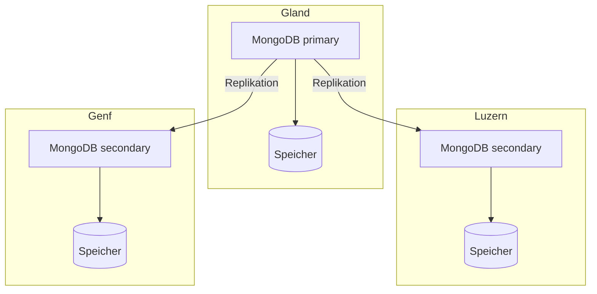

import NavigationFooter from '@site/src/components/NavigationFooter';

# MongoDB auf Hikube

Hikube bietet einen **verwalteten MongoDB-Dienst**. MongoDB ist eine dokumentenorientierte Datenbank: Die Daten werden als JSON-Dokumente (BSON) ohne vorgegebenes Schema gespeichert, was sie für sich weiterentwickelnde Datenmodelle geeignet macht.

Der Dienst stellt ein repliziertes und selbstheilendes **Replica Set** bereit, optional mit einer **geshardeten** Topologie, um die Daten auf mehrere Knotengruppen zu verteilen. Sie erstellen und verwalten Ihre Cluster über die [Hikube-Konsole](https://console.hikube.cloud) (Menü **DB & Messaging** → **MongoDB**).

---

## Architektur und Funktionsweise

### Replica Set (Standard)

- Ein **primäres Mitglied** (Primary) nimmt alle Schreibvorgänge entgegen.
- Die **sekundären Mitglieder** replizieren fortlaufend die Operationen des Primary und können Lesezugriffe bedienen.
- Fällt der Primary aus, **wählen** die verbleibenden Mitglieder automatisch einen neuen Primary.

### Geshardete Topologie (Option)

Wenn die Option **Sharding (Distributed Topology)** bei der Erstellung aktiviert ist, stellt die Plattform automatisch die **Konfigurationsserver** und die **Mongos-Router** bereit und konfiguriert die Replicas als **Shards**. Siehe [Sharding konfigurieren](./how-to/configure-sharding.md).

---

## Was Sie über die Konsole verwalten

| Funktion | Verfügbar |
|----------|------------|
| Erstellung eines Clusters (Version 6.0, 7.0 oder 8.0, Preset, Disk-Größe, 1, 3 oder 5 Replicas, externer Zugriff, Sharding) | Ja |
| Benutzer, globale Rolle und Zugriff pro Datenbank (Admin / schreibgeschützt), Passwortrotation | Ja |
| Änderung der Version, der Disk-Größe und des externen Zugriffs | Ja |
| Änderung des Presets, der Anzahl der Replicas oder des Shardings nach der Erstellung | Nein, [wenden Sie sich an den Support](mailto:support@hidora.io) |
| Backups und Wiederherstellung | Nein, [wenden Sie sich an den Support](mailto:support@hidora.io) |

---

## Anwendungsfälle

- **Produkt- und Inhaltskataloge**, deren Struktur von Element zu Element variiert
- **Web- und Mobilanwendungen**, die nativ mit JSON arbeiten
- **Benutzerprofile, Präferenzen, Warenkörbe** und angereicherte Sitzungsdaten
- **Ereigniserfassung und IoT**, mit der geshardeten Topologie für große Datenmengen
- **Schnelles Prototyping**, ohne Schemamigration bei jeder Änderung

<NavigationFooter
  nextSteps={[
    {label: "Konzepte", href: "../concepts"},
    {label: "Schnellstart", href: "../quick-start"},
  ]}
  seeAlso={[
    {label: "Alle Datenbanken", href: "../../"},
  ]}
/>
