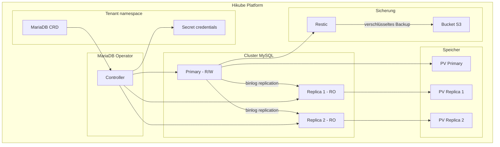
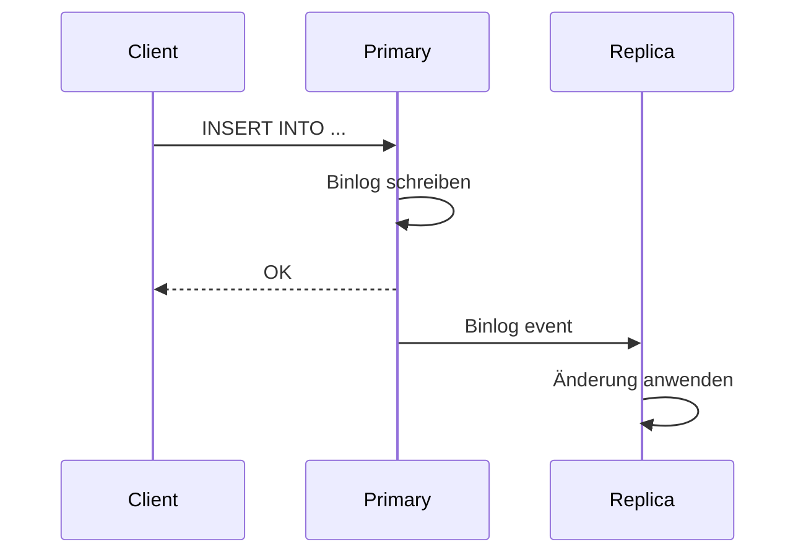

# Konzepte — MySQL

## Architektur

MySQL auf Hikube ist ein verwalteter Dienst basierend auf dem Operator **MariaDB-Operator**. Obwohl der Operator MariaDB (einen MySQL-kompatiblen Fork) verwendet, ist der Dienst vollständig kompatibel mit MySQL-Clients und -Protokollen. Jede über die Ressource `MariaDB` bereitgestellte Instanz erstellt einen replizierten Cluster mit einem Primary und Replikas für Hochverfügbarkeit.



---

## Terminologie

| Begriff | Beschreibung |
|---------|-------------|
| **MariaDB** | Kubernetes-Ressource (`apps.cozystack.io/v1alpha1`), die einen verwalteten MySQL-Cluster darstellt. Die CRD heißt `MariaDB`, da der Dienst auf dem MariaDB-Operator basiert. |
| **Primary** | Hauptknoten, der Lese- und Schreibvorgänge akzeptiert. |
| **Replica** | Schreibgeschützter Knoten, der vom Primary über Binlog-Replikation synchronisiert wird. |
| **MariaDB-Operator** | Kubernetes-Operator, der Bereitstellung, Replikation, Failover und Sicherungen verwaltet. |
| **Restic** | Sicherungstool zum Erstellen verschlüsselter Snapshots auf S3-Speicher. |
| **Switchover** | Geplanter Wechsel der Primary-Rolle zu einem anderen Knoten im Cluster. |
| **resourcesPreset** | Vordefiniertes Ressourcenprofil (nano bis 2xlarge). |

---

## Replikation und Hochverfügbarkeit

Der MySQL-Cluster verwendet die **Binlog-Replikation** von MariaDB:

1. **Der Primary** schreibt alle Änderungen in das Binary Log
2. **Die Replikas** konsumieren das Binlog und wenden die Änderungen an
3. **Bei einem Ausfall** des Primary befördert der Operator automatisch ein Replika



### Manueller Switchover

Sie können den Primary zu einem anderen Knoten für Wartungszwecke wechseln:

```bash
kubectl edit mariadb <instance-name>
# spec.replication.primary.podIndex ändern
```

:::warning
Der Wechsel des Primary verursacht eine kurze Unterbrechung der Schreibvorgänge. Lesevorgänge bleiben über die Replikas verfügbar.
:::

---

## Sicherung

MySQL auf Hikube verwendet **Restic** für Sicherungen:

- Die Snapshots werden mit einem Restic-Passwort **verschlüsselt**
- Gespeichert in einem **S3-kompatiblen Bucket** (Hikube Object Storage, AWS S3 usw.)
- Die **Aufbewahrungsstrategie** (`cleanupStrategy`) steuert die Aufbewahrungsdauer

| Parameter | Beschreibung |
|-----------|-------------|
| `backup.schedule` | Cron-Zeitplan (z.B.: `0 2 * * *`) |
| `backup.cleanupStrategy` | Restic-Aufbewahrungsoptionen (z.B.: `--keep-last=3 --keep-daily=7`) |
| `backup.resticPassword` | Verschlüsselungspasswort für die Sicherungen |
| `backup.s3*` | S3-Anmeldedaten und Bucket |

:::tip
Testen Sie regelmäßig das Wiederherstellungsverfahren. Eine nicht getestete Sicherung garantiert keine erfolgreiche Wiederherstellung.
:::

---

## Benutzer- und Datenbankverwaltung

Das Manifest ermöglicht die Deklaration von:

- **Benutzern**: Name, Passwort, Verbindungslimit (`maxUserConnections`)
- **Datenbanken**: Name und Rollenzuweisung
- **Rollen**: `admin` (vollständiger Lese-/Schreibzugriff), `readonly` (nur SELECT)

Ein `root`-Passwort wird automatisch vom Operator generiert und im Secret `<instance>-credentials` gespeichert.

---

## Ressourcen-Presets

| Preset | CPU | Speicher |
|--------|-----|----------|
| `nano` | 250m | 128Mi |
| `micro` | 500m | 256Mi |
| `small` | 1 | 512Mi |
| `medium` | 1 | 1Gi |
| `large` | 2 | 2Gi |
| `xlarge` | 4 | 4Gi |
| `2xlarge` | 8 | 8Gi |

:::warning
Wenn das Feld `resources` (explizite CPU/Speicher) definiert ist, wird `resourcesPreset` ignoriert.
:::

---

## Limits und Kontingente

| Parameter | Wert |
|-----------|------|
| Max. Replikas | Je nach Tenant-Kontingent |
| Speichergröße (`size`) | Variabel (in Gi) |
| `maxUserConnections` | Pro Benutzer konfigurierbar (0 = unbegrenzt) |

---

## Weiterführende Informationen

- [Übersicht](./overview.md): Vorstellung des Dienstes
- [API-Referenz](./api-reference.md): Alle Parameter der MariaDB-Ressource
