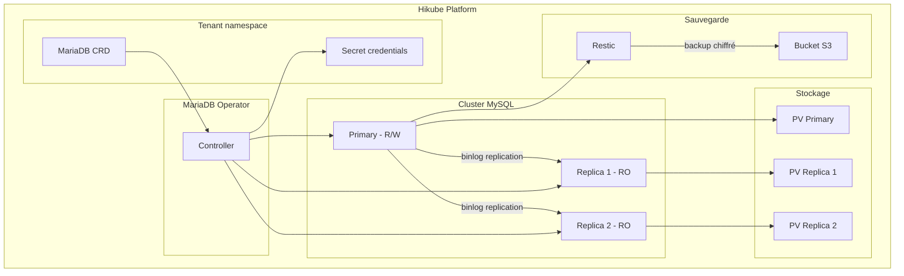
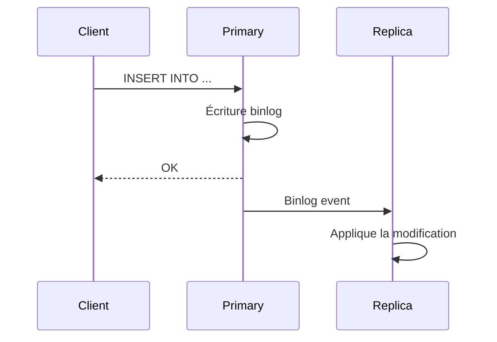

# Concepts — MySQL

## Architecture

MySQL auf Hikube est un service managé basierend auf dem Operator **MariaDB-Operator**. Bien que l'opérateur utilise MariaDB (un fork compatible de MySQL), le service est entièrement compatible avec les clients et protocoles MySQL. Chaque instance déployée via la ressource `MariaDB` crée un cluster répliqué avec un primary et des réplicas pour la Hochverfügbarkeit.



---

## Terminologie

| Terme | Beschreibung |
|-------|-------------|
| **MariaDB** | Ressource Kubernetes (`apps.cozystack.io/v1alpha1`) représentant un cluster MySQL managé. Le CRD s'appelle `MariaDB` car le service repose sur MariaDB-Operator. |
| **Primary** | Nœud principal qui accepte les lectures et écritures. |
| **Replica** | Nœud en lecture seule, synchronisé depuis le primary via la réplication binlog. |
| **MariaDB-Operator** | Opérateur Kubernetes qui gère le Deployment, la réplication, le failover et les sauvegardes. |
| **Restic** | Outil de sauvegarde utilisé pour créer des snapshots chiffrés vers un stockage S3. |
| **Switchover** | Bascule planifiée du rôle primary vers un autre nœud du cluster. |
| **resourcesPreset** | Profil de ressources prédéfini (nano à 2xlarge). |

---

## Réplication et Hochverfügbarkeit

Le cluster MySQL utilise la **réplication binlog** de MariaDB :

1. **Le primary** écrit toutes les modifications dans le binary log
2. **Les réplicas** consomment le binlog et appliquent les modifications
3. **En cas de panne** du primary, l'opérateur promeut automatiquement un réplica



### Switchover manuel

Vous pouvez basculer le primary vers un autre nœud pour effectuer une maintenance :

```bash
kubectl edit mariadb <instance-name>
# Modifier spec.replication.primary.podIndex
```

:::warning
La bascule du primary entraîne une brève interruption des écritures. Les lectures restent disponibles via les réplicas.
:::

---

## Sauvegarde

MySQL auf Hikube utilise **Restic** pour les sauvegardes :

- Les snapshots sont **chiffrés** avec un mot de passe Restic
- Stockés dans un **bucket S3-compatible** (Hikube Object Storage, AWS S3, MinIO)
- La **stratégie de rétention** (`cleanupStrategy`) contrôle la durée de conservation

| Paramètre | Beschreibung |
|-----------|-------------|
| `backup.schedule` | Planification cron (ex: `0 2 * * *`) |
| `backup.cleanupStrategy` | Options Restic de rétention (ex: `--keep-last=3 --keep-daily=7`) |
| `backup.resticPassword` | Mot de passe de chiffrement des sauvegardes |
| `backup.s3*` | Identifiants et bucket S3 |

:::tip
Testez régulièrement la procédure de restauration. Une sauvegarde non testée ne garantit pas une restauration réussie.
:::

---

## Gestion des utilisateurs et bases

Le manifeste permet de déclarer :

- **Utilisateurs** : nom, mot de passe, limite de connexions (`maxUserConnections`)
- **Bases de données** : nom et attribution de rôles
- **Rôles** : `admin` (lecture/écriture complète), `readonly` (SELECT uniquement)

Un mot de passe `root` est généré automatiquement par l'opérateur et stocké dans le Secret `<instance>-credentials`.

---

## Presets de ressources

| Preset | CPU | Mémoire |
|--------|-----|---------|
| `nano` | 250m | 128Mi |
| `micro` | 500m | 256Mi |
| `small` | 1 | 512Mi |
| `medium` | 1 | 1Gi |
| `large` | 2 | 2Gi |
| `xlarge` | 4 | 4Gi |
| `2xlarge` | 8 | 8Gi |

:::warning
Si le champ `resources` (CPU/mémoire explicites) est défini, `resourcesPreset` est ignoré.
:::

---

## Limites et quotas

| Paramètre | Wert |
|-----------|--------|
| Réplicas max | Selon quota tenant |
| Taille stockage (`size`) | Variable (en Gi) |
| `maxUserConnections` | Configurable par utilisateur (0 = illimité) |

---

## Weiterführende Informationen

- [Overview](./overview.md) : présentation du service
- [API-Referenz](./api-reference.md) : tous les paramètres de la ressource MariaDB
