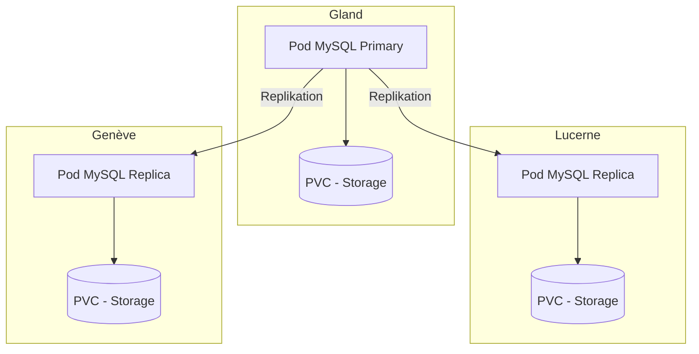

# MySQL auf Hikube

Hikube bietet einen **verwalteten MySQL-Dienst**, basierend auf dem Operator **MariaDB-Operator**.
Er gewährleistet die Bereitstellung eines replizierten und selbstheilenden Clusters und garantiert **Hochverfügbarkeit**, **einfache Verwaltung** und **zuverlässige Leistung**, ohne Aufwand seitens des Benutzers.

---

## 🏗️ Architektur und Funktionsweise

Der **verwaltete MySQL-Dienst** auf Hikube basiert auf dem Operator **MariaDB-Operator**, der die vollständige Verwaltung des Datenbank-Lebenszyklus automatisiert: Bereitstellung, Aktualisierung, Replikation und Wiederherstellung nach Ausfällen.

Die Architektur basiert auf einem **replizierten Cluster**:

- Ein **Primary-Knoten** (Primary) verwaltet alle Schreibvorgänge und gewährleistet die Datenkonsistenz.
- Ein oder mehrere **Replikas** (Standby) empfangen Transaktionen in Echtzeit über asynchrone oder semi-synchrone Replikation.
- Ein **Auto-Failover**-Mechanismus befördert automatisch ein Replika zum neuen Primary bei einem Ausfall und garantiert **Hochverfügbarkeit**.

Dieser Ansatz bietet:

- **Resilienz** bei Hardware- oder Softwareausfällen
- **Lese-Skalierbarkeit** dank der Verteilung von Anfragen auf die Replikas
- **Einfache Verwaltung**, da die Plattform die Koordination und Wartung des Clusters übernimmt

---

## 💡 Anwendungsfälle

Der **verwaltete MySQL-Dienst auf Hikube** eignet sich besonders für:

- **Transaktionale Webanwendungen (OLTP)**: E-Commerce, ERP, CRM, bei denen Zuverlässigkeit und Transaktionsgeschwindigkeit wesentlich sind.
- **Multi-Client-SaaS-Anwendungen**: Jeder Client kann über eine eigene isolierte Datenbank verfügen und gleichzeitig von der Hochverfügbarkeit profitieren.
- **Workloads mit hoher Leselast**: Die Replikas ermöglichen die Verteilung von Anfragen und verbessern die Gesamtleistung.
- **Disaster-Recovery-Szenarien**: Dank des Auto-Failover-Mechanismus und der integrierten S3-Sicherungen.
