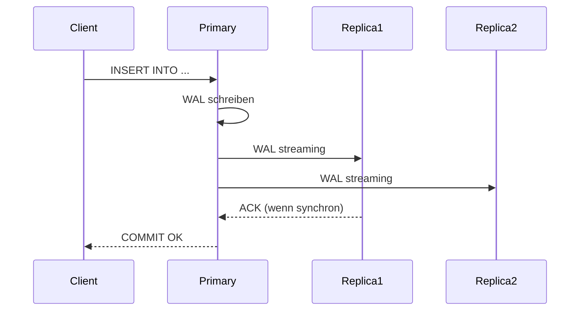

# Konzepte — PostgreSQL

## Architektur

PostgreSQL auf Hikube ist ein verwalteter Dienst basierend auf dem Operator **CloudNativePG**. Jede über die Ressource `Postgres` bereitgestellte Instanz erstellt einen replizierten Cluster mit automatischem Failover, Streaming-Replikation und integrierter Sicherung.

---

## Terminologie

| Begriff | Beschreibung |
|---------|-------------|
| **Postgres** | Kubernetes-Ressource (`apps.cozystack.io/v1alpha1`), die einen verwalteten PostgreSQL-Cluster darstellt. |
| **Primary** | Hauptinstanz, die Lese- und Schreibvorgänge akzeptiert. |
| **Replica** | Schreibgeschützte Instanz, die über Streaming-Replikation vom Primary synchronisiert wird. |
| **CloudNativePG** | Kubernetes-Operator, der den Lebenszyklus von PostgreSQL-Clustern verwaltet (Bereitstellung, Failover, Backup). |
| **PITR** | Point-In-Time Recovery — Wiederherstellung zu einem bestimmten Zeitpunkt dank kontinuierlicher WAL-Archivierung. |
| **WAL** | Write-Ahead Log — Transaktionsjournal von PostgreSQL, Grundlage für PITR und Replikation. |
| **Quorum** | Mindestanzahl synchroner Replikas, die vor der Bestätigung eines Schreibvorgangs erforderlich sind. |
| **resourcesPreset** | Vordefiniertes Ressourcenprofil (nano bis 2xlarge) zur Vereinfachung der Dimensionierung. |

---

## Replikation und Hochverfügbarkeit

CloudNativePG gewährleistet Hochverfügbarkeit durch:

1. **Streaming Replication**: Die Replikas erhalten die WAL in Echtzeit vom Primary
2. **Automatisches Failover**: Wenn der Primary ausfällt, wird automatisch ein Replika befördert
3. **Synchrone Replikation** (optional): Der Primary wartet auf die Schreibbestätigung der Replikas, bevor eine Transaktion validiert wird

Das Feld `quorum` definiert die Anzahl der synchronen Replikas:
- `quorum: 0` (Standard) — asynchrone Replikation, beste Leistung
- `quorum: 1` — mindestens 1 synchrones Replika, Schutz vor Datenverlust

:::tip
Konfigurieren Sie für die Produktion `replicas: 3` und `quorum: 1` für einen guten Kompromiss zwischen Leistung und Haltbarkeit.
:::

---

## Sicherung und Wiederherstellung

PostgreSQL auf Hikube unterstützt zwei Sicherungsmechanismen:

### Kontinuierliche Sicherung (WAL-Archivierung)

Die WAL werden kontinuierlich in einen S3-Bucket archiviert. Dies ermöglicht **PITR** (Point-In-Time Recovery) — die Wiederherstellung der Datenbank zu jedem beliebigen Zeitpunkt in der Vergangenheit.

### Geplante Sicherung

Ein Cron-Zeitplan löst vollständige Sicherungen (Base Backup) in regelmäßigen Abständen aus. Die Aufbewahrungsrichtlinie (`retentionPolicy`) bestimmt die Aufbewahrungsdauer.

| Parameter | Beschreibung |
|-----------|-------------|
| `backup.schedule` | Cron-Zeitplan (z.B.: `0 2 * * *`) |
| `backup.retentionPolicy` | Aufbewahrungsdauer (z.B.: `30d`) |
| `backup.s3*` | Anmeldedaten und Endpoint des S3-Buckets |

---

## Benutzer- und Datenbankverwaltung

Jeder PostgreSQL-Cluster ermöglicht die Deklaration von:

- **Benutzern** mit Passwort
- **Datenbanken** mit Owner
- **Rollen**: `admin` (Lesen/Schreiben), `readonly` (nur Lesen)

Die Anmeldedaten werden in einem **Kubernetes-Secret** namens `<instance>-credentials` gespeichert.

---

## Ressourcen-Presets

| Preset | CPU | Speicher |
|--------|-----|----------|
| `nano` | 250m | 128Mi |
| `micro` | 500m | 256Mi |
| `small` | 1 | 512Mi |
| `medium` | 1 | 1Gi |
| `large` | 2 | 2Gi |
| `xlarge` | 4 | 4Gi |
| `2xlarge` | 8 | 8Gi |

:::warning
Wenn das Feld `resources` (explizite CPU/Speicher) definiert ist, wird `resourcesPreset` ignoriert. Die beiden Ansätze schließen sich gegenseitig aus.
:::

---

## Limits und Kontingente

| Parameter | Wert |
|-----------|------|
| Max. Replikas | Je nach Tenant-Kontingent |
| Speichergröße | Variabel (`size` in Gi) |
| Verbindungen pro Benutzer | Pro Datenbank konfigurierbar |

---

## Weiterführende Informationen

- [Übersicht](./overview.md): Vorstellung des Dienstes
- [API-Referenz](./api-reference.md): Alle Parameter der Postgres-Ressource
