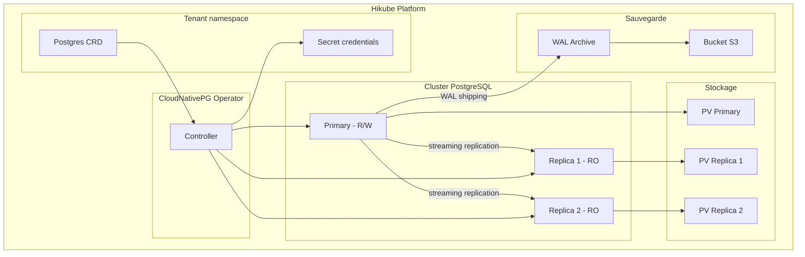
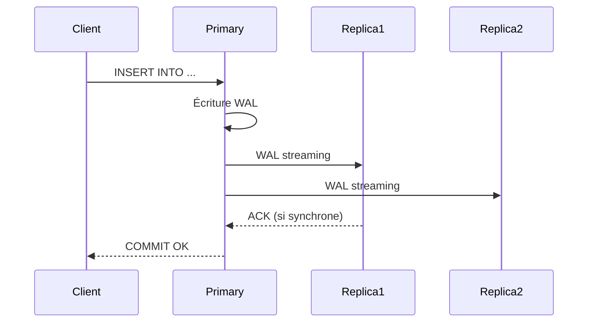

# Concepts — PostgreSQL

## Architecture

PostgreSQL auf Hikube est un service managé basierend auf dem Operator **CloudNativePG**. Chaque instance déployée via la ressource `Postgres` crée un cluster répliqué avec failover automatique, réplication streaming et sauvegarde intégrée.

---

## Terminologie

| Terme | Beschreibung |
|-------|-------------|
| **Postgres** | Ressource Kubernetes (`apps.cozystack.io/v1alpha1`) représentant un cluster PostgreSQL managé. |
| **Primary** | Instance principale qui accepte les lectures et écritures. |
| **Replica** | Instance en lecture seule, synchronisée par streaming replication depuis le primary. |
| **CloudNativePG** | Opérateur Kubernetes qui gère le cycle de vie des clusters PostgreSQL (Deployment, failover, backup). |
| **PITR** | Point-In-Time Recovery — restauration à un instant précis grâce à l'archivage continu des WAL. |
| **WAL** | Write-Ahead Log — journal des transactions PostgreSQL, base du PITR et de la réplication. |
| **Quorum** | Nombre minimum de réplicas synchrones requis avant de confirmer une écriture. |
| **resourcesPreset** | Profil de ressources prédéfini (nano à 2xlarge) pour simplifier le dimensionnement. |

---

## Réplication et Hochverfügbarkeit

CloudNativePG assure la Hochverfügbarkeit via :

1. **Streaming replication** : les réplicas reçoivent les WAL en temps réel depuis le primary
2. **Failover automatique** : si le primary tombe, un réplica est promu automatiquement
3. **Réplication synchrone** (optionnel) : le primary attend la confirmation d'écriture des réplicas avant de valider une transaction

Le champ `quorum` définit le nombre de réplicas synchrones :
- `quorum: 0` (défaut) — réplication asynchrone, meilleures performances
- `quorum: 1` — au moins 1 réplica synchrone, protection contre la perte de données

:::tip
Pour la production, configurez `replicas: 3` et `quorum: 1` pour un bon compromis entre performance et durabilité.
:::

---

## Sauvegarde et restauration

PostgreSQL auf Hikube supporte deux mécanismes de sauvegarde :

### Sauvegarde continue (WAL archiving)

Les WAL sont archivés en continu vers un bucket S3. Cela permet le **PITR** (Point-In-Time Recovery) — restaurer la base à n'importe quel instant dans le passé.

### Sauvegarde planifiée

Un cron schedule déclenche des sauvegardes complètes (base backup) à intervalles réguliers. La politique de rétention (`retentionPolicy`) détermine la durée de conservation.

| Paramètre | Beschreibung |
|-----------|-------------|
| `backup.schedule` | Planification cron (ex: `0 2 * * *`) |
| `backup.retentionPolicy` | Durée de rétention (ex: `30d`) |
| `backup.s3*` | Identifiants et endpoint du bucket S3 |

---

## Gestion des utilisateurs et bases

Chaque cluster PostgreSQL permet de déclarer :

- **Utilisateurs** avec mot de passe
- **Bases de données** avec owner
- **Rôles** : `admin` (lecture/écriture), `readonly` (lecture seule)

Les credentials sont stockés dans un **Secret Kubernetes** nommé `<instance>-credentials`.

---

## Presets de ressources

| Preset | CPU | Mémoire |
|--------|-----|---------|
| `nano` | 250m | 128Mi |
| `micro` | 500m | 256Mi |
| `small` | 1 | 512Mi |
| `medium` | 1 | 1Gi |
| `large` | 2 | 2Gi |
| `xlarge` | 4 | 4Gi |
| `2xlarge` | 8 | 8Gi |

:::warning
Si le champ `resources` (CPU/mémoire explicites) est défini, `resourcesPreset` est ignoré. Les deux approches sont mutuellement exclusives.
:::

---

## Limites et quotas

| Paramètre | Wert |
|-----------|--------|
| Réplicas max | Selon quota tenant |
| Taille stockage | Variable (`size` en Gi) |
| Connexions par utilisateur | Configurables par base |

---

## Weiterführende Informationen

- [Overview](./overview.md) : présentation du service
- [API-Referenz](./api-reference.md) : tous les paramètres de la ressource Postgres
