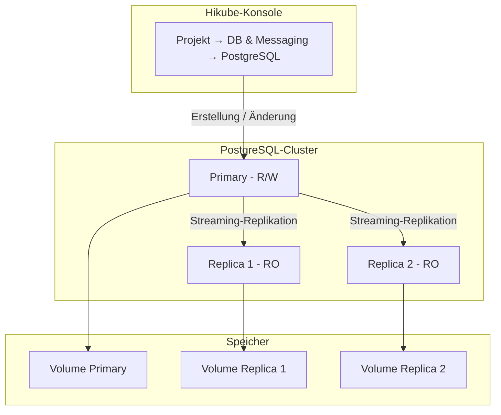
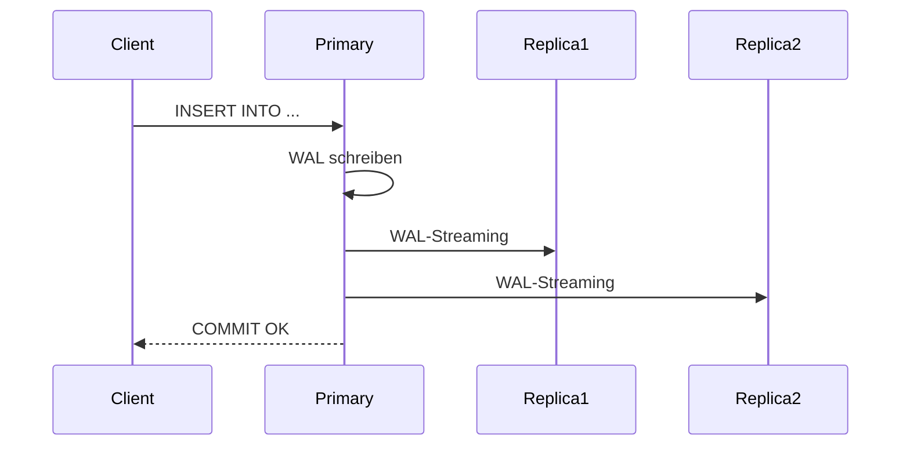

# Konzepte — PostgreSQL

## Architektur

PostgreSQL auf Hikube ist ein verwalteter Service. Jeder in der Konsole erstellte Cluster ist eine Gruppe replizierter PostgreSQL-Instanzen mit automatischem Failover und Streaming-Replikation. Er gehört zu einem **Projekt** und verbraucht die Quotas dieses Projekts (CPU, Arbeitsspeicher, Speicher).

```mermaid
graph TB
    subgraph "Hikube-Konsole"
        UI[Projekt → DB & Messaging → PostgreSQL]
    end

    subgraph "PostgreSQL-Cluster"
        P[Primary - R/W]
        R1[Replica 1 - RO]
        R2[Replica 2 - RO]
    end

    subgraph "Speicher"
        PV1[Volume Primary]
        PV2[Volume Replica 1]
        PV3[Volume Replica 2]
    end

    UI -->|Erstellung / Änderung| P
    P -->|Streaming-Replikation| R1
    P -->|Streaming-Replikation| R2
    P --> PV1
    R1 --> PV2
    R2 --> PV3
```

---

## Terminologie

| Begriff | Beschreibung |
|-------|-------------|
| **PostgreSQL-Cluster** | Verwaltete Instanz, die in der Konsole erstellt wird und aus einem Primary und gegebenenfalls Replicas besteht. |
| **Projekt** | Isolierter Bereich, der Ihre Ressourcen bündelt und die Quotas trägt. |
| **Primary** | Hauptinstanz, die Lese- und Schreibvorgänge annimmt. |
| **Replica** | Schreibgeschützte Instanz, die per Streaming-Replikation vom Primary synchronisiert wird. |
| **Instanz-Preset** | Ressourcenvorlage (CPU, Arbeitsspeicher), die jedem Knoten des Clusters zugewiesen wird. |
| **Externer Zugriff** | Option, die den Cluster über eine öffentliche IP-Adresse im Internet verfügbar macht. |
| **Erweiterung (Extension)** | PostgreSQL-Modul (zum Beispiel `pgcrypto`, `vector`), das pro Datenbank aktiviert wird. |
| **WAL** | Write-Ahead Log — das Transaktionsprotokoll von PostgreSQL, Grundlage der Replikation. |

---

## Replikation und Hochverfügbarkeit

Die Hochverfügbarkeit beruht auf:

1. **Streaming-Replikation**: Die Replicas erhalten die WAL fortlaufend vom Primary
2. **Automatisches Failover**: Fällt der Primary aus, wird automatisch eine Replica befördert

```mermaid
sequenceDiagram
    participant Client
    participant Primary
    participant Replica1
    participant Replica2

    Client->>Primary: INSERT INTO ...
    Primary->>Primary: WAL schreiben
    Primary->>Replica1: WAL-Streaming
    Primary->>Replica2: WAL-Streaming
    Primary-->>Client: COMMIT OK
```

Die Anzahl der Replicas wird bei der Erstellung im Feld **Number of replicas** festgelegt:

| Angebotener Wert | Verwendung |
|-----------------|-------|
| **1 (Standalone)** | Entwicklung, Tests |
| **2 (High Availability)** | Produktion mit einem Standby |
| **3 (Max High Availability)** | Kritische Produktion |

:::warning
Die Anzahl der Replicas kann nach der Erstellung nicht mehr geändert werden („The mode cannot be changed after creation“). Wählen Sie sie entsprechend Ihrem Verfügbarkeitsbedarf. Um sie zu ändern, [wenden Sie sich an den Support](mailto:support@hidora.io).
:::

Synchrone Replikation (Quorum) wird in der Konsole nicht angeboten; wenden Sie sich an den Support.

---

## Datenbanken, Benutzer und Rechte

Jeder Cluster verfügt über:

- eine automatisch erstellte Datenbank **`postgres`**;
- die **Datenbanken**, die Sie bei der Erstellung oder später hinzufügen (Registerkarte **Databases**), mit ihren **Erweiterungen**;
- die **Benutzer**, die Sie anlegen (Registerkarte **Users**). Jeder Benutzer erhält pro Datenbank eines der beiden folgenden Rechte:
  - **Administrator (Admin)**: Lesen und Schreiben;
  - **Read-only**: nur Lesen.

Das Passwort eines Benutzers wird von der Plattform generiert und **nur ein einziges Mal** angezeigt, bei der Erstellung oder nach einer Rotation. Danach ist es nicht mehr einsehbar: Wenn Sie es verlieren, generieren Sie mit **Change Password** ein neues.

### Benennungsregeln

| Element | Regel |
|---------|-------|
| Clustername | 3 bis 16 Zeichen: Kleinbuchstaben, Ziffern und Bindestriche; beginnt mit einem Buchstaben, endet mit einem Buchstaben oder einer Ziffer |
| Benutzername | 3 bis 16 Zeichen: Kleinbuchstaben, Ziffern und Unterstriche (`_`); beginnt mit einem Kleinbuchstaben oder einem Unterstrich. Kein Bindestrich (`-`). |
| Datenbankname | 1 bis 63 Zeichen: Kleinbuchstaben, Ziffern und Unterstriche |

Die Benutzernamen `postgres`, `admin`, `root`, `owner`, `superuser`, `streaming_replica`, `cnpg_pooler_pgbouncer` sowie alle Namen, die mit `pg_` beginnen, sind reserviert.

---

## Instanz-Presets

Das **Instance preset** legt die Kapazität fest, die **jedem Knoten** des Clusters zugewiesen wird. Maßgeblich ist die im Assistenten angezeigte Liste; zur Orientierung:

| Preset | CPU | Arbeitsspeicher |
|--------|-----|---------|
| `nano` | 250m | 128Mi |
| `micro` | 500m | 256Mi |
| `small` | 1 | 512Mi |
| `medium` | 1 | 1Gi |
| `large` | 2 | 2Gi |
| `xlarge` | 4 | 4Gi |
| `2xlarge` | 8 | 8Gi |

Das Standard-Preset des Assistenten ist `small`. Die Festlegung freier CPU-/Arbeitsspeicher-Ressourcen (außerhalb der Presets) wird in der Konsole nicht angeboten; wenden Sie sich an den Support.

---

## Netzwerkzugriff

- **Externer Zugriff deaktiviert** (Standard): Der Cluster ist nicht im Internet erreichbar. Das Feld **Host** auf der Seite des Clusters zeigt **Not defined** an.
- **Externer Zugriff aktiviert**: Die Plattform weist eine öffentliche IP-Adresse zu, die im Feld **Host** angezeigt wird. Der Port ist der PostgreSQL-Standardport `5432`.

Der externe Zugriff kann nach der Erstellung über **Edit** aktiviert oder deaktiviert werden. Seine Kosten (öffentliche IP-Adresse) sind in der Angabe **Estimated cost** des Assistenten enthalten.

---

## Backup und Wiederherstellung

Die Konfiguration von Backups und die Wiederherstellung werden in der Konsole nicht angeboten; wenden Sie sich an den Support. Siehe [Backups konfigurieren](./how-to/configure-backups.md).

---

## Quotas und Kosten

Der Erstellungsassistent zeigt ab dem Schritt **Configuration** die **Estimated cost** (monatlich und stündlich) sowie die Auswirkung des Clusters auf die Quotas des Projekts (CPU, Arbeitsspeicher, Speicher) an. Der Verbrauch berücksichtigt das Preset, die Anzahl der Replicas und die Disk-Größe. Überschreitet der Cluster die verfügbaren Quotas, bleibt die Schaltfläche **Next** inaktiv.

| Parameter | Wert |
|-----------|--------|
| Disk-Größe | 1 bis 4 096 GB, im Rahmen des Speicher-Quotas des Projekts |
| Replicas | 1, 2 oder 3 |

---

## Weiterführende Informationen

- [Übersicht](./overview.md): Vorstellung des Service
- [Schnellstart](./quick-start.md): Ihren ersten Cluster erstellen
