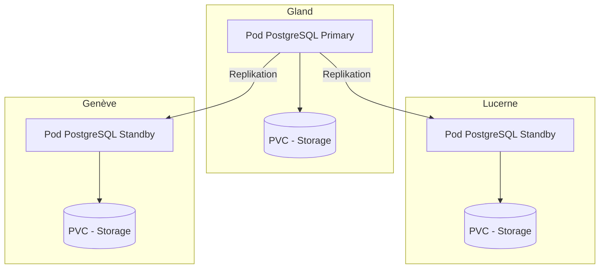

# PostgreSQL auf Hikube

Hikube bietet einen verwalteten PostgreSQL-Dienst, basierend auf dem Operator **CloudNativePG**, der in der Community anerkannt und weit verbreitet ist.
Die Plattform unterstützt die Bereitstellung und Verwaltung eines **replizierten und selbstheilenden** PostgreSQL-Clusters und gewährleistet Robustheit, Leistung und Hochverfügbarkeit ohne Aufwand seitens des Benutzers.

---

## 🏗️ Architektur und Funktionsweise

Der verwaltete PostgreSQL-Dienst auf Hikube basiert auf dem Operator **CloudNativePG**, der die vollständige Verwaltung des Datenbank-Lebenszyklus automatisiert: Erstellung, Aktualisierung, Replikation und Wiederherstellung nach Ausfällen.

Die Architektur basiert auf einem **replizierten Cluster**:

- Ein **Primary-Knoten** (Primary), der die Schreibvorgänge verarbeitet und als Referenz für die Datenkonsistenz dient.
- Ein oder mehrere **Replikas** (Standby), die Änderungen dank synchroner oder asynchroner Replikation in Echtzeit erhalten.
- Ein **Auto-Failover**-Mechanismus, der automatisch ein Replika zum neuen Primary befördert, falls ein Ausfall auftritt, und so eine **Hochverfügbarkeit** ohne manuellen Eingriff sicherstellt.

Dieser Ansatz garantiert:

- **Resilienz** gegenüber Hardware- oder Softwareausfällen
- **Lese-Skalierbarkeit** dank der Verteilung von Anfragen auf die Replikas
- **Betriebliche Einfachheit**, da die Plattform die Koordination und Wartung des Clusters übernimmt

---

## 💡 Anwendungsfälle

- **Geschäftskritische Anwendungen**, die eine zuverlässige und hochverfügbare Datenbank erfordern
- **E-Commerce und ERP**, wo Servicekontinuität unverzichtbar ist
- **Multi-Tenant-SaaS**, das die Lastverteilung zwischen Primary und Replikas ermöglicht
- **Business Intelligence und Reporting**, dank optimierter Lesevorgänge auf den Replikas
- **Cloud-native Anwendungen**, integriert in Kubernetes-Umgebungen
